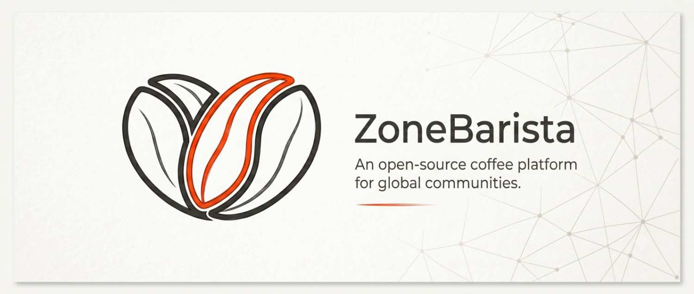

# ☕ ZONE BARISTA

  <strong>A science-first knowledge base, brewing calculator, and engineering platform designed specifically for specialty coffee professionals.</strong>

 

---

  <h3><em>"Translating abstract coffee science into practical, everyday application."</em></h3>

---

## 📑 Table of Contents
- [🎯 Why Zone Barista?](#-why-zone-barista)
- [✨ Core Features](#-core-features)
- [🧬 The Knowledge Matrix](#-the-knowledge-matrix)
- [🧮 Interactive Engineering](#-interactive-engineering)
- [🛠️ Tech Stack Architecture](#-tech-stack-architecture)
- [👨‍💻 Credits](#-credits)

---

## 🎯 Why Zone Barista?

The specialty coffee industry has traditionally relied on fragmented resources—scattered spreadsheets, disparate blog posts, and isolated tools. **Zone Barista (Coffee OS)** was engineered to solve this by providing a single, unified, mathematically rigorous platform.

Whether you are:

| Professional | How Zone Barista Empowers You |
|:---:|:---|
| 🔬 **The Roaster** | Analyze the thermal dynamics of Maillard reactions and track RoR curves. |
| ⚖️ **The Barista** | Dial in the perfect extraction yield and troubleshoot water alkalinity on the fly. |
| 📊 **The Cafe Manager** | Run beverage costing models, scale recipes, and track profit margins dynamically. |
| 🎓 **The Researcher** | Structure deep dives into coffee science using visually mapped knowledge nodes. |

> Zone Barista acts as the ultimate digital companion for elevating your coffee craft—transforming raw data into a luxurious, cinematic scientific archive.

---

## ✨ Core Features

### 🎨 Cinematic & Brutalist UI/UX
An uncompromising design language featuring warm paper aesthetics, precise grid patterns, micro-animations, and a highly responsive layout that feels like a premium digital magazine.

### 📈 Advanced Data Visualization
Say goodbye to flat data. Experience interactive constellation knowledge graphs powered by **D3.js** that map out how different coffee concepts interconnect, alongside extraction analytics charts powered by **Chart.js**.

### ⚡ Lightning Fast "Fuzzy" Search
Integrated `Fuse.js` provides instant search capabilities across the entire knowledge base. Press <kbd>⌘</kbd> + <kbd>K</kbd> from anywhere in the app to instantly locate formulas, SOPs, and research papers.

### 🧮 Dynamic Calculators
A suite of interactive tools to dial in extraction yield, calculate water chemistry buffer zones, adjust roasting metrics, and perform live beverage costing.

---

## 🧬 The Knowledge Matrix

Zone Barista isn't just a wiki; it's an interconnected **Knowledge Matrix**. Topics are categorized into distinct, color-coded domains:

- 🟢 **Beginner Pathways:** French Press, Basic Ratios, Cafe Hygiene.
- 🟡 **Intermediate Dynamics:** Pour-over Turbulence, Water Recipes, Sensory Analysis.
- 🔴 **Advanced Science:** Thermal Fluid Dynamics, CO2 Degassing Kinetics, Fick's Law of Diffusion.

---

## 🧮 Interactive Engineering

At the heart of Zone Barista is its engineering engine. Some of the built-in calculators include:

1. **Extraction Yield (EY%) Optimizer**
2. **Total Dissolved Solids (TDS) Tracker**
3. **Water Alkalinity & Hardness Balancer**
4. **COGS (Cost of Goods Sold) Margin Calculator**

---

## 🛠️ Tech Stack Architecture

<b>Click to expand the technical specifications</b>

 

Zone Barista is a modern, serverless single-page application (SPA) built for maximum performance and deployment flexibility.

- **Core Framework**: React 18 with TypeScript for type-safe, component-driven development.
- **Build & Bundle**: Vite for lightning-fast HMR and optimized production builds.
- **Styling Engine**: Tailwind CSS (with custom brutalist utility classes).
- **Client-Side Routing**: React Router DOM.
- **Data Visualization**: D3.js (Force-directed graphs) and Chart.js (Radar/Bar charts).
- **Iconography**: Lucide React.
- **Search Engine**: Fuse.js (Client-side fuzzy searching).

---

## 👨‍💻 Credits

**Designed and engineered with absolute precision by:**

<table>
  <tr>
    <td align="center">
      <a href="https://github.com/Matrixxboy">
         
        <b>Utsav Lankapati</b>
      </a>
    </td>
    <td>
      <strong>Software Engineer & Coffee Science Enthusiast</strong> 
      Building tools that translate complex formulas into interactive learning systems.  
      🔗 <a href="https://github.com/Matrixxboy">GitHub Profile</a>
    </td>
  </tr>
</table>

 

  <i>Made with ❤️ for the love of specialty coffee and premium UI engineering.</i>

