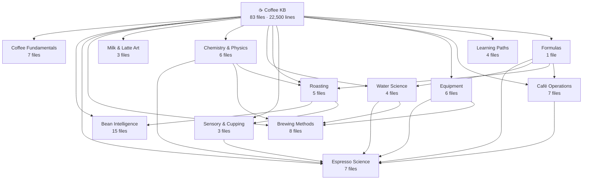

# ☕ Coffee Intelligence Knowledge Base — Master Index

> **83 files · ~22,500 lines · Production-ready · SCA-aligned · AI/RAG/Vector-DB optimised**
> Complete scientifically rigorous coffee knowledge — barista education, extraction science, origin intelligence, roast engineering, sensory analysis, café operations, and more.
>
> **Credits:** Made by **Utsav Lankapati Matrixxboy** ([GitHub](https://github.com/matrixxboy/))

---

## 🗂️ Full File Structure (83 files)

```
coffee-kb/
│
├── INDEX.md                                         ← You are here
├── TAXONOMY.xml                                     ← Full ontology + topic graph
├── KNOWLEDGE_GRAPH.xml                              ← All file connections + learning paths
├── RECIPES_DATA.xml                                 ← All brew recipes structured data
├── EQUIPMENT_DATA.xml                               ← Equipment specs structured data
├── ORIGINS_DATA.xml                                 ← Origins + species structured data
│
├── coffee-fundamentals/         [7 files]
│   ├── history-of-coffee.md
│   ├── specialty-coffee-movement.md
│   ├── supply-chain.md
│   ├── certifications-standards.md
│   ├── coffee-economics.md
│   ├── sustainability-climate.md
│   └── sourcing-direct-trade.md
│
├── beans/                       [15 files]
│   ├── species-overview.md
│   ├── terroir-science.md
│   ├── processing-methods.md
│   ├── green-coffee-grading.md
│   ├── barista-workflow-science.md
│   ├── profiles/
│   │   ├── arabica.md
│   │   ├── robusta.md
│   │   ├── liberica.md
│   │   └── excelsa.md
│   └── regions/
│       ├── ethiopia.md
│       ├── brazil.md
│       ├── colombia.md
│       ├── india.md
│       ├── extended-origins.md          ← Kenya, Guatemala, Indonesia, Panama, Rwanda, El Salvador
│       ├── africa-extended.md           ← Rwanda, Burundi, Uganda, Tanzania + emerging
│       ├── central-america-mexico.md    ← Honduras, Costa Rica, Mexico
│       └── brazil-colombia-india.md     ← Legacy combined reference
│
├── espresso/                    [7 files]
│   ├── extraction-theory.md
│   ├── pressure-flow-profiling.md
│   ├── puck-preparation.md
│   ├── dialing-in.md
│   ├── shot-diagnosis.md
│   ├── espresso-blending.md
│   └── espresso-machine-technology.md
│
├── brewing-methods/             [8 files]
│   ├── brewing-science-overview.md
│   ├── pour-over.md
│   ├── french-press.md
│   ├── aeropress.md
│   ├── cold-brew.md
│   ├── moka-pot.md
│   ├── siphon.md
│   └── batch-brewing.md
│
├── milk-latte-art/              [3 files]
│   ├── milk-science.md
│   ├── steaming-technique.md
│   └── latte-art-patterns.md
│
├── chemistry-physics/           [6 files]
│   ├── extraction-chemistry.md
│   ├── maillard-caramelization.md
│   ├── solubility-science.md
│   ├── thermal-fluid-dynamics.md
│   ├── co2-degassing-freshness.md
│   └── coffee-health-science.md
│
├── water-science/               [4 files]
│   ├── water-chemistry.md
│   ├── water-recipes.md
│   ├── filtration-systems.md
│   └── WATER_DATA.xml
│
├── roasting/                    [5 files]
│   ├── roast-science.md
│   ├── roast-curves-profiles.md
│   ├── roast-defects.md
│   ├── roast-color-agtron.md
│   └── roastery-operations.md
│
├── sensory-cupping/             [3 files]
│   ├── cupping-protocol.md
│   ├── flavor-wheel-guide.md
│   └── sensory-training.md
│
├── equipment/                   [6 files]
│   ├── espresso-machines.md
│   ├── espresso-machine-technology.md
│   ├── grinders.md
│   ├── brewing-equipment.md
│   ├── maintenance-cleaning.md
│   └── coffee-lab-tools.md
│
├── cafe-operations/             [7 files]
│   ├── workflow-sop.md
│   ├── beverage-costing.md
│   ├── staff-training.md
│   ├── menu-development.md
│   ├── inventory-management.md
│   ├── marketing-branding.md
│   └── cafe-design-layout.md
│
├── formulas/                    [1 file]
│   └── formula-library.md       ← 24 formulas: brewing, water, roast, business
│
└── learning-paths/              [4 files]
    ├── learning-paths.md         ← 7 pathways: beginner → Q Grader
    ├── competition-guide.md      ← WBC, WBrC, WLAC, WAC complete guide
    ├── q-grader-study-plan.md   ← All 22 modules, 6-month programme
    └── sca-curriculum-map.md    ← All SCA modules, levels, diploma pathway
```

---

## 🧭 Quick Navigation by Role

| Role | Start Here | Then Read |
|------|-----------|-----------|
| **Beginner home barista** | `learning-paths/learning-paths.md` | `brewing-methods/pour-over.md` |
| **Aspiring professional barista** | `learning-paths/learning-paths.md` → Path B | `espresso/extraction-theory.md` |
| **Espresso specialist** | `espresso/extraction-theory.md` | `espresso/dialing-in.md` → `shot-diagnosis.md` |
| **Roaster** | `roasting/roast-science.md` | `roast-curves-profiles.md` → `roastery-operations.md` |
| **Café owner/manager** | `cafe-operations/workflow-sop.md` | `beverage-costing.md` → `staff-training.md` |
| **Coffee scientist** | `chemistry-physics/extraction-chemistry.md` | `maillard-caramelization.md` → `solubility-science.md` |
| **Competition barista** | `learning-paths/competition-guide.md` | `espresso/pressure-flow-profiling.md` |
| **Q Grader candidate** | `learning-paths/q-grader-study-plan.md` | `sensory-cupping/cupping-protocol.md` |
| **Water specialist** | `water-science/water-chemistry.md` | `water-recipes.md` → `filtration-systems.md` |
| **Origin researcher** | `beans/species-overview.md` | All `beans/regions/*.md` |
| **Green coffee buyer** | `beans/green-coffee-grading.md` | `coffee-fundamentals/sourcing-direct-trade.md` |
| **SCA student** | `learning-paths/sca-curriculum-map.md` | Module-specific files |

---

## 🔗 Core Knowledge Graph



---

## 📐 Formula Quick Reference (24 formulas)

| # | Formula | File |
|---|---------|------|
| F-01 | `Brew Ratio = Yield / Dose` | `formulas/formula-library.md` |
| F-02 | `EY% = (TDS × Yield) / Dose × 100` | `espresso/extraction-theory.md` |
| F-07 | `Hardness = (Ca²⁺ × 2.497) + (Mg²⁺ × 4.118)` | `water-science/water-chemistry.md` |
| F-11 | `DTR% = (Post-crack time / Total time) × 100` | `roasting/roast-curves-profiles.md` |
| F-12 | `Roast Loss = (Green − Roasted) / Green × 100` | `roasting/roast-science.md` |
| F-13 | `RoR = ΔT / Δt` | `roasting/roast-curves-profiles.md` |
| F-14 | `Bev Cost% = COGS / Price × 100` | `cafe-operations/beverage-costing.md` |
| F-18 | `Prime Cost% = (COGS + Labor) / Revenue × 100` | `cafe-operations/beverage-costing.md` |
| F-23 | `SCA Score = Σ(10 attributes) − Defect penalties` | `sensory-cupping/cupping-protocol.md` |

---

## 🌍 Origin Coverage (16 origins profiled)

| Origin | File | Signature Flavour |
|--------|------|------------------|
| Ethiopia (Yirgacheffe) | `beans/regions/ethiopia.md` | Jasmine, bergamot, lemon |
| Ethiopia (Harrar) | `beans/regions/ethiopia.md` | Blueberry, wine, dark choc |
| Brazil | `beans/regions/brazil.md` | Chocolate, caramel, hazelnut |
| Colombia | `beans/regions/colombia.md` | Red fruit, citrus, caramel |
| India | `beans/regions/india.md` | Spice, chocolate, earthy |
| Kenya | `beans/regions/extended-origins.md` | Blackcurrant, tomato, phosphoric |
| Guatemala | `beans/regions/extended-origins.md` | Peach, honey, caramel |
| Indonesia (Sumatra) | `beans/regions/extended-origins.md` | Earthy, cedar, dark choc |
| Panama (Gesha) | `beans/regions/extended-origins.md` | Jasmine, tropical, floral |
| Rwanda | `beans/regions/extended-origins.md` | Pomegranate, citrus, caramel |
| El Salvador | `beans/regions/extended-origins.md` | Caramel, chocolate, fruit |
| Rwanda + Burundi | `beans/regions/africa-extended.md` | Peach, honey, floral |
| Uganda + Tanzania | `beans/regions/africa-extended.md` | Citrus, chocolate, clean |
| Honduras | `beans/regions/central-america-mexico.md` | Peach, honey, balanced |
| Costa Rica | `beans/regions/central-america-mexico.md` | Citrus, stone fruit, clean |
| Mexico | `beans/regions/central-america-mexico.md` | Chocolate, caramel, mild |

---

## 📊 Knowledge Base Statistics

| Metric | Value |
|--------|-------|
| **Total files** | 83 |
| **Total lines** | ~22,500 |
| **Markdown files** | 76 |
| **XML data files** | 7 |
| **Domains covered** | 14 |
| **Origins profiled** | 16+ |
| **Species profiled** | 4 |
| **Brewing methods** | 9 |
| **Formulas documented** | 24 |
| **Equipment profiles** | 25+ |
| **Learning pathways** | 7 |
| **Mermaid diagrams** | 45+ |
| **SCA-aligned** | ✅ Throughout |
| **RAG/Vector-DB ready** | ✅ Modular YAML headers |
| **AI fine-tuning ready** | ✅ Consistent structure |
| **Cross-referenced** | ✅ Every file links to related files |

---

## 🏷️ Full Tag Index

**Origins:** `ethiopia` `yirgacheffe` `harrar` `brazil` `colombia` `india` `kenya` `indonesia` `sumatra` `vietnam` `panama` `gesha` `rwanda` `burundi` `uganda` `tanzania` `honduras` `costa-rica` `mexico` `guatemala` `el-salvador`

**Species:** `arabica` `robusta` `liberica` `excelsa` `bourbon` `typica` `SL-28` `caturra` `catuai` `pacamara` `castillo` `pink-bourbon`

**Processing:** `washed` `natural` `honey` `anaerobic` `wet-hulled` `monsooned` `carbonic-maceration` `lactic-fermentation`

**Espresso:** `extraction` `TDS` `EY` `brew-ratio` `dialing-in` `channeling` `pressure-profiling` `puck-prep` `tamping` `WDT` `pre-infusion` `turbo-shot` `blending`

**Brewing:** `pour-over` `V60` `Chemex` `Kalita` `french-press` `aeropress` `cold-brew` `moka-pot` `siphon` `batch-brew` `nitro`

**Milk:** `microfoam` `steaming` `latte-art` `rosetta` `tulip` `heart` `oat-milk` `plant-milk` `barista-edition`

**Chemistry:** `Maillard` `caramelization` `CGA` `chlorogenic-acid` `caffeine` `solubility` `CO2` `lipids` `volatiles` `degassing`

**Water:** `TDS` `hardness` `alkalinity` `magnesium` `calcium` `bicarbonate` `pH` `RO` `BWT` `Bestmax` `filtration` `remineralisation`

**Roasting:** `roast-curve` `DTR` `RoR` `first-crack` `development` `baked` `scorching` `Agtron` `colorimeter` `Cropster` `Artisan`

**Sensory:** `cupping` `SCA` `flavor-wheel` `Q-grader` `aroma` `acidity` `body` `defects` `triangle-test` `Le-Nez-du-Cafe`

**Equipment:** `La-Marzocco` `Nuova-Simonelli` `Breville` `E61` `dual-boiler` `HX` `PID` `EK43` `Niche-Zero` `DF64` `flat-burr` `conical-burr` `VST` `refractometer`

**Operations:** `SOP` `workflow` `COGS` `margin` `prime-cost` `staff-training` `calibration` `menu-engineering` `inventory` `FIFO` `par-stock` `cafe-design`

**Education:** `learning-path` `SCA-certification` `WBC` `WBrC` `WLAC` `WAC` `Q-grader` `diploma` `competition`

---

*Complete knowledge base — production-ready for RAG pipelines, vector databases, AI training, barista education platforms, café management tools, and web deployment.*
