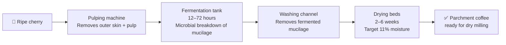
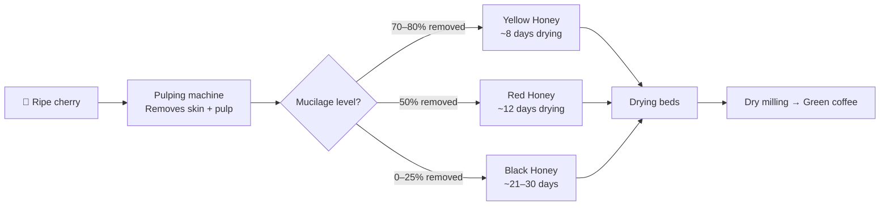

# Coffee Processing Methods — Complete Science Guide

## 📍 Parent Topics
- [Bean Intelligence](../INDEX.md)
- [Green Coffee Grading](green-coffee-grading.md)

---

## Overview: Why Processing Matters

The coffee cherry contains the green bean surrounded by multiple layers. Processing removes these layers and dries the bean to stable moisture (~11%). **How and when these layers are removed determines everything about the final cup.**

```
Coffee Cherry Cross-Section:
┌─────────────────────────────────────┐
│  OUTER SKIN (exocarp)               │ → Removed by depulping
│    PULP (mesocarp — fruit flesh)    │ → Removed by depulping
│      MUCILAGE (pectin layer)        │ → Removed by fermentation/washing
│        PARCHMENT (endocarp)         │ → Removed by dry milling
│          SILVERSKIN (testa)         │ → Removed during roasting (chaff)
│            GREEN BEAN (seed)        │ → What we roast
└─────────────────────────────────────┘
```

---

## Method 1: Washed (Wet) Processing

### Mechanism



### Fermentation Science

Fermentation is the biological degradation of mucilage (pectin) by naturally occurring microorganisms:

**Key microorganisms:**
- *Saccharomyces cerevisiae* (yeast) — ethanol fermentation
- *Lactobacillus* spp. — lactic acid production
- *Leuconostoc* spp. — additional lactic acid
- Pectinolytic bacteria — break down pectin structures

**Chemical reactions:**
$$\text{Pectin} \xrightarrow{\text{pectinases}} \text{Galacturonic acid} + \text{Methanol}$$
$$\text{Sugars} \xrightarrow{\text{yeasts}} \text{Ethanol} + \text{CO}_2$$
$$\text{Sugars} \xrightarrow{\text{LAB}} \text{Lactic acid}$$

**Time and temperature relationship:**
| Fermentation Temperature | Optimal Time |
|--------------------------|-------------|
| Hot climate (25–30°C) | 12–24 hours |
| Moderate (18–24°C) | 24–48 hours |
| Cool highlands (14–18°C) | 48–72 hours |

**Under-fermentation:** Mucilage not fully broken down → slimy parchment → drying problems → fermented defect in cup  
**Over-fermentation:** Microbial activity penetrates bean → sour/vinegar/onion defect in cup

### Cup Profile
- **Clean** — fruit flavours largely removed during washing
- **Bright** — acids preserved, not masked by fruit fermentation
- **Terroir-forward** — origin character most clearly expressed
- **Lower body** than natural
- **Common in:** Ethiopia (Yirgacheffe), Colombia, Kenya, Central America

---

## Method 2: Natural (Dry / Unwashed) Processing

### Mechanism


### Science of Natural Drying

The entire cherry dries together — the fruit flesh ferments against the bean over weeks:

**Phase 1 (Days 1–7):** Cherry turns from red to dark purple; sugars migrate into bean  
**Phase 2 (Days 7–21):** Controlled fermentation inside drying cherry; complex flavour development  
**Phase 3 (Days 21–35+):** Cherry desiccates to dark brown/black; fermentation slows  

**Critical control points:**
- **Regular turning** — prevents mould (target every 2–4 hours initially)
- **Thin layers** — maximum 4–5cm depth for airflow
- **Temperature monitoring** — > 35°C risks defects
- **Moisture tracking** — finish at 11% moisture minimum

### Flavour Chemistry

Sugars from the fruit pulp diffuse into the bean during drying:
- **Sucrose** — increases cup sweetness
- **Glucose/fructose** — additional fermentation substrates
- **Organic acids (citric, malic)** from fruit → alter final acid profile
- **Ethanol** from yeast fermentation → persists as fruity/winey notes

### Cup Profile
- **Fruity, wine-like** — berry, stone fruit, tropical
- **Heavy body** — higher lipid and suspended solid content
- **Complex ferment notes** — can be defect if uncontrolled
- **Lower perceived acidity** — fruit sugars mask acids
- **Common in:** Ethiopia (Harrar), Brazil, Yemen, some Colombia

---

## Method 3: Honey Processing (Pulped Natural)

### Mechanism



### Costa Rica's Innovation

Honey processing was pioneered in **Costa Rica** in the 1990s and 2000s as a deliberate middle path between the clean clarity of washed and the fruit complexity of natural processing.

### Honey Variants Compared

| Type | Mucilage Left | Drying Days | Cup Character |
|------|--------------|-------------|---------------|
| **White Honey** | ~90% removed | 8–10 | Closest to washed; clean, slight sweetness |
| **Yellow Honey** | 75–80% removed | 8–12 | Mild sweetness; slight fruit |
| **Red Honey** | ~50% removed | 12–18 | Balanced; stone fruit; caramel; medium body |
| **Black Honey** | 0–25% removed | 21–30 | Closest to natural; intense fruit; heavy body |

---

## Method 4: Anaerobic Fermentation

### Mechanism

Anaerobic processing places coffee (whole cherry or depulped) into **sealed, oxygen-free tanks** where fermentation occurs without oxygen exposure:

```
AEROBIC fermentation (traditional):
Cherry + Open air + Water → Ethanol + CO₂ + Lactic acid (standard)

ANAEROBIC fermentation:
Cherry + Sealed tank (no O₂) + CO₂ atmosphere →
Longer fermentation (24–200+ hours) →
Different microbial populations →
Novel flavour compounds → Unusual, intense, wine-like cup
```

### Key Variants

| Variant | Description | Typical Flavour |
|---------|-------------|----------------|
| **Anaerobic Natural** | Whole cherry in sealed tank then natural dried | Extreme fruit, wine, tropical |
| **Anaerobic Washed** | Depulped coffee in sealed tank then washed | Intense but cleaner; red wine |
| **Carbonic Maceration** | CO₂ injected into sealed tank (from wine technique) | Floral, wine-like, unusual |
| **Lactic Fermentation** | Temperature-controlled low-temp ferment | Creamy, yogurt, smooth |
| **Yeast-inoculated** | Specific commercial yeasts added | Controlled novel flavours |
| **Double anaerobic** | Two sequential anaerobic phases | Extreme complexity |

### Flavour Science

Anaerobic conditions favour different metabolic pathways:

| Condition | Dominant Pathway | Compounds Produced |
|-----------|-----------------|-------------------|
| Aerobic | Oxidative | Standard acids, ethanol |
| Anaerobic | Reductive | Lactic acid, ethyl acetate, unusual esters |
| Low temp anaerobic | Lactic acid bacteria | Lactic acid, diacetyl → creamy |
| Yeast-dominant | Saccharomyces | Ethanol, higher alcohols, fruity esters |

**Ethyl acetate** (fruity ester) is a key anaerobic product:
$$\text{Ethanol} + \text{Acetic acid} \rightleftharpoons \text{Ethyl acetate} + \text{H}_2\text{O}$$

### Controversy in Specialty

Anaerobic processing divides the specialty community:
- **Supporters:** New flavour dimensions; terroir expression through process
- **Critics:** Processing masking origin character; excessive manipulation; reproducibility issues
- **Competition:** Widely used in WBC signature drinks; some national events now restrict it
- **Consumer:** Growing mainstream popularity; younger specialty drinkers receptive

---

## Method 5: Wet-Hulled (Giling Basah) — Indonesia

Unique to Indonesia; responsible for the distinctive Sumatra/Sulawesi character:

```
Indonesian Wet-Hulled Process:
Cherry → Depulp → Short ferment (12–24h) → Partial wash →
Hull at HIGH MOISTURE (30–50% — very unusual) →
Dry only to ~11%
```

**Why hulling at high moisture creates distinctive character:**
- Swollen, deformed bean shape (less smooth)
- Cell structure breakdown exposes different compounds
- Higher surface area for oxidation during final drying
- **Earthy, cedar, tobacco** flavours develop from these structural changes

**Cup result:** Very heavy body, near-zero acidity, earthy, woody, tobacco, dark chocolate

---

## Method 6: Monsooned (India-specific)

See `beans/regions/india.md` for full detail.

**Brief:** Green beans exposed to monsoon winds 12–16 weeks → swell, change chemically → near-zero acid, very heavy body, earthy/spice character.

---

## Method 7: Experimental and Emerging Processes

### Thermophilic Fermentation

- Uses heat-loving bacteria (50–60°C fermentation)
- Extended fermentation (48–100+ hours) at elevated temperature
- Result: intense, unusual flavours; tropical fruit; candy

### Cold Fermentation

- Very low temperature (4–10°C) for extended period (72–200+ hours)
- Slower microbial activity = more controlled, cleaner
- Result: clean but complex; floral; elevated perceived sweetness

### Koji Fermentation

- *Aspergillus oryzae* (koji mould, from sake/miso fermentation)
- Produces amylase and protease enzymes → unique flavour precursors
- Very experimental; limited commercial production
- Result: umami, savoury, unusual complexity

### Wine Co-Fermentation

- Whole or crushed grapes added to fermentation tank with coffee
- Grape yeast + grape sugars influence fermentation
- Result: intense wine-like character; fruit; higher alcohol notes

---

## Processing Quality Control System

### Critical Control Points (CCPs) Across All Methods

| Stage | CCP | Target | Risk |
|-------|-----|--------|------|
| **Cherry reception** | Brix (sugar content) | >18–20 Brix = ripe | Unripe cherry → grassy cup |
| **Flotation sorting** | Float removal | Remove all floaters | Floaters = low quality |
| **Fermentation** | Time, temp, pH | Method-specific | Over-ferment = defect |
| **Washing (washed)** | Residual mucilage | None remaining | Slimy = drying problem |
| **Drying** | Moisture target | 11–12% final | >13% = mould; <9% = fragile |
| **Dry milling** | Defect separation | SCA Grade 1 targets | Defects in cup |
| **Storage (green)** | Temperature/humidity | 15–25°C, 50–70% RH | Ageing, mould |

---

## Cup Impact Summary Matrix

| Method | Acidity | Body | Sweetness | Clarity | Ferment Notes |
|--------|---------|------|-----------|---------|---------------|
| Washed | ↑↑ High | ↑ Medium | ↑ Medium | ↑↑ High | Low |
| Natural | ↑ Medium | ↑↑ Heavy | ↑↑ High | ↑ Medium | Medium–High |
| Yellow Honey | ↑↑ High | ↑ Medium | ↑↑ High | ↑↑ High | Low |
| Red Honey | ↑ Medium | ↑↑ Med-Heavy | ↑↑ High | ↑ Medium | Low–Medium |
| Black Honey | ↑ Med-Low | ↑↑↑ Heavy | ↑↑↑ High | ↓ Medium | Medium |
| Anaerobic Natural | Variable | ↑↑ Heavy | ↑↑↑ Very High | ↓ Low | Very High |
| Anaerobic Washed | Variable | ↑ Medium | ↑↑ High | ↑ Medium | High |
| Wet-Hulled | ↓↓ Very Low | ↑↑↑ Very Heavy | ↑ Low | ↓↓ Low | Earthy |

---

## 🔗 Related Topics
- [Species Overview](species-overview.md)
- [Green Coffee Grading](green-coffee-grading.md)
- [Ethiopia Origin](regions/ethiopia.md)
- [Brazil Origin](regions/brazil.md)
- [Extended Origins](regions/extended-origins.md)
- [Sensory & Cupping](../sensory-cupping/cupping-protocol.md)
- [Roasting Science](../roasting/roast-science.md)
