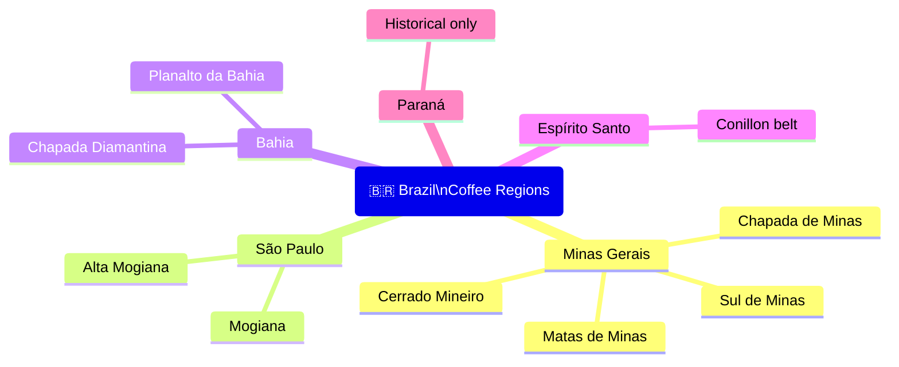
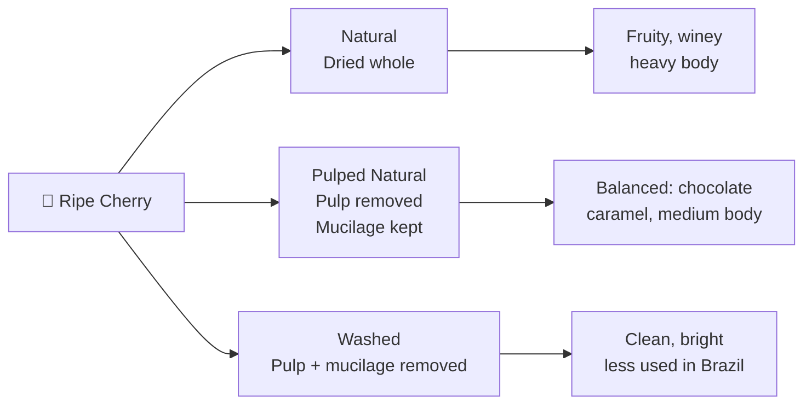

# Brazil — Coffee Origin Profile

## 📍 Parent Topics
- [Bean Intelligence](../INDEX.md)
- [Species Overview](../species-overview.md)

---

## Country Overview

| Parameter | Data |
|-----------|------|
| Production Rank | **#1 globally** |
| Annual Production | ~55–65 million 60kg bags |
| Primary Species | Arabica (~75%), Robusta/Conillon (~25%) |
| Primary Processing | Natural, Pulped Natural (Honey), Washed |
| Altitude Range | 600–1,400 masl |
| Harvest Season | May–September (main) |
| Regulatory Body | MAPA + BSCA (specialty) |
| Dominant Use | Espresso blends, commodity, growing specialty |

> 🌍 Brazil produces roughly **one-third of all coffee on Earth**. Its flat terrain enables mechanised harvesting at massive scale — unlike most other origins where hand-picking is required.

---

## Regional Map



---

## Region Profiles

### 1. Sul de Minas (South of Minas Gerais)

| Attribute | Detail |
|-----------|--------|
| Altitude | 700–1,300 masl |
| Rainfall | 1,200–1,800mm/year |
| Processing | Natural, Pulped Natural, some Washed |
| Main varietals | Bourbon, Catuai, Mundo Novo, Acaiá |
| Cup profile | Chocolate, caramel, hazelnuts, mild citrus, clean |
| Body | Medium–full |
| Acidity | Low–medium, soft |
| Notes | Brazil's largest specialty sub-region; smooth, crowd-pleasing profile |

---

### 2. Cerrado Mineiro

| Attribute | Detail |
|-----------|--------|
| Altitude | 800–1,200 masl |
| Climate | Distinct wet and dry seasons → excellent cherry development |
| Processing | Natural, Pulped Natural |
| Main varietals | Catuai, Bourbon, Acaiá |
| Cup profile | Dark chocolate, caramel, full body, low acidity |
| Body | Heavy, syrupy |
| Acidity | Very low |
| Notes | First Brazilian region with a Designation of Origin (DO). Concentrated flavours from distinct seasons. |

---

### 3. Chapada Diamantina (Bahia)

| Attribute | Detail |
|-----------|--------|
| Altitude | 900–1,200 masl |
| Location | Bahia state; semi-arid highlands |
| Processing | Natural, Pulped Natural |
| Cup profile | Tropical fruit, caramel, chocolate, bright for Brazil |
| Notes | Emerging specialty region; higher acidity than Cerrado; surprising complexity |

---

### 4. Mogiana (São Paulo)

| Attribute | Detail |
|-----------|--------|
| Altitude | 900–1,200 masl |
| Processing | Natural, Pulped Natural |
| Cup profile | Balanced, nutty, caramel, mild fruit |
| Notes | Classic Brazilian profile; reliable quality |

---

### 5. Espírito Santo

| Attribute | Detail |
|-----------|--------|
| Primary species | **Robusta (Conillon)** dominant |
| Notes | Brazil's main Robusta region; supplies commodity blends and espresso crema blends |

---

## Key Varietals

| Varietal | Characteristics | Cup Notes |
|---------|----------------|-----------|
| **Bourbon** | Classic quality; lower yield; susceptible to leaf rust | Fruity, sweet, complex, brown sugar |
| **Yellow Bourbon** | Sweeter cherry; distinct yellow fruit | Sweetness-forward, tropical notes |
| **Catuai** (Red & Yellow) | High productivity; compact plant | Balanced, mild, nutty, caramel |
| **Mundo Novo** | Large tree; high yield; excellent cup | Full body, chocolate, mild acidity |
| **Acaiá** | Mutation of Mundo Novo; excellent cup | Rich, chocolatey, full |
| **Icatu** | Robusta × Bourbon hybrid; pest resistant | Bold, rustic, earthy |
| **Topázio** | Catuai × Mundo Novo | Clean, balanced, commercial |

---

## Processing Methods — Brazil's Contribution

Brazil **pioneered pulped natural/honey processing** in the 1990s, now used worldwide:



| Method | Cup Impact | Brazil Usage |
|--------|-----------|-------------|
| **Natural** | Wine, berry, heavy body, ferment risk | Very common |
| **Pulped Natural** | Chocolate, caramel, clean, balanced | Most common in specialty |
| **Washed** | Clean, bright, less characteristic | Less common |
| **Anaerobic** | Intense, fruit-forward, novel | Growing in specialty |

---

## Flavor Profile Map

```
Brazilian Specialty Cup:

  FRUITY ────────── SWEET ────────── NUTTY/COCOA
    │                  │                  │
  (natural only)   Caramel            Hazelnut
  Berry notes      Brown sugar        Dark chocolate
  Wine-like        Honey              Bittersweet cocoa

  BODY: Heavy to very heavy
  ACIDITY: Low to very low (soft, non-aggressive)
  AFTERTASTE: Long, chocolatey, clean
```

---

## Roast Guidance

| Roast | Recommended | Cup Result |
|-------|------------|-----------|
| Light | Natural lots with fruit complexity | Reveals berry, caramel, delicate fruit |
| Medium-Light | Pulped Natural specialty | Classic Brazil: chocolate, caramel, nougat |
| **Medium** | Most Brazilian coffees | **Optimal** — chocolate, nuts, sweetness balanced |
| Medium-Dark | Blend base for espresso | Bittersweet chocolate, crema body |
| Dark | Commodity blends only | Roast dominates; origin lost |

> ☕ **Brazil as espresso base:** Brazil is the most popular single-origin espresso or blend base globally. Medium roast brings out chocolate and caramel sweetness, with low acidity that works with milk.

---

## Buying Guide

| Tier | Description | Price Range |
|------|-------------|-------------|
| Commodity | Exchange grade; anonymous origin | C-market |
| Premium | Screen-sorted, single region | C-market + 10–30% |
| Specialty (BSCA) | Q-graded ≥ 80; single farm/lot | $3–8/lb |
| CoE (Cup of Excellence) | Auctioned; score 87+ | $15–100+/lb |
| Micro-lot | Named farm, varietal, process | $5–20+/lb |

---

## 🔗 Related Topics
- [Species Overview](../species-overview.md)
- [Arabica Profile](../profiles/arabica.md)
- [Roasting Science](../../roasting/roast-science.md)
- [Espresso Extraction](../../espresso/extraction-theory.md)
- [Colombia Origin](colombia.md)
