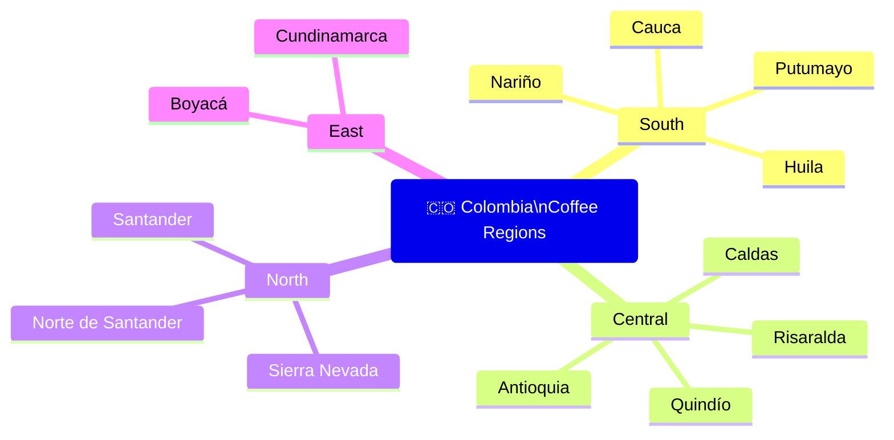

# Colombia — Coffee Origin Profile

## 📍 Parent Topics
- [Bean Intelligence](../INDEX.md)
- [Species Overview](../species-overview.md)

---

## Country Overview

| Parameter | Data |
|-----------|------|
| Production Rank | **#3 globally** |
| Annual Production | ~12–14 million 60kg bags |
| Primary Species | 100% Arabica |
| Primary Processing | Washed (dominant), some Natural/Honey |
| Altitude Range | 1,200–2,300 masl |
| Harvest Season | Main: October–February; Mitaca (fly crop): April–June |
| Regulatory Body | FNC (Federación Nacional de Cafeteros) |
| Famous Branding | "Juan Valdez" brand; "100% Colombian coffee" |

> 🌿 Colombia is unique in having **two harvest seasons per year** (main + mitaca) due to the country straddling the equator — allowing year-round Colombian coffee availability globally.

---

## Why Colombia Is Special

1. **Entirely Arabica** — no Robusta production
2. **High altitude across all regions** — consistently complex, clean coffees
3. **Washed processing tradition** — terroir-forward, bright, clean cups
4. **FNC infrastructure** — extension services, research, quality assurance reaching 500,000+ small farms
5. **Biodiversity** — varied micro-climates across Andes create distinct regional profiles

---

## Regional Map



---

## Region Profiles

### 1. Huila

| Attribute | Detail |
|-----------|--------|
| Altitude | 1,500–2,100 masl |
| Location | South-west Colombia; Magdalena River basin |
| Processing | Washed (dominant), Natural growing |
| Varietals | Caturra, Castillo, Colombia hybrid |
| Cup profile | Red fruit, citrus, floral, medium-high brightness |
| Body | Medium |
| Acidity | Bright, clean, citric/malic |
| Notes | Colombia's #1 specialty region by reputation; CoE-winning lots frequently from Huila |

---

### 2. Nariño

| Attribute | Detail |
|-----------|--------|
| Altitude | **1,700–2,300 masl** (among the highest in Colombia) |
| Location | Far south; border with Ecuador |
| Climate | Cool and wet; slower cherry maturation |
| Processing | Washed |
| Cup profile | Citrus, stone fruit, tea-like, crisp acidity, exceptional clarity |
| Body | Light–medium |
| Acidity | Very high, clean |
| Notes | Among the finest Colombian coffees; altitude drives extreme complexity |

---

### 3. Cauca

| Attribute | Detail |
|-----------|--------|
| Altitude | 1,700–2,100 masl |
| Processing | Washed |
| Cup profile | Clean, sweet, citrus, some tropical fruit, well-balanced |
| Body | Medium |
| Notes | Growing specialty profile; clean and consistent |

---

### 4. Antioquia

| Attribute | Detail |
|-----------|--------|
| Altitude | 1,200–2,000 masl |
| Location | Northwest; Medellín department |
| Processing | Washed |
| Cup profile | Chocolate, mild fruit, balanced, approachable |
| Body | Medium–full |
| Acidity | Medium, soft |
| Notes | Colombia's largest producing department; Medellín historically the coffee export hub |

---

### 5. Sierra Nevada de Santa Marta

| Attribute | Detail |
|-----------|--------|
| Altitude | 1,000–2,000 masl |
| Location | Caribbean coast; isolated mountain range |
| Processing | Washed |
| Cup profile | Chocolate, mild fruit, herbal, balanced |
| Notes | Grown by indigenous communities; certified organic and fair trade; unique terroir |

---

### 6. Santander

| Attribute | Detail |
|-----------|--------|
| Altitude | 1,000–1,800 masl |
| Cup profile | Mild, nutty, balanced, chocolate |
| Notes | Historically known for lower acidity; good for espresso blending |

---

## Key Varietals

| Varietal | Origin | Key Traits | Cup Notes |
|---------|--------|-----------|-----------|
| **Caturra** | Brazil (Bourbon mutation) | Compact; bright; primary Colombian varietal | Citrus, clean, medium body |
| **Castillo** | Colombia (FNC, 2005) | Rust-resistant; reliable; clean cup | Balanced, mild fruit, clean |
| **Colombia** | FNC hybrid (Timor × Caturra) | Rust resistant; older | Clean but less complex than Caturra |
| **Tabi** | FNC (2002); Typica × Bourbon × Timor | Tall; excellent cup; some complexity | Sweet, fruity, Bourbon-like quality |
| **Bourbon** | Classic; rare in Colombia | Low yield; high quality | Fruity, sweet, complex |
| **Pink Bourbon** | Natural mutation; Huila specialty | Extraordinary cup when well-processed | Floral, fruit, complex |
| **Gesha** | Ethiopian origin; grown in Colombia | Exceptional complexity; very expensive | Jasmine, tropical fruit, tea-like |

---

## FNC — Federación Nacional de Cafeteros

The FNC is one of the most powerful agricultural cooperatives in the world:

| Role | Activities |
|------|-----------|
| **Research** | Cenicafé (coffee research centre) — develops new varietals, agronomic practices |
| **Marketing** | Juan Valdez brand; "100% Colombian" designation |
| **Price support** | Sets internal purchase price; protects farmers from extreme C-market drops |
| **Infrastructure** | Rural roads, schools, healthcare funded by FNC premium |
| **Extension services** | Technical support to 500,000+ small farmers |
| **Quality standards** | Green coffee grading; export certification |

---

## Processing Evolution

Colombia's tradition is overwhelmingly **washed**, but the specialty scene is driving diversification:

| Processing | Cup Impact | Adoption |
|-----------|-----------|---------|
| **Washed** | Clean, bright, terroir-forward | 90%+ of production |
| **Natural** | Fruity, heavy, wine-like | Growing in specialty |
| **Honey** | Balanced, sweet | Niche specialty |
| **Anaerobic washed** | Intense, complex, novel | Competition and specialty micro-lots |
| **Lactic fermentation** | Creamy, yogurt-like | Experimental |

---

## Flavour Profile Map

```
Colombian Specialty (washed, typical):

  HIGH ACIDITY ──────────── MEDIUM BODY ──────────── CLEAN FINISH
       │                         │                        │
  Citric (Nariño)           Medium-full             Very clean cup
  Malic (Huila)             (Antioquia)             (FNC washed)
  Complex acids             Round body              No defects

  FLAVOURS:
  Red apple · Cherry · Red grape · Caramel · Mild chocolate
  Citrus zest (orange, lemon) · Floral (Huila, Nariño micro-lots)
```

---

## Roast Guidance

| Roast | Best For | Cup Result |
|-------|---------|-----------|
| **Light** | Huila, Nariño micro-lots, Pink Bourbon | Florals, red fruit, complex acidity |
| **Medium-Light** | General specialty Caturra/Castillo | Citrus, caramel, clean balance |
| **Medium** | Espresso and café service | Chocolate, caramel, balanced sweetness |
| Medium-Dark | Blending base | Reduced acidity; mild chocolate |

---

## 🔗 Related Topics
- [Species Overview](../species-overview.md)
- [Arabica Profile](../profiles/arabica.md)
- [Ethiopia Origin](ethiopia.md)
- [Brazil Origin](brazil.md)
- [Cupping Protocol](../../sensory-cupping/cupping-protocol.md)
