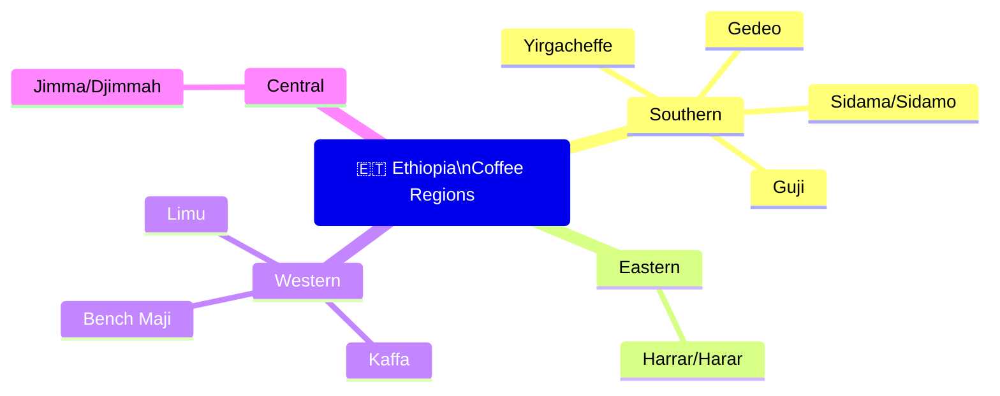

# Ethiopia — Coffee Origin Profile

## 📍 Parent Topics
- [Bean Intelligence](../INDEX.md)
- [Species Overview](../species-overview.md)

---

## Country Overview

| Parameter | Data |
|-----------|------|
| Production Rank | 5th globally (2023) |
| Annual Production | ~450,000–500,000 metric tons |
| Key Export Grades | Grade 1 (specialty), Grade 2, Grade 4 |
| Primary Species | *Coffea arabica* (heirloom varieties) |
| Altitude Range | 1,400–2,300 masl |
| Harvest Season | October–January (main); Sept in some regions |
| Processing | Washed and Natural |
| Coffee Importance | ~25–30% of national export revenue |

> 🌱 Ethiopia has **more genetic diversity** in wild coffee than any other country on Earth. Thousands of distinct heirloom varietals exist — many unnamed and uncharacterized.

---

## Regional Map Overview



---

## Region Profiles

### 1. Yirgacheffe

| Attribute | Detail |
|-----------|--------|
| Zone | SNNPR (Southern Nations) |
| Altitude (masl) | 1,700–2,200 |
| Processing | Primarily washed; some natural |
| Cup Profile | Jasmine, bergamot, lemon, peach, blackcurrant tea |
| Acidity | Bright, citric |
| Body | Light–medium, tea-like |
| Most Famous For | Floral aromatics unlike any other origin |
| Varietals | Heirloom Typica-related |

**Notes:** Yirgacheffe (spelled Yirgacheffe, Yirgalem, or Gedeb in subdistricts) is considered by many Q Graders to produce the most complex and distinctive coffees on Earth. The washed preparation emphasizes the terroir-driven florals and fruit.

---

### 2. Sidama / Sidamo

| Attribute | Detail |
|-----------|--------|
| Altitude (masl) | 1,400–2,200 |
| Processing | Washed (dominant) + Natural |
| Cup Profile | Blueberry, lemon, peach, brown spice, florals |
| Acidity | Medium–high, clean |
| Body | Medium |
| Notes | Often blended/sold as "Sidama"; now has own origin designation (2020) |

---

### 3. Guji

| Attribute | Detail |
|-----------|--------|
| Altitude (masl) | 1,800–2,200 |
| Processing | Washed and Natural |
| Cup Profile | Stone fruit, tropical fruit, jasmine, wine-like (natural) |
| Acidity | Complex, citric to malic |
| Notes | Emerging as distinct from Sidama; increasingly sought for natural processing |

---

### 4. Harrar / Harar

| Attribute | Detail |
|-----------|--------|
| Location | Eastern Ethiopia, Harari Region |
| Altitude (masl) | 1,400–2,000 |
| Processing | **Natural (dry)** — traditional |
| Cup Profile | Wild berry, blueberry, wine, chocolate, ferment |
| Acidity | Low–medium |
| Body | Heavy, syrupy |
| Notes | One of the oldest continuous coffee-growing areas; grown by smallholder farmers on small plots; distinct "mocha-like" character |

---

### 5. Limu

| Attribute | Detail |
|-----------|--------|
| Location | Western Ethiopia, Oromia Region |
| Altitude (masl) | 1,400–2,000 |
| Processing | Washed |
| Cup Profile | Mild, balanced, spice, fruit, wine |
| Body | Medium–full |
| Notes | Lower profile than Yirgacheffe/Harrar but high quality; used in blends |

---

### 6. Kaffa (Birthplace of Coffee)

| Attribute | Detail |
|-----------|--------|
| Location | Southwest Ethiopia |
| Altitude (masl) | 1,500–2,000 |
| Processing | Mostly natural / semi-washed |
| Cup Profile | Forest fruit, herbal, mild spice |
| Notes | Wild coffee still harvested from forest; biosphere reserve; UNESCO recognition |

---

## Processing Traditions in Ethiopia

| Method | Regions | Cup Impact |
|--------|---------|-----------|
| **Washed (Wet)** | Yirgacheffe, Sidama, Limu | Clean, bright, floral, terroir-forward |
| **Natural (Dry)** | Harrar, some Guji, Sidama | Fruity, wine-like, heavy, fermented |
| **Anaerobic** | Select specialty mills | Intense, novel flavor |

---

## Flavor Wheel Mapping — Ethiopia

```
Washed Yirgacheffe:
  Floral → Jasmine → ✅
  Floral → Rose → ✅
  Fruity → Citrus → Lemon → ✅
  Fruity → Dried Fruit → Apricot → ✅

Natural Harrar:
  Fruity → Berry → Blueberry → ✅
  Fruity → Berry → Strawberry → ✅
  Sweet → Vanilla → ✅
  Roasted → Tobacco → (at darker roast)
```

---

## Buying & Grading

Ethiopian coffees are traded through the **Ethiopia Commodity Exchange (ECX)** for lower grades, and direct-to-roaster for top specialty. Grade 1 requires:
- Zero primary defects
- Max 5 secondary defects per 350g sample
- Cup score ≥ 80 pts

**Common lot designations:** KOCHERE, CHELBA, BANKO GOTITI, KONGA (Yirgacheffe subdistricts); KERCHA, SHAKISO (Guji subdistricts)

---

## 🔗 Related Topics
- [Species Overview](../species-overview.md)
- [Arabica Profile](../profiles/arabica.md)
- [Sensory & Cupping](../../sensory-cupping/cupping-protocol.md)
- [History of Coffee](../../coffee-fundamentals/history-of-coffee.md)
- [Specialty Coffee Movement](../../coffee-fundamentals/specialty-coffee-movement.md)
