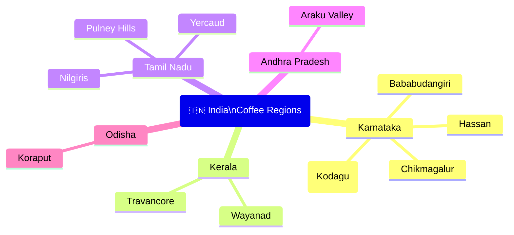

# India — Coffee Origin Profile

## 📍 Parent Topics
- [Bean Intelligence](../INDEX.md)
- [Species Overview](../species-overview.md)

---

## Country Overview

| Parameter | Data |
|-----------|------|
| Production Rank | 6th–7th globally |
| Annual Production | ~5–6 million 60kg bags |
| Primary Species | Robusta (~70%), Arabica (~30%) |
| Altitude Range | 600–1,900 masl |
| Harvest Season | November–February |
| Processing | Washed, Natural, Wet-hulled (Monsooned) |
| Regulatory Body | Coffee Board of India |
| Primary Growing States | Karnataka (65%), Kerala (25%), Tamil Nadu (8%) |

> ☕ **Historical note:** Coffee arrived in India in the 17th century when Sufi saint Baba Budan smuggled 7 coffee seeds from Yemen to the Bababudangiri Hills in Karnataka — now considered sacred ground in Indian coffee history.

---

## Regional Map



---

## Region Profiles

### 1. Coorg / Kodagu (Karnataka)

| Attribute | Detail |
|-----------|--------|
| Altitude | 900–1,700 masl |
| Primary species | Arabica + Robusta |
| Processing | Washed (Arabica); some Natural |
| Cup profile | Spice, chocolate, earthy, medium body, clean finish |
| Body | Medium–full |
| Acidity | Low–medium |
| Notes | India's largest coffee district; shade-grown under pepper, orange, cardamom trees — intercropping adds complexity |

---

### 2. Chikmagalur (Karnataka)

| Attribute | Detail |
|-----------|--------|
| Altitude | 900–1,900 masl |
| Primary species | Arabica |
| Processing | Washed |
| Cup profile | Fruity, mild acidity, chocolatey, balanced |
| Notes | Among India's best Arabica; grown on misty Western Ghats slopes |

---

### 3. Bababudangiri (Karnataka)

| Attribute | Detail |
|-----------|--------|
| Altitude | 1,000–1,800 masl |
| Historical significance | Baba Budan's original planting site (~1670); first coffee in India |
| Cup profile | Balanced, mild spice, clean |
| Notes | Revered origin; small production; used mostly in premium blends |

---

### 4. Wayanad (Kerala)

| Attribute | Detail |
|-----------|--------|
| Altitude | 600–1,200 masl |
| Primary species | Robusta (dominant) + some Arabica |
| Processing | Washed |
| Cup profile | Earthy, woody, mild chocolate, full body |
| Notes | Kerala's primary coffee region; much of production goes to commodity blending |

---

### 5. Nilgiris (Tamil Nadu)

| Attribute | Detail |
|-----------|--------|
| Altitude | 1,000–1,700 masl |
| Primary species | Arabica |
| Processing | Washed |
| Cup profile | Mild, floral, light acidity, clean |
| Notes | High rainfall; delicate cup; some of India's more elegant Arabica |

---

### 6. Yercaud (Tamil Nadu)

| Attribute | Detail |
|-----------|--------|
| Altitude | 1,000–1,500 masl |
| Primary species | Arabica |
| Cup profile | Mild, balanced, nutty, chocolatey |
| Notes | Smaller production; growing specialty interest |

---

### 7. Araku Valley (Andhra Pradesh)

| Attribute | Detail |
|-----------|--------|
| Altitude | 900–1,400 masl |
| Primary species | Arabica |
| Processing | Washed and Natural |
| Cup profile | Chocolate, mild spice, clean sweetness, low acidity |
| Special features | **Tribal-grown**: Indigenous Adivasi communities; **certified organic**; internationally recognised |
| Awards | Paris-based Araku brand won international specialty awards |
| Notes | One of India's most exciting specialty origins; emerging on world stage |

---

## Monsooned Malabar — India's Unique Process

India's most distinctive and globally known coffee processing technique:

### What Is Monsooning?

| Parameter | Detail |
|-----------|--------|
| Origin | Malabar Coast (Karnataka/Kerala) |
| History | Accidental discovery: colonial-era beans shipped to Europe absorbed monsoon moisture during 3–6 month sailing journeys; Europeans loved the unusual flavour |
| Modern process | Green beans spread in open warehouses exposed to south-west monsoon winds for **12–16 weeks** |
| Transformation | Beans swell to ~2× normal size; lose almost all acidity; colour turns pale gold/yellow |

### Sensory Profile

| Attribute | Description |
|-----------|-------------|
| Body | **Extremely heavy** — some of the heaviest body of any coffee globally |
| Acidity | **Near-zero** — almost completely neutralised by moisture absorption |
| Flavours | Earthy, woody, tobacco, musty, spice, mild chocolate, grain |
| Aroma | Distinctive musty-spice character |
| Aftertaste | Long, earthy, lingering |

### Commercial Use

| Use | Reason |
|-----|--------|
| **Italian espresso blends** | Adds body, crema, and lower acidity; balances bright Arabica in blends |
| **South Indian filter coffee** | Traditional use in dark roast blends (80% Robusta + Monsooned Arabica + sometimes chicory) |
| **Specialty exploration** | Growing interest from Western specialty buyers as a unique terroir expression |

---

## South Indian Filter Coffee Culture

A cherished national tradition distinct from specialty espresso culture:

```
Traditional South Indian Filter Coffee Setup:
┌─────────────────────────────────────────┐
│  Classic Blend:                         │
│  70–80% Robusta (Wayanad/Coorg)        │
│  20–30% Arabica (Karnataka/Chicory)    │
│                                         │
│  Brewing Tool: Metal filter (percolator)│
│  2-piece: upper chamber (grounds)      │
│            lower chamber (decoction)   │
│                                         │
│  Serving: Tumbler + Davara (wide bowl) │
│  Style: Poured between vessels to       │
│         aerate and cool → frothy       │
│  Temperature: Very hot; served milky   │
│  Sweetness: Often with sugar            │
└─────────────────────────────────────────┘
```

---

## Indian Specialty Coffee — Emerging Scene

India's specialty movement is growing rapidly:

| Development | Detail |
|------------|--------|
| **Q Grader training** | Expanding through ICS (Indian Coffee Specialists) |
| **Araku international wins** | Raises global profile |
| **Farm-direct relationships** | International roasters buying direct from Karnataka farms |
| **Processing innovation** | Anaerobic, honey, and natural processing at select estates |
| **Micro-lot production** | Named estates offering traceable lots: Reverence Estate (Coorg), Blue Tokai partnerships |
| **Domestic specialty market** | Booming in Bangalore, Mumbai, Delhi; Percentage Coffee, Third Wave Coffee, Naivo, Blue Tokai |

---

## Key Varietals in India

| Varietal | Region | Notes |
|---------|--------|-------|
| **S795** | Karnataka dominant | Liberica hybrid × Kent; India's most planted Arabica; spicy, balanced |
| **Cauvery (Catimor)** | Karnataka | Rust-resistant; some quality compromise; clean |
| **Selection 9** | Karnataka | High quality; good disease resistance |
| **Kent** | Legacy variety | Original Indian Arabica; excellent cup but disease susceptible |
| **Robusta** | Kerala, Karnataka | High yield; body; blending value |

---

## Flavour Map

```
Indian Arabica (Washed):
  SPICE ─── CHOCOLATE ─── MILD ACIDITY ─── CLEAN
  Cardamom   Dark choc    Mild citrus      Low defects
  Pepper     Cocoa        Soft malic       Balanced

Monsooned Malabar:
  EARTH ─── TOBACCO ─── WOOD ─── MUSTY ─── NEAR-ZERO ACID
  Heavy, syrupy body; unique character

Araku Valley (Specialty):
  CHOCOLATE ─── MILD SPICE ─── CLEAN SWEETNESS
  Organic; tribal grown; delicate for India
```

---

## 🔗 Related Topics
- [Species Overview](../species-overview.md)
- [Arabica Profile](../profiles/arabica.md)
- [Robusta Profile](../profiles/robusta.md)
- [Ethiopia Origin](ethiopia.md)
- [Colombia Origin](colombia.md)
- [Sensory & Cupping](../../sensory-cupping/cupping-protocol.md)
