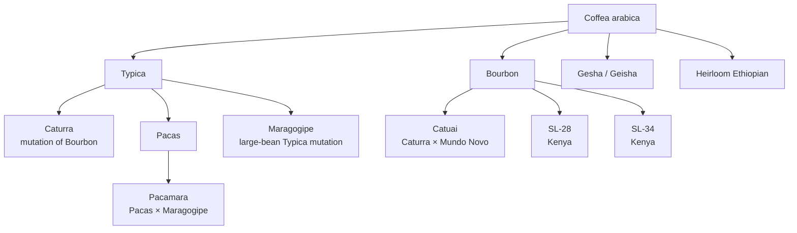
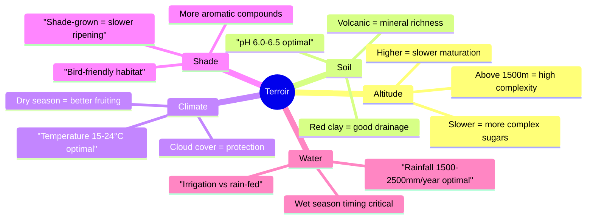

# Coffee Species & Varietals Overview

## 📍 Parent Topics
- [Bean Intelligence](../INDEX.md)
- [Taxonomy](../TAXONOMY.xml)

---

## Species Comparison Matrix

| Attribute | *C. arabica* | *C. canephora* (Robusta) | *C. liberica* | *C. liberica* var. *dewevrei* (Excelsa) |
|-----------|-------------|------------------------|--------------|----------------------------------------|
| Chromosomes | 44 (tetraploid) | 22 (diploid) | 22 (diploid) | 22 (diploid) |
| Caffeine (%) | 1.2–1.5 | 2.2–2.7 | ~1.2 | ~1.0 |
| Global share | ~60% | ~40% | <1% | <1% |
| Altitude (masl) | 600–2200 | 0–800 | 0–500 | 0–500 |
| Disease resistance | Low (CLR susceptible) | High | High | High |
| Self-pollinating | Yes | No (cross-pollination) | No | No |
| Flavor complexity | Very high | Lower | Unusual | Complex |
| Body | Medium–full | Heavy, harsh | Heavy | Medium |
| Acidity | Medium–high, complex | Low | Low | Medium |
| Crema production | Moderate | Excellent (more lipids) | Moderate | — |

> 🔬 *Arabica is the result of a natural hybridization event between C. canephora and C. eugenioides, giving it a doubled chromosome count and unique flavor complexity.*

---

## *Coffea arabica* — Species Deep Dive

### Key Varietals

| Varietal | Origin | Flavor Notes | Key Regions |
|---------|--------|-------------|-------------|
| **Typica** | Yemen → Java → Americas | Clean, sweet, delicate, nutty | Jamaica, Peru, Sumatra |
| **Bourbon** | Bourbon Island (Réunion) | Complex, fruity, sweet, full | Rwanda, Burundi, El Salvador |
| **Gesha/Geisha** | Ethiopia (Gori Gesha forest) | Jasmine, bergamot, stone fruit, tea-like | Panama, Ethiopia, Colombia |
| **SL-28** | Kenya (Scott Labs, 1931) | Blackcurrant, citrus, tomato, complex | Kenya |
| **SL-34** | Kenya | Blackcurrant, full body, medium acidity | Kenya |
| **Caturra** | Brazil (Bourbon mutation) | Citrus, bright, medium body | Colombia, C. America |
| **Catuai** | Brazil | Balanced, nutty, mild acidity | Brazil, Honduras |
| **Pacamara** | El Salvador | Floral, complex, large bean | El Salvador, Guatemala |
| **Maragogipe** | Brazil | Very mild, complex, low productivity | Nicaragua, Mexico |
| **Heirloom Ethiopian** | Ethiopia (>10,000 wild varieties) | Enormous range: berry to floral | Ethiopia |
| **Castillo** | Colombia (hybrid) | Clean, balanced, disease resistant | Colombia |
| **H3** | Kenya (Ruiru hybrid) | High yield, lower complexity | Kenya |

---

## *Coffea canephora* (Robusta) — Species Deep Dive

### Why Robusta Matters

- **Higher caffeine** = natural pest resistance
- **More lipids** = better crema in espresso blends
- **Cheaper to grow** = lower altitude, less care needed
- **Boldness in blends** = Italian espresso tradition uses 10–30% Robusta

### Flavor Characteristics
- Earthy, woody, rubbery, grainy
- Can exhibit chocolate and nut notes when high-grade ("Fine Robusta")
- Much lower in perceived acidity
- Vietnamese, Italian, Indonesian blends rely heavily on Robusta

### Fine Robusta / "Specialty Robusta"
> An emerging category: high-altitude Robusta (Uganda, India, Vietnam highlands) cupping above 80 points on adapted scales. Still rare but growing.

---

## *Coffea liberica* — Species Profile

- **Large, irregular beans** (twice the size of Arabica)
- Grown primarily in **West Africa and Southeast Asia** (Philippines: Kapeng Barako)
- Flavor: **smoky, woody, floral with a unique musty quality**
- Used locally; rare in specialty markets
- High drought resistance makes it a climate-adaptation candidate

---

## *Coffea liberica* var. *dewevrei* (Excelsa) — Species Profile

- Previously classified separately; now a variety of Liberica
- Grown in **Southeast Asia** (Philippines, Vietnam)
- Flavor: **tart, fruity, dark chocolate, wine-like**
- Used in **blends** for complexity
- Under-researched but gaining interest

---

## Terroir: Environmental Factors Affecting Bean Character

### Altitude Effect on Cup Quality

| Altitude (masl) | Typical Cup Quality |
|----------------|---------------------|
| < 600 | Lower complexity; Robusta territory |
| 600–900 | Mild, low acidity; commercial grade |
| 900–1200 | Moderate complexity; balanced |
| 1200–1500 | Higher complexity; bright acidity |
| 1500–2000 | Very high complexity; floral, fruity |
| > 2000 | Exceptional; concentrated, delicate |

---

## Bean Physical Characteristics

| Property | Measurement | Significance |
|---------|-------------|-------------|
| **Screen size** | 1/64 inch increments (10–20) | Uniformity, bean development |
| **Density** | g/mL (0.6–0.8 typical) | Higher = better development, harder |
| **Moisture** | 10–12% optimal (green) | >13% = mold risk; <9% = brittle |
| **Water activity** | < 0.70 Aw | Food safety threshold |
| **Color** | Bluish-green ideal | Yellowing = age/oxidation |

---

## 🔗 Related Topics
- [Arabica Deep Dive](profiles/arabica.md)
- [Robusta Deep Dive](profiles/robusta.md)
- [Ethiopia Region](regions/ethiopia.md)
- [Brazil Region](regions/brazil.md)
- [Roasting Science](../roasting/roast-science.md)
- [Extraction Theory](../espresso/extraction-theory.md)
