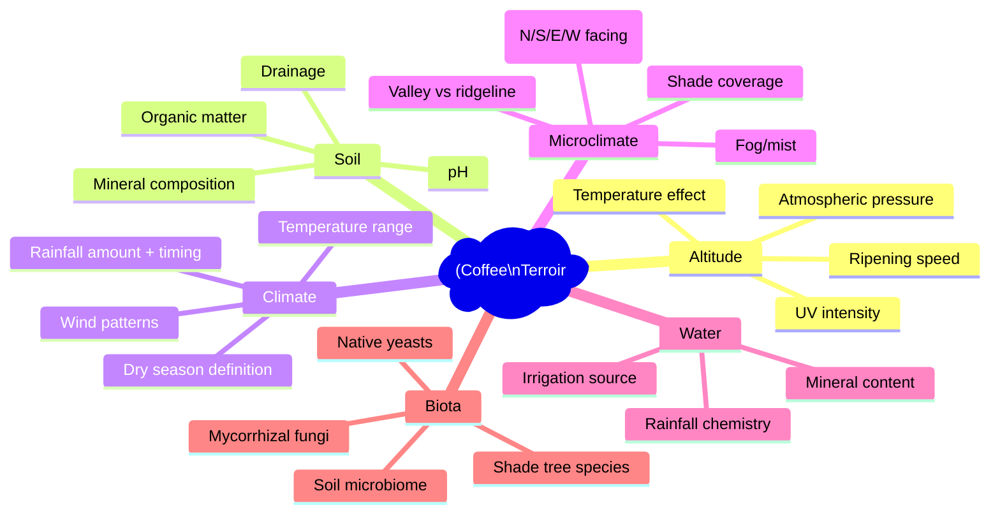

# Terroir Science in Coffee

## 📍 Parent Topics
- [Bean Intelligence](../INDEX.md)
- [Species Overview](../species-overview.md)

---

## What Is Coffee Terroir?

Borrowed from viticulture (wine), **terroir** describes the totality of environmental factors — altitude, soil, climate, microclimate, water, shade — that give a coffee its unique character distinct from any other origin.



---

## 1. Altitude — The Primary Terroir Driver

Altitude is the single most influential terroir variable for cup quality:

### The Altitude-Quality Relationship

```
Bean complexity vs altitude:

High complexity ─ │                              ●●●●
                  │                          ●●●●
                  │                      ●●●●
                  │                  ●●●●
                  │              ●●●●
                  │          ●●●●
Low complexity ─  │      ●●●●
                  └──────────────────────────────────
                  600  900  1200  1500  1800  2200 masl
```

### Why Altitude Improves Quality: The Mechanism

**Temperature effect:**

| Altitude Increase | Temperature Drop | Cherry Ripening | Sugar Development |
|-----------------|-----------------|-----------------|-------------------|
| +300 masl | ~2°C cooler | Slower (30–50% longer) | More complex sugars |
| +600 masl | ~4°C cooler | Much slower | Maximum complexity |
| > 2,000 masl | < 15°C | Very slow | Exceptional complexity |

**The slow ripening mechanism:**
1. Lower temperature → slower photosynthesis → slower sugar production
2. Cherry stays on tree longer (up to 12 months vs 6–8 months at low altitude)
3. More time for complex organic acid development
4. Higher density bean (harder, denser cell structure)
5. Lower moisture activity → more concentrated flavour compounds

**UV intensity:**
- Higher altitude = more UV exposure
- Higher UV → increased anthocyanin production in cherry skin (antioxidant response)
- These anthocyanins contribute to flavour precursors

---

### Altitude Classification Table

| Altitude (masl) | Temperature | Ripening | Complexity | Grade (Central America) |
|----------------|------------|---------|------------|------------------------|
| < 600 | > 25°C | Very fast | Low | Commercial/Standard |
| 600–900 | 22–25°C | Fast | Low-medium | Hard Bean (HB) |
| 900–1,200 | 19–22°C | Moderate | Medium | High Grown (HG) |
| 1,200–1,600 | 16–19°C | Slow | Medium-high | Strictly High Grown (SHG) |
| 1,600–2,000 | 13–16°C | Very slow | High | Specialty |
| > 2,000 | < 13°C | Extremely slow | Very high | Exceptional specialty |

---

## 2. Soil Science

Soil chemistry directly influences bean mineral content and tree health, which affect cup quality.

### Soil Type Comparison

| Soil Type | Description | Best For Coffee | Key Origins |
|-----------|-------------|----------------|-------------|
| **Volcanic (andisols)** | High mineral density; excellent drainage; pH 5.5–6.5 | Outstanding | Ethiopia, Guatemala (Antigua), Costa Rica, Colombia, Hawaii |
| **Red clay (ferralsols)** | Good drainage; iron/aluminium rich; stable | Very good | Kenya, Tanzania |
| **Alluvial** | River-deposited; high nutrient; variable | Good | Some Brazil lowlands |
| **Sandy loam** | Free-draining; may need nutrient supplementation | Moderate | Various |
| **Heavy clay** | Poor drainage; compaction risk; root restriction | Poor | Avoid |

### Key Soil Minerals for Coffee

| Mineral | Optimal Soil Level | Role |
|---------|------------------|------|
| **Nitrogen (N)** | 2,000–4,000 ppm | Protein synthesis; leaf growth; chlorophyll |
| **Phosphorus (P)** | 10–30 ppm | Root development; energy transfer; fruit quality |
| **Potassium (K)** | 200–400 ppm | Sugar transport; drought resistance; fruit development |
| **Calcium (Ca)** | 1,000–2,000 ppm | Cell wall strength; root growth |
| **Magnesium (Mg)** | 100–200 ppm | Chlorophyll synthesis; enzyme activation |
| **Zinc (Zn)** | 1–5 ppm | Enzyme function; IAA production |
| **pH** | 6.0–6.5 | Nutrient availability optimised |

**Volcanic soil advantage:** Volcanic basalt provides natural slow-release minerals (especially phosphorus and trace minerals) that feed complex flavour precursor development over decades.

---

## 3. Climate Variables

### Rainfall

| Pattern | Impact |
|---------|--------|
| **Total annual rainfall 1,500–2,500mm** | Optimal — adequate water without disease pressure |
| **Distinct dry season (3+ months)** | Critical for simultaneous flowering; uniform maturation |
| **Well-distributed wet season** | Even cherry development; prevents stress |
| **Too much rain (> 3,000mm)** | Disease (CLR, leaf spot); poor processing conditions; diluted flavour |
| **Too little rain (< 1,200mm)** | Water stress; poor cherry fill; small, dense beans |

### Temperature Range

| Condition | Impact |
|---------|--------|
| **Mean annual 15–24°C** | Optimal development |
| **Diurnal range > 10°C** | Excellent — cool nights slow respiration; more sugars retained |
| **Consistent cool** (> 1,500 masl) | Slow maturation → high complexity |
| **Frost** | Catastrophic — damages leaves and cherries |
| **Extreme heat (> 30°C)** | Stress; accelerated ripening; quality loss |

### Dry Season (Critical for Uniformity)

Arabica flowers are **triggered by the first rain** after a dry period:

```
Dry season → Trees water-stressed → First rains arrive → 
Synchronised mass flowering (all trees at once) → 
Uniform cherry development → Harvested within same 2–4 week window
```

Without a clear dry season (eg. some equatorial zones):
- Continuous, staggered flowering
- Cherries at all stages of ripeness simultaneously
- Selective picking required; harvest quality control harder

---

## 4. Shade and Microclimate

### Shade-Grown Coffee Science

| Variable | Under Shade | Full Sun |
|---------|------------|---------|
| Temperature | 2–5°C cooler | Higher ambient temp |
| Cherry ripening | Slower | Faster |
| Bean density | Higher | Lower |
| Cup complexity | Higher | Lower |
| Pest pressure | Lower (birds + shade balance) | Higher |
| Yield per tree | Lower | Higher |
| Water requirement | Lower | Higher |
| Longevity of trees | Longer | Shorter |

**Scientific basis (Muschler 2001):**  
Shade slows leaf and fruit temperature → extends maturation → higher sucrose and acid content in cherry → more complex flavour precursors for roasting.

### Microclimate Factors

| Factor | Impact |
|--------|--------|
| **Valley position** | Fog and mist → additional moisture; temperature buffering |
| **Ridgeline exposure** | More wind; potentially drier; more UV |
| **North vs south facing (N. hemisphere)** | North-facing = cooler; slower maturation; more complexity |
| **East-facing** | Morning sun; cooler afternoons; temperature buffering |
| **Near water bodies** | Higher humidity; temperature moderation |
| **Forest edge** | Beneficial biodiversity; natural pest control |

---

## 5. Soil Microbiome

Emerging research shows the soil microbiome significantly influences coffee quality:

**Mycorrhizal fungi:** Form symbiotic relationships with coffee roots:
- Expand effective root zone by up to 1,000×
- Improve mineral uptake (especially phosphorus)
- Improve drought resistance
- Transfer carbon through soil food web

**Bacterial communities:** Nitrogen-fixing bacteria (*Rhizobium*, *Azospirillum*) around shade tree roots feed the coffee system.

**Native yeasts:** Wild yeasts present on cherry skin during processing originate from the soil and surrounding environment → contribute to distinctive regional fermentation character.

> 🔬 *This is why "same varietal, different farm" produces different cups — the soil microbiome, distinct to each plot, influences everything from root chemistry to cherry fermentation.*

---

## 6. Varietals × Terroir Interaction

The same varietal expresses differently under different terroir:

| Varietal | Kenya | Ethiopia | Colombia |
|---------|-------|---------|---------|
| **Bourbon** | Blackcurrant, full body (Kenyan soil + SL genes) | — | Fruity, complex |
| **Caturra** | — | — | Citrus, clean, bright |
| **Heirloom** | — | Jasmine, bergamot, floral (Yirgacheffe terroir) | — |

**Key principle:** Terroir and genetics are **multiplicative** — excellent terroir with a mediocre varietal produces limited results; exceptional varietal on poor terroir also limited. The greatest cups combine both.

---

## 7. The Terroir Expression Spectrum

```
Terroir Expression in Cup Quality:

MOST TERROIR EXPRESSION
    ↑ Light roast — preserves origin character fully
    │ Washed process — removes fruit; bean = terroir
    │ High altitude — slow ripening = complex sugars
    │ Heirloom/unmodified varietal — full genetic expression
    │
    ↓ Dark roast — roast character overwrites terroir
LEAST TERROIR EXPRESSION
    ↓ Natural process — fermentation adds its own flavours
    ↓ Low altitude — less complex development
    ↓ Commercial hybrid varietal — bred for yield, not cup
```

---

## 8. Famous Terroir Expressions

| Cup Character | Terroir Explanation |
|--------------|---------------------|
| **Yirgacheffe jasmine + bergamot** | 1,800–2,200m altitude + volcanic soil + mist-valley microclimate + heirloom genetics |
| **Kenyan blackcurrant** | Red volcanic clay + SL-28 genetics + distinct dry season + intensive washed processing |
| **Panama Gesha floral** | 1,600–2,000m + volcanic Boquete soil + cool temps + Gesha genetics expressing fully |
| **Sumatra earthy/cedar** | Wet-hulled processing + volcanic ash soil + distinct "terroir" of processing method |
| **Brazil chocolate/caramel** | Low altitude (600–1,200m) + natural processing + fast ripening = Maillard-forward, low acid |

---

## 🔗 Related Topics
- [Species Overview](../species-overview.md)
- [Processing Methods](processing-methods.md)
- [Sustainability & Climate](../../coffee-fundamentals/sustainability-climate.md)
- [Ethiopia Origin](regions/ethiopia.md)
- [Kenya/Extended Origins](regions/extended-origins.md)
- [Roasting Science](../../roasting/roast-science.md)
