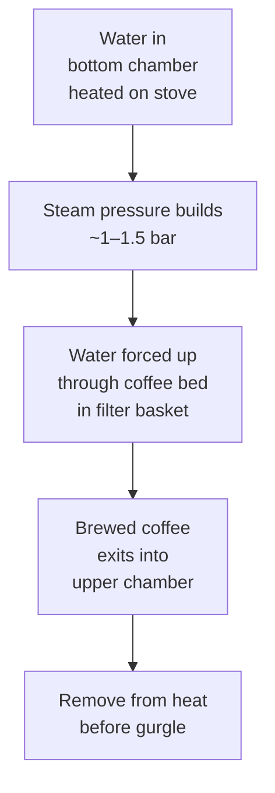
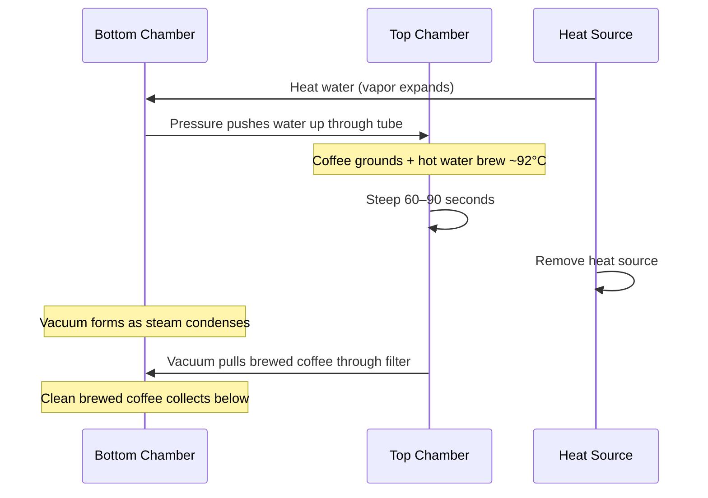

# AeroPress — Complete Brew Guide

## What Makes AeroPress Unique

The AeroPress combines **immersion brewing + gentle pressure** in a single compact device. It allows:
- Wide ratio flexibility (espresso-style concentrate to light filter)
- Temperature flexibility (65–96°C)
- Time flexibility (30s–3 min)
- Near-zero cleanup time
- Travel/camping use

> 💡 *The AeroPress has one of the most active competition communities in coffee — the **World AeroPress Championship (WAC)** draws hundreds of national champions annually, all with radically different recipes.*

---

## Standard Recipes

### Recipe 1: Classic (James Hoffman All-Rounder)

| Parameter | Value |
|---------|-------|
| Dose | 11g |
| Water | 200g |
| Ratio | 1:18 |
| Grind | Medium-fine |
| Temperature | 90°C |
| Total time | ~2:30 |

**Steps:**
1. Standard orientation; pre-wet paper filter; discard rinse water
2. Add 11g ground coffee
3. Pour 200g of 90°C water
4. Stir 10 times at top
5. Place filter cap immediately
6. At 2:00 — flip (if using standard orientation) or press slowly
7. Press over 30 seconds; stop at first hiss
8. Serve as-is or dilute to taste

---

### Recipe 2: Strong Concentrate (Espresso-style)

| Parameter | Value |
|---------|-------|
| Dose | 18g |
| Water | 80g |
| Ratio | 1:4.5 |
| Grind | Fine |
| Temperature | 93°C |
| Steep | 1:00 |

**Steps (Inverted method):**
1. Assemble inverted (plunger end down)
2. Add 18g fine-ground coffee
3. Pour 80g of 93°C water
4. Stir 10 times
5. Cap with wet filter; wait 60 seconds
6. Flip onto cup; press over 20–30 seconds
7. Dilute 1:1 for Americano-style or use as-is with milk

---

### Recipe 3: WAC-style (Competition Inspired)

| Parameter | Value |
|---------|-------|
| Dose | 20g |
| Water | 130g |
| Ratio | 1:6.5 |
| Grind | Medium-fine |
| Temperature | 85°C |
| Total time | ~1:45 |

**Steps (Inverted):**
1. Inverted orientation; 20g coffee
2. Pour 130g of 85°C water rapidly
3. Stir aggressively 30 times
4. Cap; steep 60 seconds
5. Flip; press over 20 seconds
6. Result: concentrated, complex; dilute or drink straight

---

## Standard vs Inverted

| Aspect | Standard | Inverted |
|--------|---------|---------|
| Drip during steep | Some drip through filter | None |
| Ease | Easier for beginners | Slightly trickier to flip |
| Consistency | Slight variation from drip | More control over steep |
| Best for | Light recipes, quick brews | Experimental; longer steeps |

---

## Filter Types

| Filter | Flavor Impact | Body |
|--------|--------------|------|
| **Paper (standard)** | Clean, no oils | Light–medium |
| **Paper (Aesir — ultra-thin)** | Maximum clarity, floral | Light |
| **Metal (Fellow Prismo, Able Disk)** | Oils pass through | Heavy; French Press-like |
| **Fellow Prismo valve** | No drip + metal filter | Heavy body, easy inverted |

---

## Troubleshooting

| Problem | Cause | Fix |
|---------|-------|-----|
| Bitter | Over-extracted / too fine | Coarser grind, lower temp, shorter steep |
| Sour/weak | Under-extracted | Finer grind, higher temp, longer steep |
| Gritty texture | Metal filter or very fine grind | Paper filter or coarser grind |
| Hard to press | Too fine | Coarser grind |
| Watery | Too little coffee | Increase dose or reduce water |

---

## 🔗 Related Topics
- [Brewing Science Overview](brewing-science-overview.md)
- [French Press](french-press.md)
- [Cold Brew](cold-brew.md)

---
---
title: Cold Brew — Complete Guide
category: Brewing Methods
subcategory: Cold Extraction
difficulty: Beginner
tags: [cold-brew, cold-extraction, concentrate, iced-coffee, RTD, smooth, low-acid]
---

# Cold Brew — Complete Guide

## Science of Cold Extraction

Cold brew uses **low-temperature water** (4–20°C) over a **long time** (12–24 hours) to extract coffee. The result is chemically different from hot-brewed coffee cooled:

| Property | Cold Brew | Iced Coffee (hot-brewed) |
|---------|-----------|--------------------------|
| Acids extracted | Fewer (citric, malic mostly retained) | Full spectrum |
| Bitter compounds | Fewer (less soluble at cold temp) | Standard |
| Volatiles | Fewer (low temp = less off-gassing) | More |
| Body | High (long contact time) | Variable |
| Perceived acidity | Low–very low | Higher |
| Sweetness | Perceived higher | Lower |
| Shelf life | 1–2 weeks refrigerated | Best same day |
| Caffeine | Similar to hot brew (slightly lower per volume) | Standard |

---

## Recipes

### Recipe 1: Concentrate (1:8)

| Parameter | Value |
|---------|-------|
| Dose | 100g coarse ground |
| Water | 800g cold or room temp |
| Steep | 18–24 hours at 4°C |
| Result | Concentrate (dilute 1:1–1:3 to serve) |

**Steps:**
1. Combine coffee and water in jar or pitcher
2. Stir to ensure all grounds wet
3. Cover and refrigerate 18–24 hours
4. Filter through: mesh strainer → paper filter or coffee filter
5. Store concentrate in sealed container up to 14 days

---

### Recipe 2: Ready-to-Drink (1:15)

| Parameter | Value |
|---------|-------|
| Dose | 75g coarse ground |
| Water | 1,125g cold water |
| Steep | 12–18 hours at 4°C |
| Result | Drink straight over ice |

---

### Recipe 3: Room Temperature "Toddy" Style

- Same as concentrate recipe but steeped at 18–22°C
- Time: 12–16 hours (faster extraction at room temp)
- Result: Slightly brighter, slightly more acidic than fridge method

---

## Best Coffees for Cold Brew

| Coffee Type | Why It Works |
|------------|-------------|
| Brazil natural | Chocolate, caramel shine in cold brew |
| Colombia medium | Balanced; clean cold brew |
| Guatemala | Chocolate, nutty — excellent cold brew |
| Avoid: Very light roasts | Underdeveloped flavor at cold temp |
| Avoid: Robusta heavy blends | Harsh bitterness amplified |

---

## Serving Styles

| Style | Method |
|-------|--------|
| Classic iced | Concentrate over ice |
| Cold brew latte | Concentrate + oat/dairy milk |
| Sparkling cold brew | RTD cold brew + sparkling water |
| Nitro cold brew | Cold brew + nitrogen gas tap → creamy, smooth, no ice needed |
| Coffee tonic | Cold brew + tonic water + citrus |

---

## 🔗 Related Topics
- [Brewing Science Overview](brewing-science-overview.md)
- [AeroPress](aeropress.md)
- [Milk Science](../milk-latte-art/milk-science.md)

---
---
title: Moka Pot — Complete Guide
category: Brewing Methods
subcategory: Stovetop Pressure
difficulty: Beginner–Intermediate
tags: [moka-pot, bialetti, stovetop, pressure, Italian, concentrated]
---

# Moka Pot — Complete Guide

## How It Works



The Moka Pot operates at **~1–1.5 bar** — much lower than espresso (9 bar). It does NOT make espresso, but produces a **concentrated, bold coffee** with some espresso-like character.

---

## Recipe

| Parameter | Value |
|---------|-------|
| Coffee | Fill basket level (not tamped) — ~15–20g for 3-cup |
| Grind | Fine-medium (between filter and espresso) |
| Water | Fill bottom chamber to below the safety valve |
| Heat | Medium-low (slow is better) |
| Time | 5–8 minutes |

**Steps:**
1. Fill bottom chamber with **pre-boiled water** (reduces scorching)
2. Insert filter basket; fill with ground coffee — level only, **never tamp**
3. Screw top chamber on tightly
4. Place on medium-low heat; lid open
5. Watch: coffee begins flowing into top chamber (~5 min)
6. **Remove from heat** before the final gurgling rush (steam-driven water = over-extracted, bitter)
7. Run cold water on bottom chamber to stop extraction

---

## Key Rules

| Rule | Why |
|------|-----|
| Pre-boiled water | Reduces heat-up time → less scorching of grounds |
| Never tamp | Creates excessive pressure → safety risk + over-extraction |
| Medium-low heat | Slow extraction = better flavor |
| Remove before gurgle | Gurgling = steam rushing through = bitterness |
| Stainless > aluminum | Aluminum reacts with coffee over time |

---

## Troubleshooting

| Problem | Cause | Fix |
|---------|-------|-----|
| Bitter, burnt | Too fine grind or too high heat | Coarser grind, lower heat |
| Weak, sour | Too coarse or not enough coffee | Finer grind, fill basket fully |
| Gurgling loudly | Heat too high | Lower heat |
| No flow (or very slow) | Too fine grind | Coarser grind |
| Metallic taste | Old aluminum pot | Deep clean or switch to stainless |

---

## 🔗 Related Topics
- [Brewing Science Overview](brewing-science-overview.md)
- [Espresso Extraction Theory](../espresso/extraction-theory.md)

---
---
title: Siphon (Vacuum Pot) — Complete Guide
category: Brewing Methods
subcategory: Vacuum / Hybrid
difficulty: Intermediate–Advanced
tags: [siphon, vacuum-pot, vac-pot, theater, clarity, high-temp, Japanese-coffee]
---

# Siphon — Complete Guide

## How It Works



---

## Recipe

| Parameter | Value |
|---------|-------|
| Dose | 25g |
| Water | 400g |
| Ratio | 1:16 |
| Grind | Medium (slightly coarser than V60) |
| Brew temp (upper) | ~92°C |
| Upper chamber steep | 60–90 seconds |
| Filter | Cloth (traditional) or paper |

**Steps:**
1. Fill bottom chamber with 400g hot water
2. Attach top chamber securely
3. Place on heat source; water rises to top
4. Add 25g ground coffee; stir gently to wet all grounds
5. Steep 60–90 seconds with gentle stir at 30s
6. Remove heat; watch coffee draw back down through filter
7. Serve immediately from bottom chamber

---

## Why Siphon?

| Characteristic | Why It Matters |
|---------------|---------------|
| **Very high temperature stability** | Water stays at precise brewing temp throughout |
| **Clean cup** | Cloth filter removes oils but preserves body |
| **Theater** | Visually dramatic; great for café presentation |
| **Unique texture** | Light, clean but not as stark as Chemex |

**Popular in:** Japanese specialty cafés; high-end café presentation; competition brewing

---

## 🔗 Related Topics
- [Brewing Science Overview](brewing-science-overview.md)
- [Pour Over](pour-over.md)
- [Equipment](../equipment/espresso-machines.md)

---
---
title: Batch Brewing — Commercial & Home Guide
category: Brewing Methods
subcategory: Automated Percolation
difficulty: Beginner–Intermediate
tags: [batch-brew, commercial, SCAA-certified, thermal-carafe, high-volume, filter-coffee]
---

# Batch Brewing — Complete Guide

## What Is Batch Brewing?

Batch brewing uses an **automatic drip machine** to brew large quantities of filter coffee. In specialty cafés, **SCA-certified** batch brewers are used to meet quality standards.

---

## SCA Batch Brew Certification Requirements

To earn SCA certification, a batch brewer must:

| Requirement | Specification |
|------------|--------------|
| Water temperature at brew head | 90–96°C |
| Total brew time | ≤ 8 minutes |
| Water-to-coffee contact | Even distribution over grounds |
| Hold temperature | 80–85°C (thermal carafe) |
| Materials | Food-safe throughout |

**SCA-certified brewers:** Fetco CBS-2131XTS, Bunn AXIOM, Marco Jet, BKON Craft Brewer

---

## Recipe (SCA Golden Cup)

| Parameter | Value |
|---------|-------|
| Dose | 65g per 1 liter batch |
| Water | 1,000g (1 liter) |
| Ratio | 1:15.4 |
| Grind | Medium (coarser than V60, finer than French Press) |
| Water temp | 93°C |
| Brew time | 4–6 minutes |

---

## Freshness & Holding

| Container | Freshness Window |
|----------|----------------|
| **Thermal carafe** | ~45–60 minutes peak; 90 min acceptable |
| **Glass carafe on warmer** | ~15–20 minutes only (heat degrades coffee rapidly) |
| **Never:** Reheating brewed coffee | Destroys volatile aromatics completely |

**Rule:** Brew fresh every 45–60 minutes during service; never hold overnight.

---

## High-Volume Workflow

```
Café batch brew schedule (busy morning service):
07:00 — Brew 1st batch (4L)
07:45 — Brew 2nd batch (discard any remainder from 1st)
08:30 — Brew 3rd batch
...continue every 45 min throughout service
```

---

## 🔗 Related Topics
- [Brewing Science Overview](brewing-science-overview.md)
- [Pour Over](pour-over.md)
- [Café Operations](../cafe-operations/workflow-sop.md)
