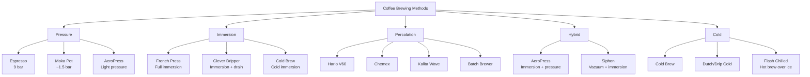

# Brewing Science — Overview

## 📍 Parent Topics
- [Coffee Knowledge Base](../INDEX.md)
- [Extraction Theory](../espresso/extraction-theory.md)

---

## Brewing Method Taxonomy



---

## Core Extraction Science

### The Extraction Sequence

When water contacts ground coffee, compounds dissolve in a predictable order:

```
Time →
├── 0–30%  Fruity acids, volatile aromatics (sour, bright)
├── 30–70% Sugars, Maillard compounds, body (sweet, balanced)
└── 70–100% Bitter phenols, harsh pyrolytic acids (bitter, dry)
```

**The goal:** Extract deep enough for sweetness and body, stop before harsh compounds dominate.

**Optimal window:** 18–22% Extraction Yield (EY) for both espresso and filter.

---

### The Six Brewing Variables

Every brewing method is controlled by variations of these six levers:

| Variable | ↑ Increases EY | ↓ Decreases EY | Notes |
|---------|---------------|----------------|-------|
| **Grind size** | Finer | Coarser | Most impactful variable |
| **Water temperature** | Higher | Lower | Max ~96°C; diminishing returns above |
| **Contact time** | Longer | Shorter | Immersion: direct; percolation: via pour rate/grind |
| **Agitation** | More turbulence | Less turbulence | Bloom, stirring, pulse pouring |
| **Brew ratio** | Lower dose (same water) | Higher dose (same water) | Affects strength AND yield |
| **Water quality** | More minerals (to a point) | Very soft water | Mg²⁺ most impactful mineral |

---

### Immersion vs Percolation

| Attribute | Immersion | Percolation |
|---------|-----------|-------------|
| Mechanism | Coffee sits in water; concentration equilibrium | Fresh water continuously flows through grounds |
| Extraction ceiling | Lower (equilibrium limits) | Higher (fresh water always extracts) |
| Consistency | High (harder to over-extract) | Requires more skill (easy to over-extract) |
| Flavor | Rounded, full | Brighter, cleaner |
| Sediment | More (French Press) or filtered (Clever) | None with paper filter |
| Examples | French Press, Cold Brew, AeroPress immersion | V60, Chemex, Batch Brew |

> 🔬 *In immersion brewing, extraction slows as the water becomes saturated with dissolved coffee. This is why French Press doesn't over-extract easily with the right grind — equilibrium is reached.*

---

### Bloom (Pre-Wetting)

**What is the bloom?**
The bloom (also called pre-infusion in filter context) wets the grounds with 2–3× the coffee weight in hot water, then waits 30–45 seconds before continuing.

**Why it matters:**
- Fresh coffee contains significant CO₂ (especially within 2 weeks of roast)
- CO₂ repels water, creating channeling and uneven extraction
- Bloom allows CO₂ to escape before extraction proper begins
- Results in more even extraction and fuller flavor

**Visual sign of fresh coffee:** Grounds dramatically rise and bubble during bloom → indicates freshness.

**Stale coffee sign:** Minimal bloom → CO₂ already off-gassed → coffee likely stale.

---

### Turbulence & Agitation

Stirring or pouring increases turbulence, which:
- Disrupts the **concentration gradient** at the particle surface
- Brings fresh water into contact with grounds faster
- Speeds up extraction rate

| Agitation Level | Effect |
|----------------|--------|
| None (still water) | Slowest extraction; risk of channeling in percolation |
| Light (gentle pour) | Standard for most methods |
| Moderate (pulse pours, stirring) | Increases extraction; increases body and strength |
| Heavy (vigorous stir, AeroPress) | Very fast extraction; risk of over-extraction |

---

### Grind Size & Surface Area

$$\text{Surface Area} \propto \frac{1}{\text{Particle Diameter}^2}$$

Halving particle size → **4× the surface area** → dramatically faster extraction.

**Practical grind guide:**

| Method | Grind Size | Visual Reference |
|--------|-----------|-----------------|
| Cold Brew | Extra coarse | Rough pebbles |
| French Press | Coarse | Coarse sea salt |
| Chemex | Medium-coarse | Table salt |
| Batch Brew | Medium | Granulated sugar |
| V60 | Medium-fine | Fine salt |
| AeroPress | Fine–medium | Table sugar |
| Moka Pot | Fine-medium | Between filter and espresso |
| Espresso | Fine | Powdered sugar boundary |
| Turkish | Extra fine | Flour-like |

---

### Temperature & Solubility

```
Compound Solubility vs Temperature
│
│          ████████████ Bitter phenols
│       ████████████
│    ████ Sugars/Maillard
│ ████ Acids
│████
└────────────────────────────────
  60   70   80   90   96   100°C
```

Higher temperature increases solubility of **all** compounds — including undesirable ones. This is why temperature fine-tuning matters:
- **Light roasts (harder to extract):** Higher temperature (93–96°C) needed
- **Dark roasts (easy to extract):** Lower temperature (88–92°C) prevents bitterness
- **Cold brew:** Near-zero temperature → slow extraction, low acid, smooth character

---

### The SCA Brewing Control Chart

```
TDS %     │ Too Strong  │              │ Too Strong   │
(Strength) │    &        │   IDEAL      │    &         │
          │  Under      │    ZONE      │   Over       │
1.45% ────┼─────────────┼──────────────┼──────────────
          │             │              │              │
1.30% ─ ─ ┼ ─ ─ ─ ─ ─ ─│─ ─ ─ ─ ─ ─ ─│─ ─ ─ ─ ─ ─ ─
          │ Too Weak    │   IDEAL      │  Too Weak    │
1.15% ────┼─────────────┼──────────────┼──────────────
          │    &        │    ZONE      │    &         │
          │  Under      │              │   Over       │
          └─────────────┴──────────────┴──────────────
                   18%      20%      22%
                          EY %
```

The ideal zone = TDS 1.15–1.45% AND EY 18–22%.

---

## Method Quick-Select Guide

| Situation | Best Method |
|---------|------------|
| Bright, floral, origin-forward | V60 washed light roast |
| Clean, delicate, guest-impressive | Chemex |
| Quick, versatile, travel | AeroPress |
| Rich, full-body, easy | French Press |
| Hot climate, smooth | Cold Brew |
| Traditional Italian | Moka Pot |
| Theater/presentation | Siphon |
| High-volume café | Batch Brew |
| Maximum concentration | Espresso |

---

## 🔗 Related Topics
- [Pour Over Methods](pour-over.md)
- [Espresso Extraction Theory](../espresso/extraction-theory.md)
- [Water Chemistry](../water-science/water-chemistry.md)
- [Grinders](../equipment/espresso-machines.md)
- [Formula Library](../formulas/formula-library.md)
