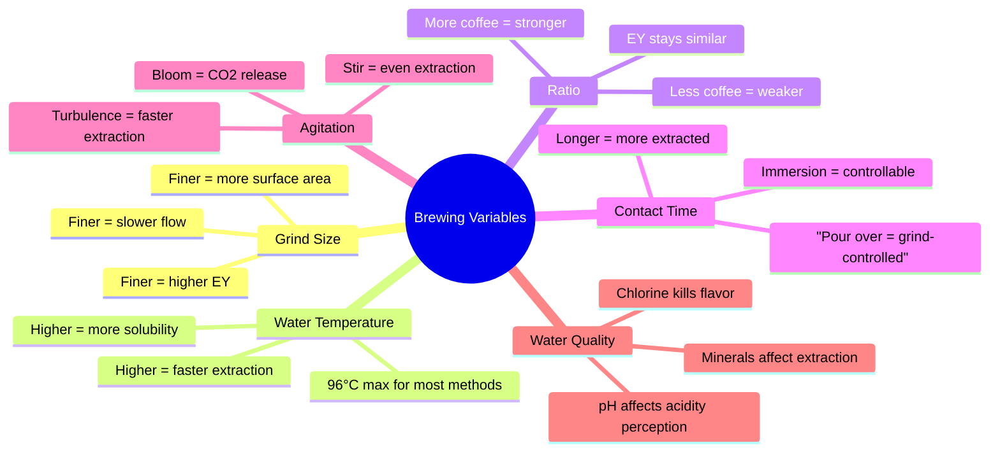

# Brewing Methods — Complete Guide

## 📍 Parent Topics
- [Coffee Knowledge Base](../INDEX.md)
- [Extraction Theory](../espresso/extraction-theory.md)

---

## Brewing Method Comparison Matrix

| Method | Type | Ratio | Grind | Temp °C | Time | Body | Clarity | Skill |
|--------|------|-------|-------|---------|------|------|---------|-------|
| Espresso | Pressure | 1:2 | Very fine | 90–96 | 25–35s | Very heavy | Low | High |
| Hario V60 | Pour-over | 1:15–17 | Medium-fine | 90–96 | 2:30–3:30 | Light-medium | High | Med-High |
| Chemex | Pour-over | 1:15–17 | Medium-coarse | 90–96 | 3:30–5:00 | Light, clean | Very high | Medium |
| Kalita Wave | Pour-over | 1:15–17 | Medium | 92–96 | 3:00–4:00 | Medium | High | Medium |
| French Press | Immersion | 1:15–17 | Coarse | 92–96 | 4:00 | Heavy, full | Low (sediment) | Low |
| AeroPress | Hybrid | 1:6–15 | Fine–medium | 80–96 | 1:00–3:00 | Variable | Variable | Low-Med |
| Cold Brew | Cold immersion | 1:8–15 | Coarse | 4–20°C | 12–24h | Heavy | Low | Low |
| Moka Pot | Pressure perc. | ~1:7 | Fine-medium | Boiling | 5–8 min | Very heavy | Low | Medium |
| Siphon | Vacuum | 1:15–17 | Medium | 90–93 | 1–2 min | Light-medium | Very high | High |
| Batch Brew | Automatic | 1:15–17 | Medium | 90–96 | 5–8 min | Medium | High | Low |

---

## SCA Golden Cup Standard

The SCA defines ideal filter coffee as:

| Parameter | Target | Range |
|---------|--------|-------|
| Brew Ratio | 1:17 | 1:15–1:19 |
| Extraction Yield | 20% | 18–22% |
| TDS (Strength) | 1.3% | 1.15–1.45% |
| Brew Temperature | 93°C | 91–96°C |
| Contact Time | 4–8 min (batch) | — |

---

## Method 1: Hario V60 (Pour Over)

### What Makes V60 Unique
- **Spiral ridges** on walls → gaps allow air escape → no seal → fast flow
- **60° cone angle** → long coffee bed for even extraction
- **Large single hole** → barista controls flow entirely via pour

### Standard Recipe (James Hoffman method)
| Parameter | Value |
|---------|-------|
| Dose | 15g |
| Water | 250g |
| Ratio | 1:16.7 |
| Grind | Medium-fine (kosher salt texture) |
| Water temp | 93°C |
| Total time | ~3:30 |

**Step-by-step:**
1. Rinse filter with hot water → discard rinse water
2. Add 15g ground coffee
3. **Bloom:** Add 50g water (3× dose), stir gently, wait 45 seconds
4. Pour in circles to 150g total
5. Continue pouring to 250g total by 1:30
6. All water has dripped through by ~3:30
7. Aim for flat coffee bed at finish (even extraction indicator)

### Troubleshooting V60
| Problem | Cause | Fix |
|---------|-------|-----|
| Too fast (< 2:30) | Too coarse / underweight | Grind finer or increase dose |
| Too slow (> 4:30) | Too fine / overfilled | Grind coarser or less coffee |
| Uneven bed / hump | Uneven pours | Circular pours, avoid center |
| Sour taste | Under-extraction | Finer grind, higher temp |
| Bitter taste | Over-extraction | Coarser grind, shorter total time |

---

## Method 2: Chemex

### What Makes Chemex Unique
- **Proprietary thick filter** (25–30% heavier than standard) → removes more oils and fines
- Result: **exceptionally clean, bright, sediment-free** cup
- Ideal for fruity, floral light roasts (Ethiopia, Colombia)

### Standard Recipe
| Parameter | Value |
|---------|-------|
| Dose | 30g |
| Water | 500g |
| Ratio | 1:16.7 |
| Grind | Medium-coarse (slightly coarser than V60) |
| Water temp | 93°C |
| Total time | 4:00–5:30 |

**Step-by-step:**
1. Pre-fold and rinse Chemex filter (3-layer side toward spout)
2. Add 30g coffee
3. **Bloom:** 90g water, 45 second bloom
4. Pour in large pours: 90g intervals every 45–60 seconds
5. Total to 500g, finish by 4:30–5:00

---

## Method 3: French Press

### Science of Immersion Brewing
French Press is **full immersion** — grounds stay in contact with water for the entire brew. This produces:
- **Heavy body** (coffee oils not filtered)
- **More sediment** (no paper filter)
- **Rounded, less acidic** flavor (oils coat tongue, mute acidity)

### Standard Recipe (James Hoffman Long Steep Method)
| Parameter | Value |
|---------|-------|
| Dose | 30g |
| Water | 500g |
| Ratio | 1:16.7 |
| Grind | Coarse (breadcrumb texture) |
| Water temp | 93°C |
| Total time | 9–10 minutes |

**The Hoffman Method:**
1. Add coffee, pour all water immediately
2. Do not stir or press — let sit for 4 minutes
3. At 4 min: gently stir crust, remove floating grounds
4. Wait 5 more minutes (total 9 min)
5. Slowly press — just enough to push grounds below surface
6. Pour immediately (don't let it sit — continues extracting)

> 💡 *The long steep + no-press technique reduces fines in cup, producing cleaner French Press.*

---

## Method 4: AeroPress

### Why AeroPress Is Versatile
- **Pressure + immersion** brewing — hybrid method
- Almost infinite recipe variation
- World AeroPress Championship (WAC) drives extreme creativity
- Can produce espresso-style concentrate to light filter-style

### Standard Recipes

**Method A: Standard (easy, clean)**
| Parameter | Value |
|---------|-------|
| Dose | 15g |
| Water | 200g |
| Ratio | 1:13 |
| Grind | Medium-fine |
| Temp | 85°C |
| Time | 2:00 |

1. Standard orientation, filter pre-rinsed
2. Add coffee, 200g water, stir 10 seconds
3. Press gently over 30 seconds
4. Stop when hiss begins

**Method B: Inverted (more control)**
1. Flip AeroPress (plunger end down)
2. Add coffee + water, steep 1:30
3. Flip carefully, press over 30s

**Method C: James Hoffman All Rounder**
| Parameter | Value |
|---------|-------|
| Dose | 11g |
| Water | 200g |
| Grind | Medium-fine |
| Temp | 90°C |
1. Standard, bloom 50g for 1 min
2. Add rest, stir 10× at top
3. Rinse filter, cap immediately
4. Flip at 2 min, press slowly to 2:30

---

## Method 5: Cold Brew

### Science of Cold Extraction
Cold water extracts coffee **slower and differently** than hot water:
- **Temperature effect:** Lower temp = slower molecular diffusion → gentler extraction
- **Volatiles:** Many acids and delicate aromatics remain unextracted → smoother, less bright
- **Body:** High due to long extraction time
- **Shelf life:** Up to 2 weeks refrigerated (high concentration inhibits bacterial growth)

### Concentrate Recipe (1:8 ratio)
| Parameter | Value |
|---------|-------|
| Dose | 100g coarse ground coffee |
| Water | 800g cold or room temp |
| Time | 18–24 hours at 4°C |
| Result | Concentrate (dilute 1:1–1:3 to serve) |

### Ready-to-Drink Recipe (1:15 ratio)
| Parameter | Value |
|---------|-------|
| Dose | 100g coarse ground |
| Water | 1500g cold water |
| Time | 12–18 hours at 4°C |

### Cold Brew vs Iced Coffee vs Japanese Iced (Flash Chilled)

| Method | Temperature | Process | Flavor |
|--------|-------------|---------|--------|
| Cold Brew | Cold/room | Long steep | Smooth, less acidic, heavy |
| Iced Coffee | Hot brew | Brew over ice | Bright, acidic, clean |
| Japanese Iced (pour over over ice) | Hot water | Brew directly onto ice | Bright, aromatic, light |

---

## Method 6: Moka Pot

### How It Works
1. Water in bottom chamber heats → builds steam pressure (~1–1.5 bar)
2. Pressure pushes water up through coffee bed
3. Coffee exits through top tube → collects in upper chamber

### Key Rules
| Rule | Reason |
|------|--------|
| Use pre-boiled water | Reduces heat time = less scorching |
| Don't compact coffee | Causes excessive pressure → dangerous |
| Medium heat | Slow extraction = better flavor |
| Remove from heat before gurgle | Avoids steam-forced over-extraction |

### Standard Recipe
| Parameter | Value |
|---------|-------|
| Fill bottom chamber | Below valve |
| Coffee bed | Level, not tamped |
| Grind | Fine-medium (finer than filter, coarser than espresso) |
| Heat | Medium-low |
| Time | 5–8 minutes |

---

## Method 7: Siphon (Vacuum Pot)

### How It Works
1. Heat lower chamber → water vapor expands → pushes water up into upper chamber through tube
2. Coffee + water brew in upper chamber at ~92°C
3. Remove heat → vacuum in lower chamber pulls brew down through filter
4. Result: extremely clean, hot, aromatic cup

### Recipe
| Parameter | Value |
|---------|-------|
| Dose | 25g |
| Water | 400g |
| Ratio | 1:16 |
| Grind | Medium |
| Brew Time (upper chamber) | 60–90 seconds |

---

## Method 8: Batch Brewing

### Commercial Batch Brew (SCAE Approved Standards)
- **SCA-certified brewers** (e.g., Fetco, Marco, Bunn) required for café quality
- Must deliver water at **90–96°C** to brew bed
- Must complete brew **within 6 minutes**
- Hold temperature: **80–85°C** (not boiling; degrades flavor)
- **Freshness window:** 30 minutes in thermal carafe (glass carafe much shorter — 20 min)

---

## Brewing Science: Key Concepts Summary

---

## 🔗 Related Topics
- [Extraction Theory](../espresso/extraction-theory.md)
- [Water Chemistry](../water-science/water-chemistry.md)
- [Grinders](../equipment/grinders.md)
- [Formula Library](../formulas/formula-library.md)
- [Sensory & Cupping](../sensory-cupping/cupping-protocol.md)
