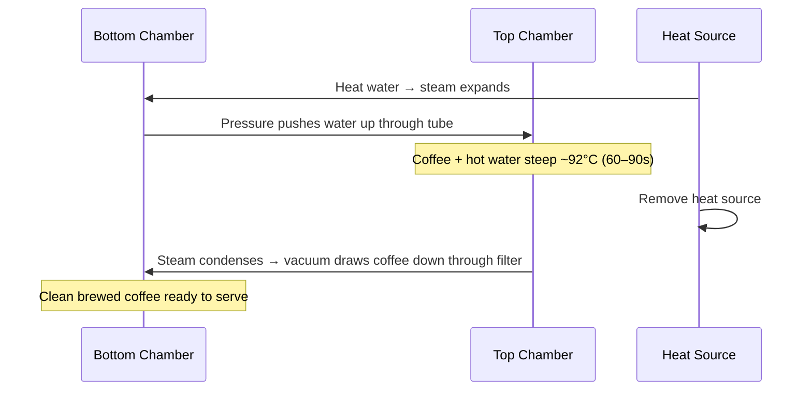

# Siphon (Vacuum Pot) — Complete Guide

## How It Works

The siphon uses **vapor pressure and vacuum** in a two-chamber glass apparatus:

---

## Recipe

| Parameter | Value |
|---------|-------|
| Dose | 25g |
| Water | 400g |
| Ratio | 1:16 |
| Grind | Medium (slightly coarser than V60) |
| Upper chamber temp | ~92°C |
| Steep time (upper) | 60–90 seconds |
| Filter | Cloth (traditional) or paper |

**Steps:**
1. Fill bottom chamber with 400g hot water (pre-boiled to speed setup)
2. Attach upper chamber securely; moisten cloth filter; secure filter hook
3. Apply heat — water will rise into upper chamber over 3–5 minutes
4. Add 25g ground coffee to upper chamber once water has risen
5. Stir gently to wet all grounds
6. Steep 60–90 seconds with a gentle stir at 30 seconds
7. Remove heat source
8. Watch coffee draw back down through filter into lower chamber (2–3 min)
9. Remove upper chamber; serve from lower chamber immediately

---

## Filter Types

| Filter | Cup Impact |
|--------|-----------|
| **Cloth (traditional)** | Slight body; cleaner than French Press; some oils |
| **Paper** | Cleanest; closest to pour-over clarity |
| **Metal mesh** | Most body; some sediment |

---

## Flavor Profile

| Attribute | Description |
|---------|-------------|
| Clarity | Very high — cleaner than French Press |
| Body | Light–medium (cloth filter) |
| Temperature | Served very hot (bottom chamber retains heat) |
| Aroma | Excellent — high brew temp preserves volatile aromatics |
| Character | Bright, clean, complex; closer to pour-over than immersion |

---

## Why Use a Siphon?

| Reason | Detail |
|--------|--------|
| **Theater** | Visually dramatic; excellent for café table-side service |
| **Temperature precision** | Consistent brew temp throughout contact time |
| **Unique texture** | Between pour-over and French Press |
| **Japanese café tradition** | Deeply embedded in Japanese specialty coffee culture |

**Popular equipment:** Hario Technica, Yama Glass, Bodum Santos, KINTo UNITEA

---

## 🔗 Related Topics
- [Brewing Science Overview](brewing-science-overview.md)
- [Pour Over](pour-over.md)
- [Equipment](../equipment/espresso-machines.md)
