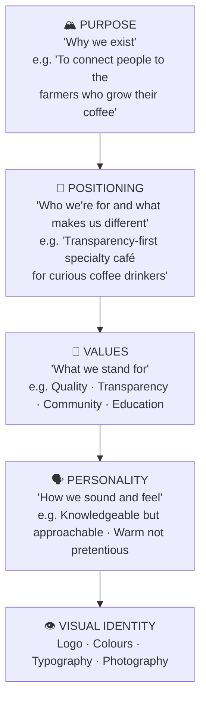
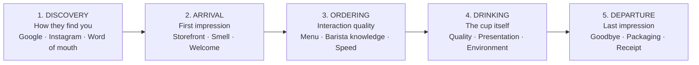

# Café Marketing, Branding & Customer Experience

## 📍 Parent Topics
- [Café Operations](../INDEX.md)
- [Menu Development](menu-development.md)

---

## Brand Identity Foundation

### The Brand Pyramid



### Specialty Café Brand Archetypes

| Archetype | Character | Example Positioning |
|-----------|----------|---------------------|
| **The Sage** | Expert, educator, truth-teller | "We'll teach you everything about your coffee" |
| **The Creator** | Artisan, craft-first | "Coffee as craft; every cup intentional" |
| **The Explorer** | Discovery, origin-focus | "Taste the world through a single cup" |
| **The Neighbour** | Community, warmth | "Your daily ritual, our daily purpose" |
| **The Rebel** | Challenging convention | "Coffee without compromise" |

---

## Storytelling Framework

Great specialty café marketing tells three stories:

### 1. The Origin Story (The Coffee)

```
Template:
"This [month] crop comes from [farmer name] in [region], 
[country]. At [altitude]m above sea level, [unique fact about 
the farm/process/person]. When you taste [descriptor], 
you're tasting [connection to the story]."

Example:
"This July crop comes from Yohannes Berhane in Yirgacheffe, 
Ethiopia. His family has farmed this land for four generations 
at 1,900m, hand-picking only the ripest red cherries during 
harvest. When you taste jasmine and lemon curd in your cup, 
you're tasting the altitude and care of those hands."
```

### 2. The Craft Story (The Process)

```
Template:
"We [specific action] to [specific result]."

Examples:
"We rest every espresso for 10 days before brewing to let 
CO₂ dissipate — so you taste the coffee, not the gas."

"We use a VST refractometer to verify every dial-in 
hits 20% extraction yield — precision you can taste."
```

### 3. The Community Story (The People)

```
Template:
"[Specific person/group] + [what coffee means to them/you]"

Examples:
"Sarah has been ordering the same flat white for four years. 
Her daughter now comes in after school. That's why we're here."

"We employ 12 people from our local community, and 
contribute 1% of revenue to the cooperatives we source from."
```

---

## Digital Marketing

### Social Media by Platform

| Platform | Content Type | Posting Frequency | Primary Goal |
|---------|-------------|-------------------|-------------|
| **Instagram** | Visual: latte art, origins, behind-scenes | 4–6×/week | Brand awareness; inspiration |
| **TikTok** | Short video: brewing, barista skills, origin stories | 3–5×/week | Reach new audiences |
| **Facebook** | Events, community, longer-form | 3–4×/week | Local community; events |
| **Google Business** | Photos, hours, responses to reviews | Weekly update | Local SEO; discovery |
| **Email newsletter** | New coffee releases, events, education | 2–4×/month | Loyal customer retention |

### Instagram Content Pillars (80/20 Rule)

**80% Value Content (non-promotional):**
- Behind-the-scenes roasting, brewing, farming
- Coffee education (how-to, science, origin)
- Team stories and barista spotlights
- Latte art process videos
- Seasonal and environmental content

**20% Promotional Content:**
- New coffee launches
- Seasonal drinks
- Events and collaborations
- Loyalty programme announcements

---

### Content Calendar Template

```
WEEK ___ SOCIAL CONTENT PLAN

MONDAY:    [Education] — Coffee fact or origin story (carousel)
TUESDAY:   [Process] — Brewing video or barista skill reel
WEDNESDAY: [Community] — Team spotlight or regular customer story
THURSDAY:  [Product] — New coffee or drink feature (max 1×/week promo)
FRIDAY:    [Behind-scenes] — Weekend prep, latte art practice
SATURDAY:  [Atmosphere] — Morning rush, café energy, community
SUNDAY:    [Reflection] — Week's best moments or farming story

STORY content daily: Cups, orders, team moments, polls
```

---

## Customer Experience Design

### The Five Touchpoints



### Sensory Experience Design

| Sense | Elements to Design |
|-------|-------------------|
| **Smell** | Fresh coffee aroma at door; no burnt milk smell; no harsh cleaning chemicals lingering |
| **Sound** | Music volume/genre matched to brand; grinder sound managed; staff conversation tone |
| **Sight** | Cleanliness; barista workflow visible; plant/design; light quality |
| **Touch** | Cup weight and warmth; comfortable seating; counter height |
| **Taste** | The coffee itself — quality, consistency, temperature |

---

## Loyalty Programmes

### Programme Types

| Type | Mechanic | Best For |
|------|---------|---------|
| **Stamp card** | 9 stamps = 1 free | Simple; low-tech; traditional |
| **Points-based** | Points per £/$; redeem for drinks | Flexible; trackable |
| **Subscription** | Monthly fee = daily discount | High-frequency customers |
| **Tier-based** | Bronze/Silver/Gold = escalating benefits | Engagement; gamification |

### Effective Loyalty Design Principles

1. **Easy to join** — QR code; no app required initially
2. **Fast first reward** — customer must feel value within first 3 visits
3. **Personalisation** — remember their usual order; acknowledge milestones
4. **Exclusivity** — early access to new coffees for loyalty members
5. **Community** — loyalty members as "insiders"; behind-scenes events

### Example: Specialty Coffee Loyalty Tier

```
☕ BRONZE (0–50 visits/year)
  → 5% discount on beans retail
  → Early access to new single origins

🥈 SILVER (51–150 visits/year)
  → 10% discount on all purchases
  → Monthly tasting invitation
  → Free grind adjustment any time

🥇 GOLD (151+ visits/year)
  → 15% discount on all purchases
  → Quarterly origin box (3 coffees)
  → Name on "regulars" wall
  → Invite to private roastery tours
```

---

## Local Community Building

### Partnerships

| Partner Type | Collaboration Idea |
|-------------|-------------------|
| **Local businesses** | Cross-promotions; corporate coffee service |
| **Schools/universities** | Student discount; study space; internships |
| **Gyms/yoga studios** | Morning coffee partnership; co-branded events |
| **Bookshops** | Coffee + reading events; book club hosting |
| **Art/music community** | Gallery nights; live music mornings |
| **Local roasters** | Guest coffee weeks; coffee education |
| **Farmers markets** | Pop-up presence; retail bags |

### Events Calendar

| Event Type | Frequency | Purpose |
|-----------|-----------|---------|
| Coffee tasting/cupping | Monthly | Education; community |
| Barista workshop | Quarterly | Revenue; brand authority |
| Origin presentation | Bi-monthly | Storytelling; loyalty |
| Latte art throwdown | Quarterly | Fun; community; social content |
| Seasonal menu launch | Quarterly | New revenue; press |
| Farmer/importer visit | Annually | Authenticity; story |

---

## Handling Reviews & Feedback

### Responding to Google/Yelp Reviews

**Positive review response template:**
```
"Thank you so much, [Name]! [Specific reference to what they 
mentioned]. We're really glad [specific thing] hit the mark — 
we'll pass on the kind words to [barista name]. See you soon!"
```

**Negative review response template:**
```
"Thank you for taking the time to share this, [Name]. We're 
genuinely sorry that [specific issue] didn't meet the standard 
we hold ourselves to. We'd love to make it right — please 
reach out to us at [email] and we'll take care of you."
```

**Rules:**
- Always respond within 24 hours
- Never argue or be defensive publicly
- Move complaints to private channel quickly
- Use negative feedback as internal training material

---

## Measuring Marketing Effectiveness

### Key Marketing Metrics

| Metric | How to Measure | Target |
|--------|---------------|--------|
| New customer acquisition | POS first-visit tracking | Growing month-on-month |
| Customer retention rate | Return visit tracking | > 40% within 30 days |
| Average transaction value | POS total ÷ transactions | Growing quarter-on-quarter |
| Social media engagement | Likes + comments + shares ÷ followers | > 3% engagement rate |
| Google review rating | Google Business profile | ≥ 4.5 stars |
| Email open rate | Email platform analytics | > 25% |
| Loyalty programme uptake | Members ÷ total customers | > 30% |

---

## 🔗 Related Topics
- [Menu Development](menu-development.md)
- [Beverage Costing](beverage-costing.md)
- [Staff Training](staff-training.md)
- [Café Workflow SOP](workflow-sop.md)
- [Supply Chain](../coffee-fundamentals/supply-chain.md)
