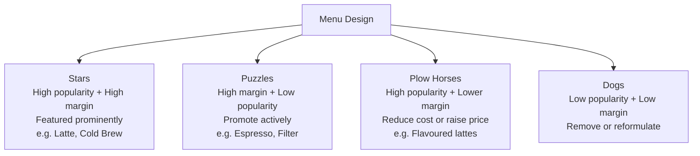

# Coffee Menu Development & Drink Recipe Reference

## 📍 Parent Topics
- [Café Operations](../INDEX.md)
- [Beverage Costing](beverage-costing.md)

---

## Core Espresso Menu

### Standard Drinks — Recipe Reference

| Drink | Espresso | Milk | Cup Size | Temp | Notes |
|-------|---------|------|---------|------|-------|
| **Espresso** | 18g → 36g (1:2) | None | 2–3oz | Hot | Served immediately |
| **Ristretto** | 18g → 22g (1:1.2) | None | 1.5–2oz | Hot | Shorter, sweeter |
| **Lungo** | 18g → 54g (1:3) | None | 4–5oz | Hot | Longer, more bitter |
| **Americano** | 18g → 36g | Hot water 150–180mL | 8–12oz | Hot | Espresso first, then water |
| **Long Black** | 18g → 36g | Hot water 120–150mL | 6–8oz | Hot | Water first, then espresso |
| **Flat White** | 18g → 22g (ristretto) | 100–120mL microfoam | 5–6oz | 60–65°C | Australian; strong ratio |
| **Cappuccino** | 18g → 36g | 80–100mL full microfoam | 5–6oz | 60–65°C | Italian; airy texture |
| **Latte** | 18g → 36g | 180–240mL microfoam | 8–12oz | 60–65°C | Smooth; milk-forward |
| **Cortado** | 18g → 36g | 30–40mL light microfoam | 3–4oz | 60–65°C | Spanish; equal ratio |
| **Piccolo** | 18g → 22g (ristretto) | 80–90mL microfoam | 3.5–4oz | 60–65°C | Australian |
| **Macchiato** | 18g → 36g | Foam dollop | 2–3oz | Hot | "Stained" espresso |
| **Gibraltar** | 18g → 36g | 60–90mL microfoam | 4oz (Gibraltar glass) | 60–65°C | US West Coast style |

---

### Iced Espresso Drinks

| Drink | Recipe | Notes |
|-------|--------|-------|
| **Iced Latte** | Double espresso + ice + 200mL cold milk | Pour espresso over ice, add milk |
| **Iced Flat White** | Ristretto + ice + 100mL cold milk | Stronger milk ratio than iced latte |
| **Iced Americano** | Double espresso + ice + cold water | Let espresso cool before adding ice to reduce dilution |
| **Shaken Espresso** | Double espresso + ice + sweetener, shaken | Frothy, chilled, slightly diluted — Starbucks-popularised |
| **Cold Brew Latte** | Cold brew concentrate + cold milk (2:1) | Smooth, low-acid |

---

### Filter Coffee Menu

| Drink | Method | Size | Price Premium |
|-------|--------|------|---------------|
| **Batch Brew (house filter)** | Automatic batch | 8–12oz | Low |
| **Pour Over (single cup)** | V60/Chemex | 8–12oz | Medium |
| **Cold Brew** | Cold-brewed concentrate | 8–12oz | Medium |
| **Nitro Cold Brew** | Cold brew + nitrogen draft | 8–12oz | High |
| **Japanese Iced Pour Over** | Hot pour over directly onto ice | 8oz | Medium |

---

## Signature Drink Development

### The Signature Drink Framework

A signature drink should have:
1. **A clear concept** — flavour story, cultural reference, or seasonal theme
2. **Espresso as base** — in café context (barista competition sometimes uses filter too)
3. **Complementary ingredients** — enhancing, not masking, the coffee
4. **Repeatable recipe** — staff can execute it consistently
5. **Visual appeal** — presentation matters
6. **Good economics** — profitable at the price point

### Flavour Pairing Science

Flavours pair well when they share aroma compounds:

| Coffee Note | Pairs Well With |
|------------|----------------|
| Chocolate | Caramel, vanilla, hazelnut, orange, raspberry, salt |
| Citrus / lemon | Thyme, honey, ginger, lavender, elderflower |
| Berry / stone fruit | Rose, vanilla, cardamom, almond |
| Floral / jasmine | Citrus, white peach, vanilla, honey |
| Earthy / tobacco | Cinnamon, cardamom, dark chocolate, maple |
| Caramel | Vanilla, sea salt, hazelnut, apple, bourbon |

### Signature Drink Recipe Template

```
DRINK NAME: ___________________
CONCEPT: _____________________

ESPRESSO BASE:
  Coffee: ____________________
  Dose: _______ Yield: _______ Temp: _______

INGREDIENTS (in pour order):
  1. _____________ | amount: _____ | purpose: ___________
  2. _____________ | amount: _____ | purpose: ___________
  3. _____________ | amount: _____ | purpose: ___________
  Garnish: _______________________________________

ASSEMBLY:
  1. ___________________________________________
  2. ___________________________________________
  3. ___________________________________________

SERVE: Hot / Cold / Room temp | Cup: ___________

TASTING NOTES: _________________________________
TARGET PRICE: ________ | COGS: ________ | MARGIN: _______
```

---

## Seasonal Menu Planning

### Seasonal Flavour Matrix

| Season | Flavour Themes | Ingredients | Example Drinks |
|--------|--------------|-------------|----------------|
| **Spring** | Floral, light, fresh | Rose, lavender, elderflower, honey, lemon | Rose Latte, Honey Lemon Cortado |
| **Summer** | Bright, cold, tropical | Citrus, mango, passionfruit, mint, coconut | Mango Cold Brew, Citrus Iced Latte |
| **Autumn** | Warm, spice, harvest | Cinnamon, cardamom, apple, maple, pear | Maple Spice Latte, Apple Americano |
| **Winter** | Rich, warming, festive | Chocolate, orange, vanilla, ginger, chestnut | Mocha, Spiced Hot Chocolate, Orange Flat White |

---

## Signature Drink Examples

### 1. Honey Cardamom Latte

| Component | Detail |
|-----------|--------|
| Espresso | 18g → 36g (medium-light roast Ethiopian) |
| Cardamom syrup | 15mL (1:1 sugar:water + 5 cardamom pods, simmered 10 min) |
| Steamed oat milk | 200mL |
| Finish | Cardamom pod on foam |
| Concept | Middle Eastern coffee tradition meets specialty |
| COGS | ~$1.40 | Price: $5.50 | Margin: 75% |

---

### 2. Black Sesame Flat White

| Component | Detail |
|-----------|--------|
| Espresso | Ristretto 18g → 22g (Colombian or Brazilian) |
| Black sesame paste | 1 tsp stirred into warm milk |
| Steamed whole milk | 100mL microfoam |
| Finish | Sesame seeds on foam |
| Concept | Japanese-inspired; umami + sweetness |
| COGS | ~$1.60 | Price: $6.00 | Margin: 73% |

---

### 3. Cold Brew Tonic

| Component | Detail |
|-----------|--------|
| Cold brew concentrate | 60mL (1:8 ratio) |
| Premium tonic water | 120mL (Fever-Tree, Schweppes 1783) |
| Ice | Large cubes |
| Garnish | Orange peel twist |
| Serve | Cold; rocks glass |
| Concept | Bittersweet; citrus lift; refreshing |
| COGS | ~$1.20 | Price: $5.50 | Margin: 78% |

---

### 4. Lavender Earl Grey Latte

| Component | Detail |
|-----------|--------|
| Espresso | 18g → 36g |
| Earl Grey tea syrup | 20mL (Earl Grey brewed strong, mixed 1:1 sugar) |
| Lavender syrup | 5mL (optional — already in tea) |
| Steamed oat milk | 200mL |
| Finish | Dried lavender |
| Concept | Bergamot from tea echoes Ethiopian floral notes |

---

### 5. Salted Caramel Cold Brew

| Component | Detail |
|-----------|--------|
| Cold brew RTD | 200mL |
| Salted caramel sauce | 15mL |
| Cold oat milk | 60mL |
| Sea salt flake | Pinch on top |
| Ice | Standard |
| Concept | Classic sweet/salty coffee indulgence |

---

## Non-Coffee Menu

### Why Non-Coffee Matters

- ~20–30% of café customers don't drink coffee
- Hot chocolate, teas, and alternatives capture this market
- Often higher margin (simpler to make, lower skill)

### Hot Chocolate — Reference Recipe

| Component | Detail |
|-----------|--------|
| Valrhona cocoa powder | 2 tsp |
| Hot water | 30mL (to form paste) |
| Steamed whole milk | 240mL |
| Sugar/sweetener | To taste |
| Finish | Cocoa dust on foam |

**Specialty variation:** Use single-origin drinking chocolate discs or artisan chocolate bars melted in for a premium tier.

---

### Matcha Latte — Reference Recipe

| Component | Detail |
|-----------|--------|
| Ceremonial-grade matcha | 2g |
| Hot water | 60mL at 75°C (not boiling — ruins flavour) |
| Whisk | Bamboo chasen or electric frother until smooth |
| Steamed milk | 200mL (oat or whole) |

**Notes:** Ceremonial grade (bright green) vs culinary grade (yellow-green) makes enormous quality difference. Source from Japan for authenticity.

---

## Menu Engineering Decisions

### How to Build a Menu That Sells



### Menu Size Principles

| Menu Size | Pros | Cons |
|-----------|------|------|
| Short (8–12 items) | Easy to execute; quality control; faster service | Less choice; some customers lost |
| Medium (12–20 items) | Good range; manageable | Requires skilled staff |
| Long (20+) | Maximum choice | Complexity; waste; training burden; slower |

**Specialty café recommendation:** Core menu of 10–14 items. Add 2–3 seasonal specials (rotated quarterly). Clear, legible menu with brief descriptions.

---

## 🔗 Related Topics
- [Beverage Costing](beverage-costing.md)
- [Workflow SOP](workflow-sop.md)
- [Milk Science](../milk-latte-art/milk-science.md)
- [Espresso Extraction Theory](../espresso/extraction-theory.md)
- [Staff Training](staff-training.md)
