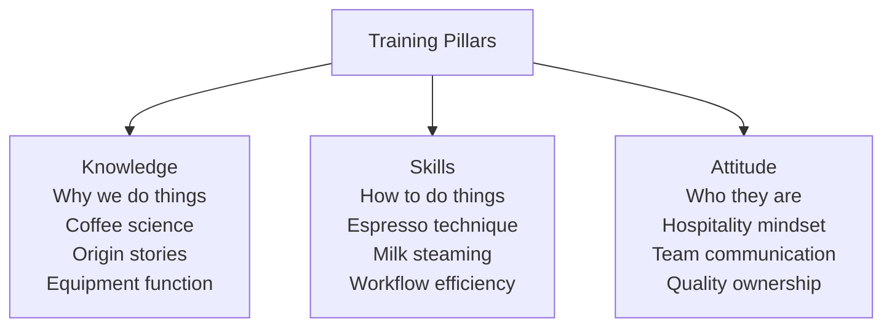
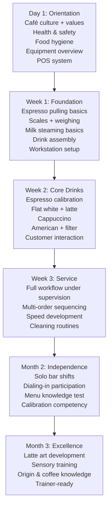

# Staff Training System — Café

## 📍 Parent Topics
- [Café Operations](../INDEX.md)
- [Workflow SOP](workflow-sop.md)

---

## Training Philosophy

Effective barista training is built on three pillars:



> 💡 *Knowledge without skills = theory without results. Skills without knowledge = inconsistency. Both without attitude = technical robot, not a barista.*

---

## Training Progression Map



---

## Day 1: Onboarding Checklist

```
ADMIN & SAFETY
□ Employment paperwork complete
□ Food hygiene certificate (if required locally)
□ Health & safety briefing
□ Emergency exits and procedures
□ Allergen awareness training
□ Personal hygiene standards explained
□ Uniform/dress code

CAFÉ ORIENTATION
□ Tour of all areas (bar, prep, storage, facilities)
□ POS system walkthrough
□ Communication tools (staff messaging, schedules)
□ Break schedule explained
□ Introduction to all team members

COFFEE BASICS
□ Intro to espresso machine (do not operate yet — observe only)
□ Coffee menu walkthrough — what every drink is
□ Current beans — where they're from, what they taste like
□ First café coffee: barista makes; new hire observes and tastes
```

---

## Week 1 Training Programme

### Day 2–3: Espresso Fundamentals

```
THEORY (30 min):
□ What espresso is and how it extracts
□ What dose, yield, and brew ratio mean
□ How to read the scale
□ What good vs bad espresso tastes like (taste samples)

PRACTICAL:
□ Portafilter handling: remove, knock, rinse, dry
□ Dosing: grind into portafilter or dosing cup
□ Distribution: levelling technique
□ Tamping: correct pressure and levelness
□ Locking portafilter and starting shot
□ Stopping at target weight (36–38g yield for 18g dose)
□ Pull 20 practice shots with trainer oversight
```

---

### Day 4–5: Milk Steaming

```
THEORY (20 min):
□ Why milk texture matters (proteins, foam, microfoam)
□ Two phases: stretch and roll
□ Target temperature 60–65°C
□ Visual signs of good microfoam

PRACTICAL (water + jug first):
□ Practice holding pitcher; wand angle
□ Steam water to understand sound and motion
□ Transition to real milk
□ Steam 20 pitchers with feedback
□ Basic heart attempt (by end of week)
```

---

## Skill Competency Assessments

### Assessment: Espresso Technical

Each item scored: **1** = Not yet competent | **2** = Developing | **3** = Competent

| Skill | Score | Notes |
|-------|-------|-------|
| Correct dose (within ±0.2g) | /3 | |
| Even distribution (WDT or equivalent) | /3 | |
| Level tamp (consistent) | /3 | |
| Correct yield (within ±1g of target) | /3 | |
| Timing within target range (±3s) | /3 | |
| Taste evaluation (identify sour/bitter/balanced) | /3 | |
| Can adjust grind direction correctly | /3 | |
| Follows pre-shot purge protocol | /3 | |
| **Total** | /24 | Pass: 18+ |

**Pass standard:** 18/24 or above to progress to solo bar shifts.

---

### Assessment: Milk & Drink Assembly

| Skill | Score | Notes |
|-------|-------|-------|
| Achieves microfoam texture (glossy, no bubbles) | /3 | |
| Correct temperature (60–65°C) | /3 | |
| Pours a recognisable heart | /3 | |
| Correct ratios for flat white vs latte vs cappuccino | /3 | |
| Milk volume appropriate for each drink | /3 | |
| Speed: flat white under 90 seconds | /3 | |
| Clean wand after every use | /3 | |
| No re-steaming milk | /3 | |
| **Total** | /24 | Pass: 18+ |

---

### Assessment: Workflow & Service

| Skill | Score | Notes |
|-------|-------|-------|
| Correct opening sequence | /3 | |
| 3-drink order handled without error | /3 | |
| Correct use of POS | /3 | |
| Allergen protocols followed | /3 | |
| Cleaning tasks completed without prompting | /3 | |
| Customer interaction professional and warm | /3 | |
| Can handle a complaint calmly | /3 | |
| **Total** | /21 | Pass: 15+ |

---

### Assessment: Coffee Knowledge

| Topic | Score | Notes |
|-------|-------|-------|
| Names 3 origin countries and their flavour profiles | /3 | |
| Explains difference: espresso / latte / flat white / cappuccino | /3 | |
| Explains what extraction means simply | /3 | |
| Can describe current seasonal espresso coffee | /3 | |
| Explains why water temperature matters | /3 | |
| **Total** | /15 | Pass: 10+ |

---

## Ongoing Calibration Training (Weekly)

**Format:** 20-minute group session before opening (or after close)

```
Week 1: Blind taste — under/over/good espresso
Week 2: Milk texture comparison — different attempts side-by-side
Week 3: Origin cupping — taste current coffees with notes
Week 4: Speed challenge — 3-drink sequence timed
Week 5: Dial-in exercise — new bag, who finds optimal setting fastest?
Week 6: Customer scenario roleplay
...Rotate and repeat
```

---

## Training Document Templates

### Shot Log Sheet (Trainee)

| Date | Grind Setting | Dose (g) | Yield (g) | Time (s) | Taste | Trainer Initials |
|------|--------------|---------|---------|---------|-------|-----------------|
| | | | | | | |
| | | | | | | |

### Trainee Progress Card (Monthly Review)

```
Trainee Name: ___________________
Review Period: ___________________
Trainer: ___________________

STRENGTHS:
□ ___________________________
□ ___________________________

DEVELOPMENT AREAS:
□ ___________________________
□ ___________________________

NEXT MILESTONE:
□ ___________________________

Signed (Trainee): _____________  Date: ________
Signed (Trainer): _____________  Date: ________
```

---

## Coaching Techniques

### The Feedback Framework (SBI Model)

**Situation → Behaviour → Impact**

❌ Wrong: "Your tamping is bad."

✅ Right: "In this morning's rush [Situation], I noticed you tamped at an angle [Behaviour], which caused the shot to channel and run unevenly [Impact]. Let me show you how to check your level."

---

### Demonstration → Guided Practice → Independent Practice

| Phase | Trainer Role | Trainee Role |
|-------|-------------|-------------|
| Demonstration | Does it; narrates | Watches; asks questions |
| Guided practice | Stands alongside; corrects in real time | Does it with feedback |
| Independent practice | Observes from distance | Does it alone; self-evaluates |
| Mastery | Checks in occasionally | Teaches others |

---

### Handling Trainee Anxiety

New baristas often fear:
- Breaking expensive equipment
- Slowing down service
- Customer complaints

**Manager response:**
- Pair trainees with patient, senior baristas (not the busiest person)
- Start training during slow periods — never rush hour
- Celebrate small wins publicly ("look at that heart!")
- Debrief after difficult situations without blame

---

## Staff Retention via Development

High turnover is the #1 hospitality challenge. Coffee knowledge investment reduces turnover:

| Investment | Impact |
|-----------|--------|
| SCA Barista Skills Foundation cert | Staff feel valued; CV-boosting; invest back |
| Origin trip or mill visit | Emotional connection to the product |
| In-house latte art competition | Fun; skill development; culture building |
| Career ladder (barista → senior → trainer → manager) | Reduces "dead end" perception |
| Cupping sessions | Elevated professional identity |

---

## 🔗 Related Topics
- [Workflow SOP](workflow-sop.md)
- [Beverage Costing](beverage-costing.md)
- [Learning Paths](../learning-paths/learning-paths.md)
- [Extraction Theory](../espresso/extraction-theory.md)
- [Milk Science](../milk-latte-art/milk-science.md)
