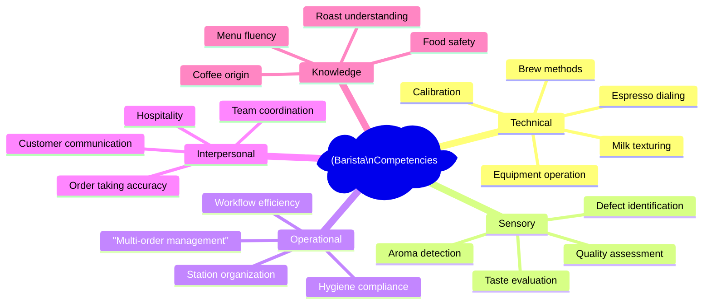
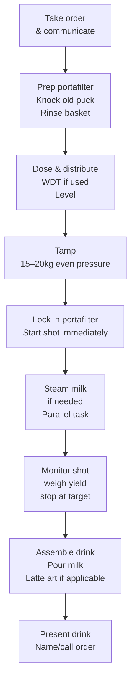
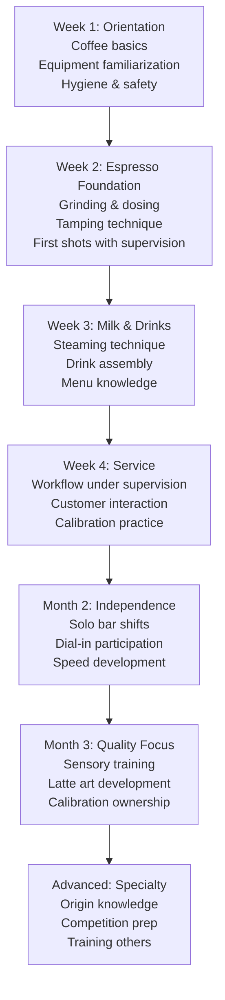

# Café Operations, Workflow SOP & Staff Training

## 📍 Parent Topics
- [Coffee Knowledge Base](../INDEX.md)

---

## Barista Core Competency Framework



---

## Opening SOP

### Machine Startup Sequence

```
MACHINE STARTUP (45–60 minutes before service)

□ 1. Power on espresso machine
     — Allow full heat-up time (varies by machine):
       Single boiler: 20–30 min
       Dual boiler / HX: 30–45 min
       La Marzocco commercial: 45 min (PID to temp)

□ 2. Power on grinder — allow burrs to reach operating temp

□ 3. Run blank shots through group heads (2–3 per group)
     — Flushes stagnant water, stabilizes temp

□ 4. Purge steam wands (3–5 seconds)

□ 5. Check water reservoir / direct line pressure

□ 6. First dial-in shots:
     — Pull 3 shots at yesterday's setting
     — Adjust for humidity/temp drift
     — Taste for target profile
     — Document: grind setting, dose, yield, time

□ 7. Prepare milk station:
     — Fill pitchers, rinse, place in fridge
     — Check steam wand cleanliness

□ 8. Check filter brew equipment (batch brewer, pour-over station)

□ 9. Stock cups, lids, sleeves at station

□ 10. Complete hygiene check (hands washed, apron on)
```

---

## Espresso Workflow SOP

### Single Drink Sequence



---

### Multi-Order Workflow (Sequencing)

In a rush, efficient baristas **batch and sequence** tasks:

**Principle: Start slow tasks first, build fast tasks in parallel**

```
Order: Latte + Espresso + Cappuccino

Optimal sequence:
1. Pull espresso shot for latte   → yields in 30s
2. While shot runs → steam milk for latte
3. Assemble latte
4. Pull espresso for straight espresso → 30s
5. While shot runs → steam milk for cappuccino  
6. Serve espresso
7. Assemble cappuccino
8. Serve cappuccino

Total time: ~3 min vs 5 min if done sequentially
```

---

## Station Organization (5S Framework)

| Principle | Application |
|---------|-------------|
| **Sort** | Remove everything not needed during service from bar top |
| **Set in Order** | Grinder → scale → portafilter → tamper in L-R workflow direction |
| **Shine** | Clean bench continuously during service; wipe after every 3–5 drinks |
| **Standardize** | Same position for every tool; everyone knows where it is |
| **Sustain** | Opening/closing checklist enforces standards daily |

### Bar Layout Optimization

```
IDEAL BAR FLOW (Right-handed barista, customer left)

[Grinder] [Scale] [Portafilter dock] [Machine] [Steam wands]
                                         ↓
                               [Cup placement zone]
                                         ↓
                              [Assembly & handoff zone]
←── Raw materials flow ──────────────────────── Finished drink ──→
```

---

## Hygiene & Food Safety SOP

### Critical Control Points

| Area | Risk | Control |
|------|------|---------|
| Steam wand | Milk protein buildup → bacterial growth | Wipe + purge after EVERY use |
| Portafilter basket | Stale oil rancidity | Backflush + enzyme clean daily |
| Milk storage | Temperature abuse | Refrigerate < 4°C; discard if > 2 hours above 8°C |
| Grinder chute | Stale grounds, oils | Clean weekly minimum |
| Cup storage | Dust, contamination | Store inverted or covered |
| Hands | Cross-contamination | Wash before service, after breaks, after touching non-food surfaces |

### Milk Safety Rules

```
MILK HANDLING RULES

✅ Use fresh cold milk (4°C or below)
✅ Discard milk that has been steamed and cooled
✅ Never re-steam milk
✅ Use separate pitchers for dairy vs non-dairy (allergen control)
✅ Label pitchers if multiple milks in use
❌ Never steam past 70°C (food safety + quality)
❌ Never leave steamed milk sitting > 5 min
```

---

## Calibration Routine

### Espresso Calibration Protocol

The **Calibration Sheet** should be filled every morning:

| Parameter | Yesterday | Today | Adjustment |
|---------|-----------|-------|-----------|
| Grind setting | e.g., 14 | Start at 14 | |
| Dose (g) | 18.0g | Weigh to ±0.1g | |
| Yield target (g) | 36.0g | Scale to ±0.5g | |
| Time target (s) | 28s | Clock it | |
| Actual yield (g) | | | |
| Actual time (s) | | | |
| Taste: sour/bitter/balanced | | | Adjust grind |
| EY% (if refractometer) | | | |
| Temperature (°C) | 93°C | Check PID | |

> 🔑 **Rule:** If a new bag of coffee has been opened → full redial from scratch, not adjustment from previous.

---

## Shift Management

### Pre-Shift Checklist (15 min before service)
```
□ Machine fully heated and calibrated
□ Milk stocked and refrigerated
□ Beans stocked (enough for shift)
□ Cups stocked (all sizes)
□ POS/register ready
□ Cleaning supplies accessible
□ Team briefing: daily specials, any issues, targets
```

### Mid-Shift Tasks (every 60–90 min)
```
□ Wipe down bar top
□ Empty knock box
□ Restock cups/lids
□ Check milk supply
□ Pull calibration shot if service has been heavy
□ Empty drip tray
```

### Closing SOP
```
□ Final backflush with enzyme cleaner
□ Clean grinder: brush hopper, wipe chute
□ Disassemble and soak portafilter baskets
□ Turn off machine per manufacturer sequence
□ Clean steam wands: purge, disassemble tip if daily protocol
□ Empty and wash milk pitchers
□ Wipe all surfaces
□ Sweep and mop bar floor area
□ Document next day's grind setting
□ Restock: note any low supplies for order
```

---

## Customer Communication Framework

### Drink Communication

| Scenario | Approach |
|---------|---------|
| Customer asks "what's good?" | Know your current beans; offer tasting notes, roast profile |
| Customer orders wrong thing for their taste | Ask what they usually enjoy; guide them |
| Complaint: too strong / too weak | Offer adjustment; don't argue |
| Allergy / intolerance | Confirm every time; use separate equipment |
| Latte art compliment | Brief, genuine thanks; don't overly elaborate during rush |

### Order Recall System

In busy service, use a consistent verbal/visual system:
```
Example: "Double Flat White for Maria, oat milk"
→ Mark cup before espresso pull
→ Repeat order back when handing off
→ Never rely purely on memory for more than 2 orders
```

---

## Barista Ergonomics

### Injury Prevention

| Risk | Prevention |
|------|-----------|
| Tamping wrist strain | Tamp at correct height (elbow ~90°); use calibrated tamp |
| Lower back (long shifts) | Anti-fatigue mat; adjust bar height if possible |
| Burn (steam wand) | Always purge; use towel; watch customer zone |
| Repetitive strain (portafilter) | Vary grip; strengthen wrist; take stretch breaks |
| Hearing (loud grinder) | Hearing protection if > 4h/day near commercial grinder |

**Ideal bar height:** Elbow height - 5cm (allows downward force for tamping without strain)

---

## Training Pathway for New Baristas



---

## 🔗 Related Topics
- [Beverage Costing](beverage-costing.md)
- [Espresso Machines](../equipment/espresso-machines.md)
- [Extraction Theory](../espresso/extraction-theory.md)
- [Milk Science](../milk-latte-art/milk-science.md)
- [Learning Paths](../learning-paths/learning-paths.md)
