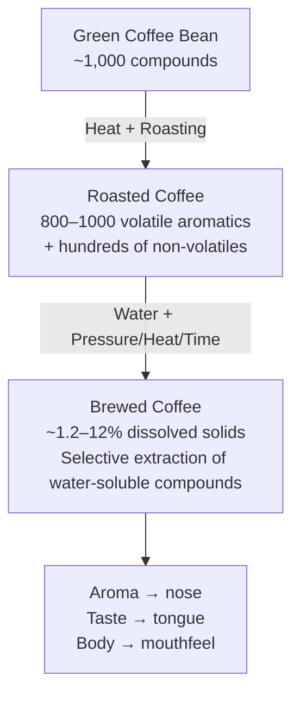

# Coffee Chemistry & Physics

## 📍 Parent Topics
- [Coffee Knowledge Base](../INDEX.md)
- [Extraction Theory](../espresso/extraction-theory.md)

---

## Overview: What Is Coffee?

Roasted coffee is one of the **most chemically complex food substances** known:
- **800–1,000+ volatile aroma compounds** identified
- Hundreds of non-volatile compounds contribute taste and body
- Extraction selectively dissolves a subset of these into water



---

## Key Compound Classes

### 1. Chlorogenic Acids (CGAs)

| Property | Value |
|---------|-------|
| Content in green Arabica | 5.5–8% dry weight |
| Content in green Robusta | 7–10% dry weight |
| Primary types | 5-CQA (5-caffeoylquinic acid) — most abundant |
| Role in green coffee | Antioxidant, defense against pathogens |
| After light roasting | ~50% degrade → quinic + caffeic acids + lactonized CGAs |
| After dark roasting | >90% degraded |
| Sensory impact | Astringency, perceived bitterness, some acidity |

**Important:** CGAs are not purely negative — their degradation products (quinolactones) contribute to the complex bitter-sweet balance in well-roasted coffee. Total CGA destruction = flat, baked coffee.

---

### 2. Caffeine

| Property | Value |
|---------|-------|
| Arabica content | 1.2–1.5% dry weight |
| Robusta content | 2.2–2.7% dry weight |
| Solubility | Highly water-soluble |
| Heat stability | Very stable — not significantly destroyed by roasting |
| Sensory role | Bitterness (one component); stimulant via adenosine receptor antagonism |
| Myth correction | Dark roast ≠ more caffeine. **By weight, light roast = slightly more caffeine** (denser bean) |

---

### 3. Organic Acids

Perceived acidity in coffee comes from a cocktail of acids:

| Acid | Origin | Sensory Character |
|------|--------|------------------|
| **Citric acid** | Naturally in bean | Citrus, lemon, bright |
| **Malic acid** | Naturally in bean | Apple, stone fruit, clean |
| **Acetic acid** | Fermentation; some roasting | Vinegar at high levels; fruity at low |
| **Phosphoric acid** | Naturally in bean | Crisp, clean brightness (present in Kenyan coffees) |
| **Quinic acid** | CGA degradation product | Dry, astringent, harsh at high levels |
| **Tartaric acid** | Fermentation-derived | Grape, wine |
| **Lactic acid** | Fermentation (lactic) | Smooth, yogurt, creamy |
| **Formic acid** | Roasting byproduct | Very low levels; minor contribution |

**Acid changes with roast:**
- Light: high citric, malic → bright, clean
- Medium: citric decreases; quinic increases → balanced
- Dark: quinic + pyrolytic acids dominate → harsh, dry

---

### 4. Sucrose & Sugars

| Property | Value |
|---------|-------|
| Sucrose in green Arabica | 6–9% dry weight |
| Sucrose in green Robusta | 3–7% |
| Fate during roasting | ~99% degraded by first crack |
| Products | Furfurals, melanoidins, caramel compounds |
| Sensory impact | Sweet perception in roasted coffee is from Maillard products, NOT residual sucrose |

---

### 5. Lipids (Fats & Oils)

| Property | Value |
|---------|-------|
| Arabica lipid content | 15–17% dry weight |
| Robusta lipid content | 10–11.5% |
| Primary lipids | Diterpenes (cafestol, kahweol), triglycerides, wax |
| Extraction | Metal filter = oils pass through; paper filter = most blocked |
| **Cafestol & Kahweol** | Raise LDL cholesterol (paper filter removes ~97%; French Press/espresso retains) |
| Sensory role | Body, mouthfeel, crema formation |

---

### 6. Volatile Aromatic Compounds

Coffee's extraordinary aroma profile (800–1,000 compounds) organized by formation:

#### Enzymatic (green bean; preserved by light roasting)
- Aldehydes, esters → **fruity, floral** character
- Examples: linalool (floral), hexanal (green/grassy)

#### Sugar-Browning / Maillard (140–200°C roasting)
- Furans → **caramel, sweet, bread**
- Pyrazines → **nutty, earthy, roasted**
- Aldehydes from Strecker degradation → **malt, chocolate**
- Furanones → **sweet, caramel, burnt sugar**

#### Dry Distillation (> 200°C; dark roasts)
- Phenols (guaiacol, 4-vinylguaiacol) → **smoky, spicy, medicinal**
- Pyridines → **sharp, astringent**
- Pyrroles → **grainy, tobacco**

#### Key Aroma Compounds in Espresso

| Compound | Aroma | Formation |
|---------|-------|-----------|
| 2-Furfurylthiol | Roasted coffee, sulfury | Maillard |
| Furanmethanol | Caramel, bread | Maillard |
| Guaiacol | Smoky, spicy | Dry distillation |
| 4-Vinylguaiacol | Spicy, clove | Dry distillation |
| Acetaldehyde | Fruity, green | Enzymatic + Maillard |
| Diacetyl | Buttery | Maillard |
| β-Damascenone | Honey, rose | Carotenoid degradation |

---

## The Maillard Reaction (In Detail)

$$\text{Amino Acid} + \text{Reducing Sugar} \xrightarrow{T > 140°C} \text{N-glycosylamine} \rightarrow \text{Amadori compound} \rightarrow \text{Melanoidins + Volatiles}$$

**Three stages:**
1. **Early Maillard:** Colorless; loss of amino acids and sugars
2. **Advanced Maillard:** Color development begins; furfurals, aldehydes form
3. **Final Maillard:** Dark brown melanoidins form; hundreds of aroma compounds

**Coffee Maillard vs food Maillard:** Coffee Maillard is more complex due to the simultaneous presence of hundreds of amino acids, dozens of sugars, and the high temperatures sustained over minutes.

---

## Caramelization

$$\text{Sucrose} \xrightarrow{T > 160°C} \text{Caramel compounds (furans, maltol, hydroxymethylfurfural, etc.)}$$

**Distinct from Maillard:** Caramelization doesn't require nitrogen/amino acids — purely thermal degradation of sugars.

**Products relevant to coffee:**
- **Maltol:** Sweet, caramel, cotton candy
- **5-HMF (hydroxymethylfurfural):** Sweet, caramel, slightly bitter
- **Furans:** Toast, caramel, bread

---

## CO₂ in Coffee

During roasting, the Maillard reaction and thermal degradation produce **CO₂** which is trapped in the bean matrix.

| State | CO₂ Behavior |
|-------|-------------|
| After roasting | Trapped in bean cells |
| First days post-roast | Rapid off-gassing through valve bags |
| Pour-over bloom | CO₂ escapes → grounds rise (bloom) |
| Espresso puck | Channeling caused by fresh CO₂ → rest 7–14 days |
| Old coffee | CO₂ fully gone → stale; bloom absent |

---

## Solubility Science

Not all compounds are equally extractable:

```
Extraction Order (fastest → slowest):
│
├─ Fruity acids, volatile aromatics   ← First (over-acidic if only these)
├─ Sugars, sweet Maillard compounds   ← Mid-extraction (sweet, balanced)
├─ Melanoidins, body compounds        ← Mid-to-late (body, bitter-sweet)
└─ Harsh phenols, pyrolytic acids     ← Last (bitter, dry, harsh)
```

**Key insight:** Perfect extraction = capturing the sweet middle zone while not running into the harsh late zone, and having enough early acids to provide brightness.

---

## Extraction Variables & Chemistry

| Variable | Chemical Effect |
|---------|----------------|
| Higher temperature | Increases kinetic energy → faster dissolution of all compounds |
| Finer grind | More surface area → faster initial acid extraction; also more rapid melanoidin extraction |
| Higher pressure (espresso) | Forces water through at speed; enables emulsification of oils → crema |
| Longer time | More complete extraction → higher EY |
| Water mineral content | Mg²⁺ forms stronger complexes with flavor compounds; Ca²⁺ contributes hardness and stability |
| Turbulence/agitation | Disrupts concentration gradient at particle surface → faster diffusion |

---

## Physical Coffee Mechanics

### Pressure & Fluid Dynamics in Espresso

The espresso puck behaves as a **non-Newtonian fluid bed**:
- Water is forced through at 9 bar (≈ 130 PSI)
- The puck compresses progressively during extraction
- Flow rate: Darcy's Law (see Pressure Profiling doc)
- Crema formation: CO₂ supersaturation released at lower pressure as liquid exits basket

### Thermal Physics in Brewing

**Heat loss during extraction:**

$$Q_{loss} = h \cdot A \cdot (T_{brew} - T_{ambient})$$

Where *h* = convective heat transfer coefficient, *A* = surface area of vessel.

**Implications:**
- Pre-heat vessels and cups (preheat portafilter, warm cup)
- Thermal mass of brewing vessel matters (Chemex vs thin plastic → different temperature curves)
- Temperature drop during extraction → some compounds extract differently at end vs start

---

## 🔗 Related Topics
- [Extraction Theory](../espresso/extraction-theory.md)
- [Roasting Science](../roasting/roast-science.md)
- [Water Chemistry](../water-science/water-chemistry.md)
- [Sensory & Cupping](../sensory-cupping/cupping-protocol.md)
- [Formula Library](../formulas/formula-library.md)
