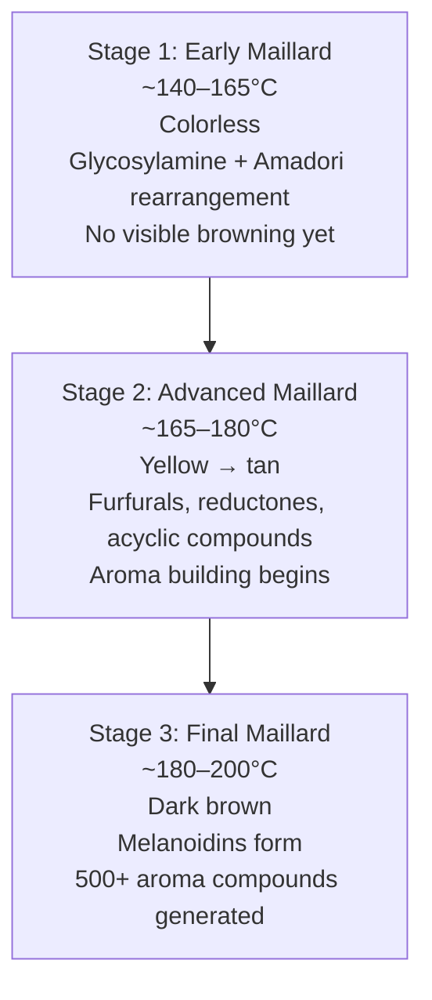
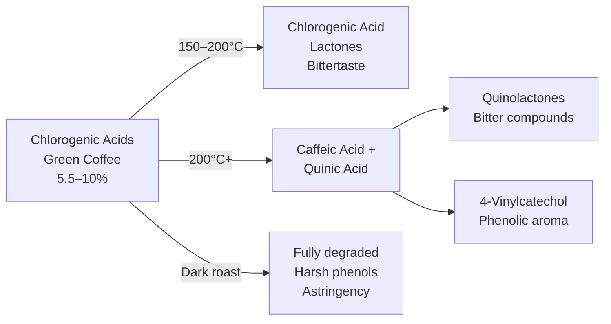

# Maillard Reaction, Caramelization & Thermal Chemistry

## 📍 Parent Topics
- [Extraction Chemistry](extraction-chemistry.md)
- [Roasting Science](../roasting/roast-science.md)

---

## The Maillard Reaction — In Depth

### Discovery and Mechanism

Named after **Louis-Camille Maillard** (1912), who first described the browning reaction between amino acids and reducing sugars.

**General reaction:**

$$\text{R-NH}_2 \text{ (amino acid)} + \text{R'-CHO (reducing sugar)} \xrightarrow{T > 140°C} \text{N-substituted glycosylamine} \rightarrow \text{Amadori product} \rightarrow \text{Complex products}$$

### Three Stages in Coffee

### Key Flavor Compounds from Maillard

| Compound Class | Formation | Flavor Notes |
|---------------|-----------|-------------|
| **Furans** | Sugar degradation | Caramel, bread, sweet, nutty |
| **Pyrazines** | Strecker + cyclization | Nutty, roasted, earthy, green |
| **Aldehydes** (Strecker) | Amino acid oxidation | Malty, green, chocolate |
| **Pyrroles** | Proline + sugars | Bread, grain, cereal |
| **Thiophenes** | Sulfur-containing compounds | Roasted, meaty |
| **Melanoidins** | High-MW polymers | Brown color; bitter-sweet; body |
| **2-Furfurylthiol** | Specific Maillard pathway | Most potent coffee aroma compound |

> 🔬 *2-Furfurylthiol has a detection threshold of ~0.01 ppb in water — it is often cited as the single most characteristic aroma compound of roasted coffee.*

---

### Strecker Degradation

A sub-reaction within the Maillard pathway:

$$\text{α-amino acid} + \text{α-dicarbonyl compound} \rightarrow \text{Strecker aldehyde} + \text{aminoketone}$$

**Strecker aldehydes from coffee amino acids:**

| Amino Acid | Strecker Aldehyde | Aroma |
|-----------|------------------|-------|
| Valine | Isobutanal | Malty |
| Leucine | 3-Methylbutanal | Dark chocolate, malty |
| Alanine | Acetaldehyde | Green, fruity |
| Phenylalanine | Phenylacetaldehyde | Honey, rose, sweet |
| Methionine | Methional | Potato, cooked |

---

## Caramelization — In Depth

Caramelization is **purely thermal** — requires no amino acids. Sucrose (the dominant sugar in green coffee at 6–9%) undergoes:

$$\text{Sucrose} \xrightarrow{186°C} \text{Glucose} + \text{Fructose} \xrightarrow{\text{continued heat}} \text{Caramel compounds}$$

### Key Caramelization Products

| Compound | Flavor | Threshold (ppm) |
|---------|--------|----------------|
| **Maltol** | Sweet, caramel, cotton candy | 35 |
| **5-HMF** (hydroxymethylfurfural) | Sweet, caramel, bread | 22 |
| **Diacetyl** | Buttery, cream | 0.04 |
| **Furaneol** (HDMF) | Caramel, strawberry | 0.06 |
| **Isomaltol** | Caramel, toasty | 16 |

### Caramelization Temperature Ranges

| Stage | Temperature | Products |
|-------|------------|---------|
| Sucrose inversion | 186°C | Glucose + fructose |
| Early caramel | 190–200°C | Furans, diacetyl |
| Mid caramel | 200–220°C | Maltol, furaneol |
| Dark caramel | 220–230°C | Caramel color, bitter notes |
| Carbonization | > 230°C | Carbon (burnt) |

---

## Pyrolysis (Dark Roasting)

At temperatures above ~220°C (second crack), **pyrolysis** dominates — thermal decomposition without oxidation:

$$\text{Organic compounds} \xrightarrow{T > 220°C} \text{Smaller molecules} + \text{CO}_2 + \text{H}_2\text{O} + \text{char}$$

### Pyrolysis Products in Dark Roast

| Compound | Formation | Flavor |
|---------|-----------|--------|
| **Guaiacol** | Lignin pyrolysis | Smoky, medicinal, spicy |
| **4-Vinylguaiacol** | Ferulic acid decarboxylation | Clove, spicy |
| **Catechol** | Chlorogenic acid pyrolysis | Phenolic, dry |
| **Pyridine** | Trigonelline pyrolysis | Harsh, astringent |
| **Indene/Naphthalene** | PAHs at very high temp | Bitter, chemical |

> ⚠️ *Polycyclic aromatic hydrocarbons (PAHs) can form at very high roasting temperatures. This is a food safety concern addressed by roasting standards (EU Regulation No 835/2011 limits benzo[a]pyrene to 5 μg/kg in roasted coffee). Specialty roasting temperatures are typically well below this threshold.*

---

## Chlorogenic Acid (CGA) Transformation

CGAs are the most abundant group of phenolic compounds in green coffee (5.5–10% dry weight). Their transformation during roasting is complex:

**Roast level impact:**
- Light roast: High CGA → bright, perceived acidity, antioxidant-rich
- Medium roast: CGA lactones → pleasant bittersweet balance
- Dark roast: Quinolactones → harsh bitterness + dry finish

---

## Thermal Fluid Dynamics in Brewing

### Heat Transfer in Espresso

During espresso extraction at 9 bar, 93°C water passes through the puck:

**Convective heat loss:**
$$\dot{Q}_{conv} = h \cdot A \cdot (T_{water} - T_{puck})$$

The puck starts at room temperature → heat is transferred to coffee particles during extraction → affects first few seconds of extraction significantly.

**Pre-infusion mitigates this** by allowing the puck to thermally equilibrate before full pressure extraction.

### Temperature Gradients in Pour-Over

During a pour-over, the coffee bed experiences:
- **Top zone:** Fresh hot water (93°C+)
- **Middle zone:** Partially extracted, cooling water (~88–92°C)
- **Bottom zone:** Coolest, most extracted zone (~85–90°C)

This gradient means different parts of the bed extract at different temperatures — contributing to the complexity of pour-over vs espresso (which is more thermally uniform).

---

## Viscosity and Flow

Espresso is a **non-Newtonian fluid** — its viscosity changes under shear stress:

$$\tau = K \cdot \dot{\gamma}^n$$

Where:
- *τ* = shear stress
- *K* = consistency coefficient
- *γ̇* = shear rate
- *n* < 1 → shear-thinning (espresso behavior)

**Practical implication:** Espresso flows more easily at higher flow rates (shear-thinning). This contributes to the self-regulating behavior of espresso extraction.

---

## 🔗 Related Topics
- [Extraction Chemistry](extraction-chemistry.md)
- [Roasting Science](../roasting/roast-science.md)
- [Solubility Science](solubility-science.md)
- [Sensory & Cupping](../sensory-cupping/cupping-protocol.md)
