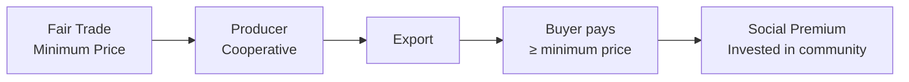
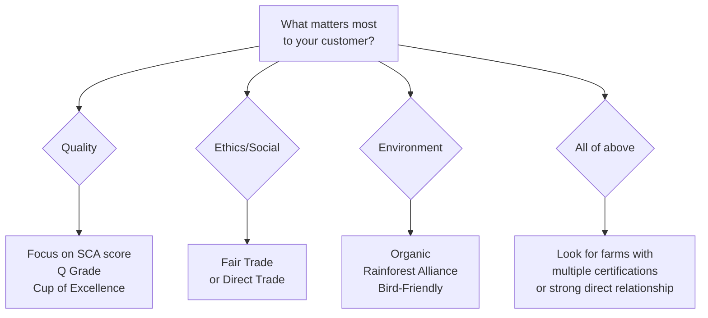

# Coffee Certifications & Standards

## 📍 Parent Topics
- [Coffee Fundamentals](../INDEX.md)
- [Supply Chain](supply-chain.md)

---

## Why Certifications Matter

Certifications serve three audiences:
- **Consumers:** Signal of quality, ethics, or environmental care
- **Buyers/Roasters:** Shorthand for sourcing values
- **Producers:** Market access, price premiums, technical support

> ⚠️ *No single certification covers everything. A coffee can be organic but low quality. A non-certified farm can produce world-class specialty. Use certifications as one signal among many.*

---

## Quality Certifications

### SCA Specialty Grade

| Attribute | Requirement |
|---------|------------|
| Primary defects | 0 per 350g sample |
| Secondary defects | Max 5 per 350g sample |
| Cup score | ≥ 80 points (SCA cupping form) |
| Quakers | 0 allowed |
| Moisture | 10–13% |
| Screen size | No minimum (origin-dependent) |

**What it means:** The coffee has been evaluated by a trained cupper and scored at or above 80 points. It's a quality claim, not an ethical or environmental one.

---

### Q Grader (CQI)

The **Q Arabica Grader** certification is issued by the **Coffee Quality Institute (CQI)**. It certifies that an individual can:
- Reliably evaluate Arabica coffee to SCA standards
- Pass 22 individual tests covering aroma, taste, cupping calibration, green grading, and roast identification
- Maintain calibration through recertification every 3 years

| Q Program | Species | Issuer |
|-----------|---------|--------|
| Q Arabica | Arabica | CQI |
| Q Robusta | Robusta | CQI |
| Q Processing | Processing expertise | CQI |

---

### Cup of Excellence (CoE)

- Run by the **Alliance for Coffee Excellence (ACE)**
- National competitions in producing countries
- Top coffees cupped by international panel of Q Graders
- Scores above 87 qualify; top lots auctioned online
- Auction prices: $10–$300+/lb at farm gate
- Provides maximum income transparency to producer

| Country with CoE | First Year |
|-----------------|-----------|
| Brazil | 1999 |
| Guatemala | 2001 |
| Honduras | 2004 |
| Ethiopia | 2020 |
| Colombia | 2005 |

---

## Ethical & Social Certifications

### Fair Trade (Fairtrade International / Fair Trade USA)

| Parameter | Detail |
|---------|--------|
| Minimum price | ~$1.80/lb washed Arabica (verify current FLO floor price) |
| Social premium | +$0.20/lb for cooperative projects |
| Structure | Democratic cooperative required (for Fairtrade Intl) |
| Audit | Third-party annual audit |
| Best for | Smallholder cooperatives in developing countries |
| Limitation | Quality not guaranteed; large estate farms excluded from some programs |

---

### Direct Trade

- No single certifying body — self-certified by roasters
- Implies: Roaster visits farm, negotiates price directly (above C-market and often above FT), builds multi-year relationship
- More transparency than Fair Trade (specific price disclosed), but no third-party verification
- **Common roaster claims:** "We pay X% above Fair Trade minimum," "We publish our pricing"

---

## Environmental Certifications

### USDA Organic / EU Organic

| Requirement | Detail |
|------------|--------|
| No synthetic pesticides | 3-year transition period required |
| No synthetic fertilizers | Composting and natural inputs only |
| GMO-free | No genetically modified organisms |
| Annual audit | Third-party certification body |
| Cost | $500–5,000+/year (prohibitive for smallholders) |

**Limitation:** Organic certification is expensive. Many small farmers use organic practices but can't afford certification — look for "transitional organic" or farmer relationship to verify.

---

### Rainforest Alliance (RA)

Formed from merger of Rainforest Alliance + UTZ (2018):

| Focus | Criteria |
|-------|---------|
| Biodiversity | Shade trees, wildlife corridors |
| Farmer livelihoods | Living wage benchmarks |
| Climate resilience | Adaptation planning required |
| Farm management | Integrated Pest Management |
| Traceability | Mass balance to farm level |

RA issues the "Rainforest Alliance Certified" seal (green frog). No minimum price guaranteed.

---

### Bird-Friendly (Smithsonian Migratory Bird Center)

- Strictest shade requirement of any certification
- Requires organic certification as prerequisite
- Minimum 40% shade cover; diverse tree species
- Protects migratory bird habitat in coffee regions
- Premium: typically small (< 5%), market mostly US specialty

---

## Green Coffee Grading Standards

### SCA Green Coffee Classification

| Grade | Primary Defects (per 350g) | Secondary Defects | Use |
|-------|--------------------------|-------------------|-----|
| Grade 1 (Specialty) | 0 | Max 5 | Specialty coffee |
| Grade 2 (Premium) | 0 | Max 8 | Specialty/premium |
| Grade 3 (Exchange) | 0–3 | Max 23 | Commercial exchange |
| Grade 4 (Below Standard) | 4–11 | Max 24 | Below standard |
| Grade 5 (Off Grade) | >11 | >24 | Off grade |

### Ethiopian Grading System

| Grade | Description |
|-------|-------------|
| Grade 1 | Specialty (≤ 3 defects per 300g); full traceability |
| Grade 2 | 4–12 defects; washed specialty |
| Grade 3 | 13–25 defects; used for export blends |
| Grade 4 | 26–45 defects; lower-end commercial |

### Kenyan Grading (Screen Size)

| Grade | Screen Size | Bean Character |
|-------|------------|----------------|
| AA | Screen 18+ | Largest; premium |
| AB | Screen 15–16 | Common specialty |
| PB | Peaberry | Round single bean; intense flavor |
| C | Screen 14 | Lower grade |
| E | Elephant (double bean) | Rare |

---

## Brewing Standards

### SCA Golden Cup Standard (Filter)

| Parameter | Target | Acceptable Range |
|---------|--------|-----------------|
| Brew Ratio | 1:17 (by weight) | 1:15 – 1:19 |
| TDS (Strength) | 1.30% | 1.15–1.45% |
| Extraction Yield | 20% | 18–22% |
| Water Temperature | 93°C | 91–96°C |
| Contact Time (batch) | 4–8 min | varies by method |

### IIAC Italian Espresso Standard

| Parameter | Specification |
|---------|--------------|
| Ground coffee dose | 7g ± 0.5g (single) |
| Water temperature | 88°C ± 2°C |
| Pressure | 9 bar ± 1 bar |
| Percolation time | 25s ± 5s |
| Volume in cup | 25mL ± 2.5mL |

---

## Certification Decision Framework

---

## 🔗 Related Topics
- [Specialty Coffee Movement](specialty-coffee-movement.md)
- [Supply Chain](supply-chain.md)
- [Coffee Economics](coffee-economics.md)
- [Cupping Protocol](../sensory-cupping/cupping-protocol.md)
