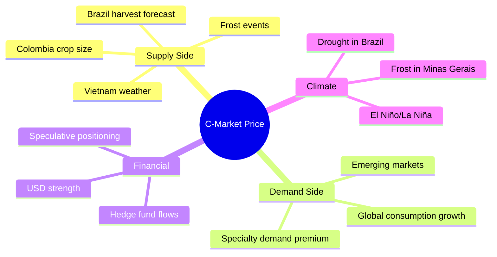

# Coffee Economics & Market Structure

## 📍 Parent Topics
- [Coffee Fundamentals](../INDEX.md)
- [Supply Chain](supply-chain.md)

---

## Global Production Statistics

| Metric | Value (approx. 2023) |
|--------|---------------------|
| Global production | ~170–175 million 60kg bags/year |
| Global export value | ~$30–40 billion USD/year |
| Number of producing countries | 70+ |
| People dependent on coffee | ~125 million (farming/processing) |
| Countries consuming most | EU, USA, Brazil, Japan |

### Top 10 Producing Countries (by volume)

| Rank | Country | Species | Bags (millions, 60kg) |
|------|---------|---------|----------------------|
| 1 | Brazil | Arabica + Robusta | 55–65 |
| 2 | Vietnam | Robusta dominant | 25–30 |
| 3 | Colombia | Arabica | 12–14 |
| 4 | Indonesia | Robusta + Arabica | 10–12 |
| 5 | Ethiopia | Arabica | 7–8 |
| 6 | Honduras | Arabica | 5–7 |
| 7 | India | Robusta + Arabica | 5–6 |
| 8 | Uganda | Robusta | 5–6 |
| 9 | Mexico | Arabica | 4–5 |
| 10 | Peru | Arabica | 4–5 |

---

## The C-Market (Commodity Coffee)

The **Coffee C Contract** traded on the **ICE Futures U.S. (Intercontinental Exchange)** is the global benchmark price for Arabica coffee.

- **Unit:** US cents per pound (¢/lb)
- **Contract size:** 37,500 lbs (one contract)
- **Delivery months:** March, May, July, September, December
- **Quality standard:** Exchange Grade 3 or better (screen 15+)
- **Historical range:** ~$0.50/lb (2001 lows) to $3.00+/lb (peaks)

### Price Drivers



---

## Price Tiers

```
Price Stack (approx. USD/lb at farm gate, 2023)
┌─────────────────────────────────────────────┐
│ Competition lot (CoE winner)    $50–200+/lb  │
│ Micro-lot specialty (direct)    $8–25/lb     │
│ SCA 80+ specialty (general)     $3–8/lb      │
│ Fair Trade minimum (cooperative)$1.80/lb min │
│ C-Market commodity              $1.20–2.50/lb│
│ Below-grade commercial          <$1.00/lb    │
└─────────────────────────────────────────────┘
```

---

## Specialty vs Commodity Economics

| Factor | Commodity Coffee | Specialty Coffee |
|--------|-----------------|-----------------|
| Price benchmark | C-market | Q-graded, buyer-set |
| Price transparency | Published daily | Negotiated |
| Farmer income | Often below cost of production | Higher, more stable |
| Quality incentive | Minimal | Strong |
| Relationship | Anonymous, via traders | Direct or semi-direct |
| Traceability | Country-level only | Farm/lot level |
| Volume | Millions of bags | Thousands of bags |

---

## Certifications & Standards

### Major Certification Systems

| Certification | Body | Core Focus | Premium Over C-Market |
|--------------|------|-----------|----------------------|
| **Fair Trade** | Fairtrade Intl | Social equity, cooperative structure | $0.20/lb social premium |
| **Rainforest Alliance** | RA (Tetrapak-backed) | Environmental, biodiversity | Varies |
| **USDA Organic** | USDA/EU | No synthetic inputs | 10–30% premium |
| **Bird-Friendly** | Smithsonian | Shade-grown habitat | Small premium |
| **SCA Specialty Grade** | SCA | Cup quality ≥ 80 pts | Negotiated |
| **Q Grade** | CQI | Scientific cup score ≥ 80 | Negotiated |
| **Cup of Excellence** | ACE | Competitive auction, top scores | $20–$300+/lb |
| **Direct Trade** | Self-certified | Relationship, quality, transparency | Variable |

### Fair Trade in Detail

- **Minimum price guarantee:** USD $1.80/lb washed Arabica (subject to periodic revision — verify current FLO rates)
- **Social premium:** +$0.20/lb invested in community (schools, health, infrastructure)
- **Cooperative requirement:** Must be democratically run cooperative (not estate/individual)
- **Limitations:** FT certification ≠ quality guarantee; certified coffees can still score below 80

### Organic Certification

- **What it covers:** No synthetic pesticides, herbicides, or fertilizers for 3+ years
- **What it doesn't cover:** Cup quality, fair wages, environmental management
- **Cost:** Certification fees ($500–$5,000+/year) — often too expensive for smallholders
- **Shade-grown correlation:** Many organic farms are also shade-grown (synergistic management)

---

## Producer Economics

### The Cost Problem

In many producing countries, the cost of production **exceeds** the C-market price at dips:

| Country | Avg Cost of Production (est.) | C-Market at $1.50/lb |
|---------|------------------------------|----------------------|
| Colombia | ~$1.20–1.60/lb | Break-even or loss |
| Ethiopia | ~$0.80–1.00/lb | Small margin |
| Honduras | ~$0.90–1.20/lb | Marginal |
| Brazil (large estate) | ~$0.80–1.00/lb | Small margin |

This makes **price volatility** existential for many smallholders who have no financial buffer.

### Why Specialty Matters Economically

Specialty coffee provides:
1. **Price floor independence** from C-market volatility
2. **Quality incentive** — better farming = higher price
3. **Direct relationships** — more of value chain stays at origin
4. **Differentiation** — terroir, varietal, process become assets not liabilities

---

## Coffee's Economic Impact

- Coffee is the **#1 or #2 agricultural export** for many producing nations (Ethiopia, Honduras, Rwanda, Burundi)
- In Ethiopia: coffee = ~25–30% of national export earnings
- In Honduras: ~20% of export revenue
- Creates millions of rural jobs in processing, logistics, export

---

## 🔗 Related Topics
- [Supply Chain & Certifications](supply-chain.md)
- [Specialty Coffee Movement](specialty-coffee-movement.md)
- [History of Coffee](history-of-coffee.md)
- [Café Operations & Costing](../cafe-operations/beverage-costing.md)
