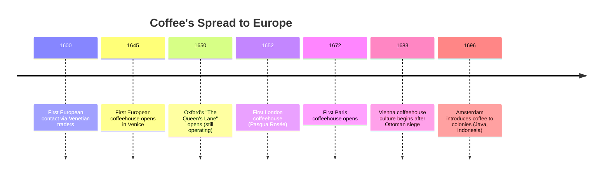
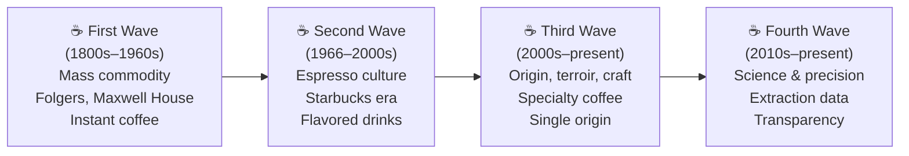

# History of Coffee

## 📍 Parent Topics
- [Coffee Fundamentals → Overview](../INDEX.md)

## 🗺️ Child Topics
- [Specialty Coffee Movement](specialty-coffee-movement.md)
- [Coffee Economics](coffee-economics.md)
- [Ethiopia Region Profile](../beans/regions/ethiopia.md)

---

## 1. Origins — Ethiopia (9th–10th Century)

The story of coffee begins in the **Kaffa region of Ethiopia**, where *Coffea arabica* grows wild to this day. The most widely cited origin legend involves a goat herder named **Kaldi**, who observed his goats becoming unusually energetic after eating red berries from a particular shrub. While the Kaldi story is likely apocryphal, **genetic and historical evidence confirms that wild Arabica coffee originated in the highlands of Ethiopia and South Sudan**, particularly the Kaffa and Boma Plateaus.

> ⚗️ *Scientific Note:* DNA studies confirm Ethiopia as the center of genetic diversity for *Coffea arabica* (Lashermes et al., 1999).

Ethiopian populations have consumed coffee in various forms for centuries — including **buna qela** (roasted coffee beans eaten with fat) and **kuti** (coffee leaf tea) — long before brewing the beverage as we know it.

---

## 2. Arabian Peninsula & Yemen (15th–16th Century)

By the **15th century**, Sufi monks in Yemen were cultivating coffee in the port city of **Mocha (Al-Mukha)** and using it to aid concentration during night prayers. Yemen became the first country to commercially cultivate and trade coffee, and the port of Mocha gave its name to the early coffee trade.

The first **coffeehouses** (Arabic: *Qahveh Khaneh*, later *qahwa*) emerged in **Mecca and Cairo** around 1511–1530, becoming social hubs for scholars, merchants, and musicians. These establishments were sometimes banned by local authorities who feared their role as centers of political discourse.

---

## 3. Coffee Reaches Europe (17th Century)

By 1700, London alone had over **2,000 coffeehouses** — known as "Penny Universities" because for the price of a penny (admission), anyone could access newspapers, intellectual debate, and business dealings. Lloyd's of London insurance market began as a coffeehouse.

---

## 4. Colonial Coffee Systems (18th–19th Century)

As European demand exploded, colonial powers established plantation systems across:

| Region | Colonial Power | Era | Key Crops |
|--------|---------------|-----|-----------|
| Java, Indonesia | Netherlands | 1696+ | Arabica |
| Martinique, Caribbean | France | 1720+ | Arabica |
| Brazil | Portugal | 1727+ | Arabica |
| India | Britain | 1840s+ | Arabica, later Robusta |
| Vietnam | France | 1857+ | Robusta |

These systems relied heavily on enslaved and indentured labor, a legacy that still echoes in current discussions of **fair trade and ethical sourcing**.

---

## 5. The Three Waves of Coffee

### First Wave (Mid-1800s–1960s)
- Coffee becomes a mass-market commodity
- Canning, instant coffee (Sanka 1909, Nescafé 1938)
- Focus: availability and convenience
- Key players: Folgers (1850), Maxwell House (1892)

### Second Wave (1966–2000s)
- **Starbucks** (founded 1971 in Seattle) popularizes espresso drinks, dark roasts, and the coffeehouse as "third place"
- Alfred Peet (Peet's Coffee, 1966) introduces high-quality roasting to the US
- Consumer awareness of origin begins

### Third Wave (2000s–Present)
- Coffee treated as **artisan product**, analogous to wine
- Emphasis on **traceability, single origin, processing method**
- **Specialty Coffee Association (SCA)** standards define quality
- Light roasting to preserve origin character
- Key pioneers: Stumptown, Intelligentsia, Counter Culture, Blue Bottle

### Fourth Wave (2010s–Present)
- **Scientific precision** in extraction (TDS meters, pressure profiling)
- **Transparency** in pricing and sourcing
- **Direct trade** relationships with farmers
- AI and data analytics in roasting
- Seed-to-cup traceability

---

## 6. The Specialty Coffee Association (SCA)

The SCA (formed 2017 from merger of SCAA + SCAE) is the primary international body setting standards for:
- Green coffee grading
- Cupping protocol
- Brewing standards (Golden Cup)
- Barista training and certification
- Sensory analysis methodology

> 📌 SCA defines **specialty coffee** as coffee scoring **≥ 80 points** on their 100-point cupping scale.

---

## 7. Quick Reference Timeline

| Year | Event |
|------|-------|
| ~850 | Kaldi legend; Ethiopian coffee consumption documented |
| 1400s | Yemen cultivation and trade |
| 1511 | First coffeehouse ban in Mecca |
| 1645 | Venice coffeehouse opens |
| 1652 | London coffeehouse opens |
| 1727 | Coffee introduced to Brazil |
| 1800s | Industrial-scale coffee trade begins |
| 1901 | First instant coffee patent (Satori Kato) |
| 1938 | Nescafé launched globally |
| 1966 | Peet's Coffee opens — Second Wave begins |
| 1971 | Starbucks founded |
| 1982 | SCAA founded |
| 2000s | Third Wave emerges |
| 2017 | SCA formed (SCAA + SCAE merger) |
| 2020s | Fourth Wave: precision, AI, sustainability |

---

## 🔗 Related Topics
- [Specialty Coffee Movement](specialty-coffee-movement.md)
- [Coffee Supply Chain](supply-chain.md)
- [Ethiopia Region Profile](../beans/regions/ethiopia.md)
- [Certifications & Standards](certifications-standards.md)
- [Coffee Economics](coffee-economics.md)
