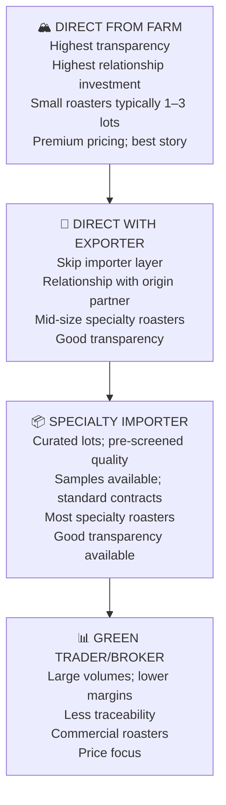
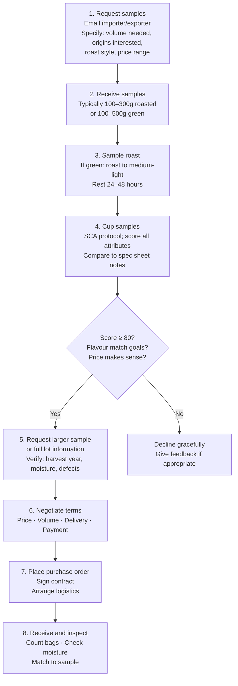

# Sourcing & Direct Trade — Practical Guide for Roasters

## 📍 Parent Topics
- [Coffee Fundamentals](../INDEX.md)
- [Supply Chain](supply-chain.md)

---

## The Sourcing Pyramid



---

## Understanding Importer Types

### Specialty Importers

Curate specific lots from farms and cooperatives they have long-term relationships with:

| Importer | Headquarters | Approach | Known For |
|---------|-------------|---------|-----------|
| **Cafe Imports** | USA (Minneapolis) | Broad specialty; comprehensive | Wide global portfolio |
| **Ally Coffee** | USA (Greenville) | Transparency-first; published prices | Pricing transparency |
| **Nordic Approach** | Norway | Ultra-direct; published full supply chain | Radical transparency |
| **DR Wakefield** | UK | UK/Europe focus; specialty | European specialty |
| **Sucafina Specialty** | Global | Specialty arm of major trader | Global reach |
| **InterAmerican Coffee** | USA | Americas focus | Central/South America |
| **Royal Coffee** | USA | Cupping room in Oakland; specialty | West Coast USA |

### Trader/Broker Model

- Larger volumes; less relationship depth
- Price negotiation more aggressive
- Less origin story; less farm-level traceability
- **Examples:** Volcafe, Neumann Gruppe, ECOM, Louis Dreyfus

---

## Sample Evaluation Workflow

### From Inquiry to Purchase Order



---

## Sample Evaluation Form

```
SAMPLE EVALUATION LOG

Importer: ___________________  Lot: ___________________
Origin: ___________________ Region: ___________________
Varietal: _________________ Process: ___________________
Harvest year: _____________ Altitude: ___________________
Sample type: □ Pre-shipment  □ Arrival  □ Green  □ Roasted
Price offered: ____________ Volume available: ___________

PHYSICAL ASSESSMENT (Green)
Colour: __________________  Moisture %: ________________
Screen size: _____________  Defects (350g): _____________
Grade: __________________  Aroma: _____________________

CUP ASSESSMENT (SCA Protocol)
Fragrance/Aroma: ___/10  Flavour: ___/10
Aftertaste: ___/10       Acidity: ___/10
Body: ___/10             Balance: ___/10
Uniformity: ___/10       Clean Cup: ___/10
Sweetness: ___/10        Overall: ___/10
Defects: ___             TOTAL: ___/100

TASTING NOTES:
____________________________________________

DECISION: □ Buy  □ Pass  □ Re-cup  □ Negotiate
Notes: _____________________________________
```

---

## Building Direct Relationships

### The Direct Trade Relationship Arc

```
YEAR 1: Introduction
  → Meet at trade show (SCA, Re:co, Origins)
  → OR introduced by trusted importer/exporter partner
  → OR source trip (you travel to origin)
  → Buy a test lot; evaluate quality
  → Provide detailed feedback

YEAR 2–3: Developing Trust
  → Return purchase; volume growing
  → Visit the farm (critically important)
  → Understand the farmer's challenges
  → Agree on pricing model (above C-market + transparent formula)
  → Begin exclusive or priority access to specific lots

YEAR 3–5: Mature Relationship
  → Multi-year forward contracts possible
  → Co-investment in processing improvements
  → Training exchange (cupping feedback to farmer)
  → Joint storytelling to consumers
  → Price premium sustained by quality performance

YEAR 5+: Partnership
  → Farmer predicts your needs; you predict their crop
  → Joint R&D (new varietals, processing experiments)
  → Farm visits become annual
  → Both parties' businesses interconnected
```

---

## Pricing Models

### C-Market + Differential

Most specialty coffee is priced as:

$$\text{Price} = \text{C-market (ICE Futures)} + \text{Differential}$$

**Differential** = premium over C-market, negotiated based on:
- Quality (cup score)
- Certification (organic, fair trade adds fixed premiums)
- Exclusivity (single farm, limited lot)
- Relationship (long-term partnership)
- Processing (unusual process commands premium)

**Example:**
- C-market: $1.80/lb
- Ethiopian Yirgacheffe Grade 1 differential: +$0.80/lb
- **Total: $2.60/lb at origin** (before freight, insurance, importer margin)

---

### Cost-Transparency Pricing (Nordic Approach Model)

Some importers publish their full price stack:

```
COST TRANSPARENCY EXAMPLE (illustrative):

Farm gate price paid:         $3.20/lb
Export taxes + certification: $0.15/lb
Logistics (origin to port):   $0.10/lb
Ocean freight:                $0.25/lb
Import duty:                  $0.08/lb
Importer margin (15%):        $0.57/lb
────────────────────────────────────
LANDED PRICE TO ROASTER:      $4.35/lb
```

This model builds trust and demonstrates where value flows in the chain.

---

## Contract Terms Reference

### Key Terms in Green Coffee Contracts

| Term | Meaning | Standard |
|------|---------|---------|
| **FOB (Free On Board)** | Seller delivers to named port; buyer pays freight | Common |
| **CIF (Cost Insurance Freight)** | Seller pays freight and insurance to destination port | Common |
| **EXW (Ex Works)** | Buyer collects from seller's warehouse | Less common |
| **Spot purchase** | Buy from existing inventory; ship now | Quick but less customised |
| **Forward contract** | Lock price before harvest; take delivery later | Price certainty; quality risk |
| **Sample approval** | Purchase conditional on arrival sample matching pre-shipment | Standard |
| **Force majeure** | Neither party liable for acts of God/war/disaster | Standard |
| **GrainPro specification** | Inner GrainPro liner required | Specialty standard |

---

## Quality Assurance During Import

### Pre-Shipment Sample (PSS)

Before the container ships, request a pre-shipment sample:
- Typically 200–500g
- Must match the coffee you cupped when buying
- Standard: within 1–2 SCA points of the offer sample
- **If PSS fails to match:** Renegotiate, delay shipment, or cancel if contract allows

### Arrival Sample

When container arrives:
- Take samples from multiple bags (minimum 3; ideally 10% of bags)
- Blend and cup arrival sample
- Compare to PSS and offer sample
- Log any discrepancies for supplier feedback

```
ARRIVAL INSPECTION CHECKLIST
□ Count total bags received vs invoice
□ Check bag condition (no tears, moisture, pest damage)
□ Check moisture meter on 5+ bags (10–12% target)
□ Visual inspection: colour, odour, visible defects
□ Arrival sample: 200g from 3+ bags
□ Cup arrival sample within 48 hours
□ Log result: matches pre-shipment sample? Y / N
□ If discrepancy: notify importer within 5 business days
```

---

## Ethical Sourcing Framework

### Minimum Standards for Responsible Sourcing

| Standard | Description |
|---------|-------------|
| **Know your origin** | Country, region, farm/coop, altitude, varietal, process documented |
| **Know your price** | What % reaches the farmer? Is it above production cost? |
| **Living wage** | Does the price paid support a dignified livelihood for producers? |
| **Child labour** | No child labour verified in supply chain |
| **Environmental** | Processing doesn't pollute waterways; shade encouraged |
| **Long-term commitment** | Multi-year relationships protect farmers from price volatility |

### Transparency Communication to Consumers

Specialty roasters who invest in direct relationships can communicate:
- "We pay $X.XX/lb — XX% above Fair Trade minimum"
- "We visited this farm in [month/year]"
- "This is our 4th consecutive year buying from [farmer name]"
- QR code linking to farm profile, GPS coordinates, farmer story

---

## Source Trip Planning

A **farm visit** transforms a transactional relationship into a partnership:

### Source Trip Essentials

```
PRE-TRIP PREPARATION
□ Secure introductions via trusted importer/trader
□ Confirm harvest timing — you MUST be there during or post-harvest
□ Prepare sensory training materials to leave with farmer
□ Prepare feedback from previous year's cups
□ Budget: typically $3,000–8,000 all-in for 1–2 week origin trip

DURING THE VISIT
□ See every step of processing (picking, pulping, fermentation, drying)
□ Cup coffees from multiple stages and lots
□ Meet the farmers (not just the exporter/mill)
□ Understand their economic reality
□ Discuss what you'd like next season (processing experiments, etc.)
□ Take photos and video for storytelling (with permission)
□ Discuss pricing expectations for next crop

POST-TRIP
□ Detailed written feedback to farmer/exporter
□ Share cupping scores from their coffees
□ Confirm next year's purchase commitment
□ Create customer-facing content from the trip
□ Thank-you communication to all hosts
```

---

## 🔗 Related Topics
- [Supply Chain](supply-chain.md)
- [Certifications & Standards](certifications-standards.md)
- [Coffee Economics](coffee-economics.md)
- [Green Coffee Grading](../beans/green-coffee-grading.md)
- [Sustainability & Climate](sustainability-climate.md)
