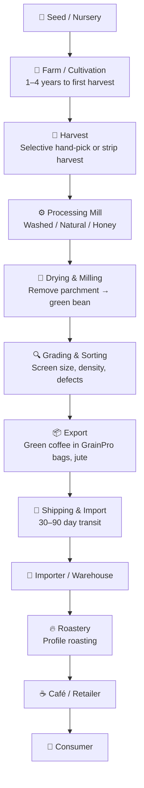
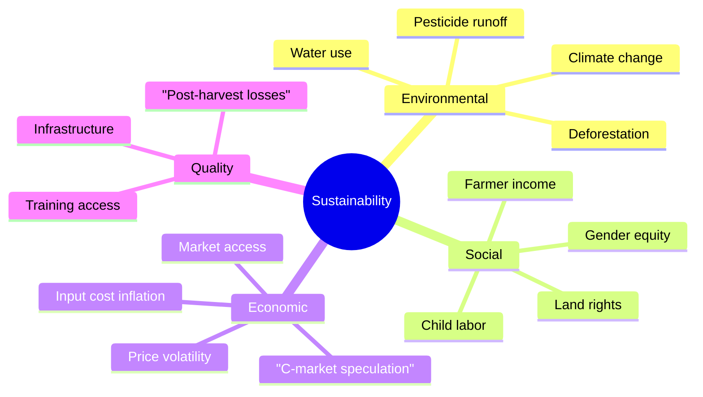

# Coffee Supply Chain & Certifications

## 📍 Parent Topics
- [Coffee Fundamentals](../INDEX.md)
- [History of Coffee](history-of-coffee.md)

---

## The Full Supply Chain

### Key Actors

| Actor | Role |
|-------|------|
| **Producer/Farmer** | Grows, harvests, sometimes processes |
| **Processing Station** | Wet mill, drying beds, fermentation control |
| **Export Mill** | Dry milling, sorting, grading, bagging |
| **Exporter** | Logistics, documentation, quality control |
| **Importer/Trader** | Buys and warehouses green coffee; samples to roasters |
| **Roaster** | Transforms green to roasted; flavor development |
| **Barista/Café** | Final extraction, customer experience |

---

## Certifications Comparison

| Certification | Focus | Minimum Price? | Farm Audit? | Best For |
|--------------|-------|---------------|-------------|---------|
| **Fair Trade** | Social equity, minimum price | ✅ Yes | ✅ | Cooperatives, smallholders |
| **Rainforest Alliance** | Environmental sustainability | ❌ No | ✅ | Large estates |
| **Organic (USDA/EU)** | No synthetic pesticides/fertilizers | ❌ No | ✅ | Health-focused consumers |
| **UTZ** (now RA) | Good agricultural practices | ❌ No | ✅ | |
| **Bird-Friendly (Smithsonian)** | Shade-grown habitat | ❌ No | ✅ | Conservation |
| **Direct Trade** | Relationship, transparency, premium | Custom | Optional | Specialty roasters |
| **SCA Q Grade** | Cup quality ≥ 80pts | ❌ No | ❌ | Specialty positioning |

> ⚠️ *Certification ≠ Quality:* A Fair Trade coffee can score below 80; a non-certified farm can produce world-class specialty.

---

## Fair Trade Key Terms

- **Minimum Price:** USD $1.80/lb for washed Arabica (as of recent years — check current ICO/FLO rates)
- **Social Premium:** +$0.20/lb invested in community projects
- **Cooperative Structure:** Most FT requires democratically-run cooperatives, not individual estates

---

## Green Coffee Grading (SCA Standard)

| Grade | Max Primary Defects | Max Secondary Defects | Min Screen Size |
|-------|--------------------|-----------------------|----------------|
| Specialty (Grade 1) | 0 | 5 | varies by origin |
| Premium (Grade 2) | 0 | 8 | |
| Exchange Grade | 0–3 | 23 | Screen 15 |
| Below Standard | 4+ | 24+ | |
| Off Grade | High | High | |

**Primary Defects** (most severe): Full black bean, full sour, dried cherry, fungus damage, foreign material, severe insect damage

**Secondary Defects** (less severe): Partial black/sour, broken/chipped, insect-damaged, floaters, shells (husks)

---

## Sustainability Challenges

---

## 🔗 Related Topics
- [Coffee Economics](coffee-economics.md)
- [Specialty Coffee Movement](specialty-coffee-movement.md)
- [Bean Profiles — Ethiopia](../beans/regions/ethiopia.md)
- [Certifications & Standards](certifications-standards.md)
