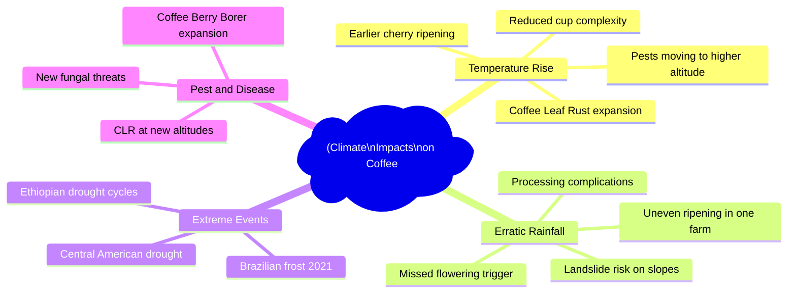

# Sustainability, Climate Change & the Future of Coffee

## 📍 Parent Topics
- [Coffee Fundamentals](../INDEX.md)
- [Supply Chain](supply-chain.md)

---

## The Climate Crisis in Coffee

Coffee is one of the **most climate-sensitive crops on Earth**. *Coffea arabica* evolved in the cool, wet montane forests of Ethiopia and requires a narrow temperature and rainfall window:

| Parameter | Optimal Range | Impact Outside Range |
|---------|--------------|---------------------|
| Temperature | 15–24°C | >25°C → cherries ripen too fast; poor cup quality |
| Rainfall | 1,500–2,500mm/year | Drought → poor cherry development; excess → disease |
| Altitude | 600–2,200 masl | Low altitude + warming = unsuitable |
| Seasonality | Distinct wet/dry | Erratic seasons → poor flowering, uneven ripening |

### The Research Evidence

**Davis et al. (2012, PLOS ONE):** Under business-as-usual climate scenarios, up to **50% of current Arabica-suitable land** globally could become unsuitable by 2050.

**Bunn et al. (2015, Climatic Change):** Coffee production areas in many countries (especially Central America and parts of Brazil) face severe suitability decline.

**Key threatened regions:**
- Central America (especially at lower altitudes)
- Brazil (Minas Gerais — increasing frost risk from erratic weather; summer droughts)
- India (Wayanad — increasing temperature; reduced flowering triggers)

---

## Current Observed Impacts

---

## Coffee Leaf Rust (CLR) — *Hemileia vastatrix*

CLR is the single greatest biological threat to Arabica coffee:

| Fact | Detail |
|------|--------|
| Host | Arabica primarily; resistant in most Robusta |
| Condition | High humidity (>85%), temperature 15–28°C |
| Impact | Defoliates trees; reduces yield 30–80%; kills trees if severe |
| Historical damage | Destroyed Sri Lanka's entire coffee sector (1869); triggered replacement with tea |
| Current spread | Devastating Central America (2012–2013 epidemic); 2.7 million bags lost |
| Climate link | Warmer temperatures at altitude = CLR moving higher = new vulnerable farms |
| Resistance | Timor Hybrid (natural Arabica × Robusta cross) carries CLR resistance |

**Resistant varietals:** Castillo (Colombia), Catimor types, Timor-derived hybrids, H3 (Kenya)  
**Trade-off:** Many CLR-resistant varietals have slightly less complex cup than susceptible heirlooms

---

## Coffee Berry Borer — *Hypothenemus hampei*

The **most economically damaging coffee pest** globally:

| Fact | Detail |
|------|--------|
| Species | Scolytid beetle (tiny — 1.5mm) |
| Behaviour | Bores into coffee cherry; lays eggs inside bean |
| Impact | Reduces cup quality; economic loss up to 30% in affected farms |
| Climate link | Warmer temperatures → faster reproduction cycles → more generations per year |
| Altitude shift | Moving to higher altitudes as lower zones warm |
| Control | Biological (Beauveria bassiana fungus); traps; harvest timing; biological controls |

---

## Adaptation Strategies

### 1. Varietal Diversification

Moving beyond Typica/Bourbon/Caturra to climate-adapted varietals:

| Strategy | Approach | Examples |
|---------|---------|---------|
| **CLR-resistant hybrids** | Sacrifice some cup quality for survival | Castillo, Catimor, F1 hybrids |
| **F1 Hybrids** | First-generation crosses; vigour + quality | Centroamerica, Starmaya, Milenio (CATIE) |
| **Ethiopian heirlooms** | Extreme genetic diversity = resilience | Wild-collected varieties in testing |
| **Robusta in new forms** | Fine Robusta at altitude; heat-tolerant | Uganda highland Robusta |
| **Liberica return** | Heat and drought tolerant | Possible in low-altitude former Arabica zones |

---

### 2. Shade-Grown / Agroforestry

One of the most proven adaptation and sustainability strategies:

**Benefits of shade:**
- Reduces ambient temperature by 2–5°C → extends quality window
- Reduces water loss / evapotranspiration
- Protects from frost (thermal blanket)
- Biodiversity corridor (birds, insects)
- Income diversification (shade trees = timber, fruit, nitrogen fixing)
- Reduces need for synthetic inputs
- Soil conservation on slopes

**Shade tree species commonly used:**
- *Inga* spp. (nitrogen-fixing; widely used in Americas)
- Banana/plantain (fast shade; food security)
- Macadamia, avocado (income + shade)
- Rubber, timber species (long-term income)
- Native forest species (biodiversity focus)

**Shade-coffee certifications:** Bird-Friendly (Smithsonian) requires minimum 40% shade cover + organic

---

### 3. Altitude Migration

As lower zones warm, farmers move production higher:
- **Feasible** where geography allows (Andes, Ethiopian highlands, East African Rift)
- **Limited** where mountains are already at max elevation
- Creates **land-use conflicts** with existing forest/biodiversity at higher altitudes
- Requires infrastructure (roads, mills) to move with cultivation

---

### 4. Water Management

Rainfall becomes less predictable → water management critical:

| Strategy | Detail |
|---------|--------|
| **Rainwater harvesting** | Collection tanks; cisterns for dry season |
| **Drip irrigation** | Precise water application; reduces use |
| **Shade tree canopy** | Reduces evaporation from soil |
| **Contour planting** | Reduces runoff; increases infiltration |
| **Mulching** | Retains soil moisture; reduces temperature |

---

### 5. Regenerative Agriculture

Growing movement applying regenerative principles to coffee:

| Principle | Coffee Application |
|---------|------------------|
| **Soil health first** | Composting; cover crops; no-till |
| **Biodiversity** | Polyculture; native species integration |
| **Carbon sequestration** | Trees as carbon sinks |
| **Reduced inputs** | Minimise synthetic fertiliser; natural pest control |
| **Farmer livelihoods** | Long-term relationships; fair pricing |

---

## The Future of Coffee — Scenarios

### Scenario 1: Business As Usual (BAU)

**RCP 8.5 (high emissions):**
- 50%+ suitable Arabica area lost by 2050
- Remaining production shifts to higher altitudes
- Major producing countries (Honduras, Guatemala, parts of Ethiopia) severely impacted
- Coffee prices escalate significantly
- Specialty becomes luxury product

### Scenario 2: Managed Transition

**RCP 4.5 (moderate mitigation):**
- 20–30% suitable area reduction
- New varieties enable continuation in some threatened zones
- Significant farmer adaptation required (shade, irrigation, varietal switch)
- Specialty coffee remains accessible but more expensive
- New origins emerge (higher-altitude zones in East Africa, Himalayas, Southern Hemisphere)

### Scenario 3: Aggressive Mitigation + Innovation

**RCP 2.6 + adaptation:**
- Climate models show most current production zones viable with adaptation
- F1 hybrids and CLR-resistant varieties deployed widely
- Agroforestry as standard practice
- Blockchain/traceability supports farmer premiums
- Coffee remains accessible

---

## New and Emerging Coffee Origins

Climate shifts are opening new production zones:

| Emerging Origin | Reason | Status |
|----------------|--------|--------|
| **China (Yunnan)** | Already producing; growing specialty | Established and growing |
| **Myanmar/Nepal** | High altitude; growing interest | Early stage |
| **Australia (Queensland)** | Subtropical; boutique production | Small but growing |
| **California, USA** | Experimental at Goleta/Santa Barbara | Very limited |
| **Hawaii (Kona)** | Established; premium but expensive | Established |
| **Uganda (highland Robusta)** | Fine Robusta recognition | Growing |

---

## Consumer Action & Responsibility

### What Café Owners Can Do

1. **Source carefully** — support farms with sustainability certifications or direct trade
2. **Pay fair prices** — quality premium reaches farmers
3. **Reduce waste** — coffee grounds as fertiliser/compost; cut single-use packaging
4. **Educate customers** — sustainability story sells premium coffee
5. **Track your carbon** — scope 1-2-3 emissions; offset where possible

### What Consumers Can Do

1. Buy from specialty roasters with published sourcing transparency
2. Reduce single-use cup usage
3. Choose shade-grown, organic, or direct-trade coffees
4. Reduce food waste (brewed coffee and grounds composted)
5. Support certification programmes

---

## 🔗 Related Topics
- [Supply Chain](supply-chain.md)
- [Certifications & Standards](certifications-standards.md)
- [Coffee Economics](coffee-economics.md)
- [Species Overview](../../beans/species-overview.md)
- [History of Coffee](history-of-coffee.md)
