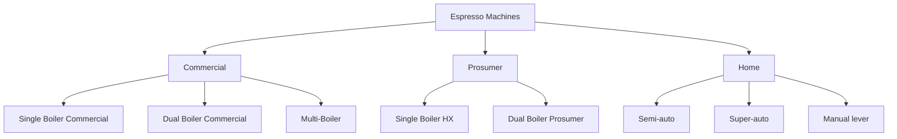

# Equipment Intelligence — Espresso Machines & Grinders

## 📍 Parent Topics
- [Coffee Knowledge Base](../INDEX.md)

---

## Espresso Machine Categories



### Boiler Type Comparison

| Boiler Type | Temperature Stability | Steam Power | Simultaneous Brew+Steam | Best For |
|------------|----------------------|-------------|------------------------|---------|
| Single Boiler | Low | Good | No (switch modes) | Home beginners |
| Heat Exchange (HX) | Medium | Excellent | Yes (with temp management) | Home advanced/prosumer |
| Dual Boiler | Excellent | Excellent | Yes, independent | Serious home, prosumer |
| Multi-Boiler | Excellent | Excellent | Yes, per group | Commercial café |

---

## Commercial Machine Profiles

### La Marzocco Linea PB

| Spec | Value |
|------|-------|
| Type | Commercial dual-boiler, multi-group |
| Groups | 1, 2, 3, or 4 group versions |
| Brew boiler | 1.75L per group |
| Steam boiler | 11L |
| Pressure | 9 bar (adjustable) |
| Temperature | PID-controlled, independent per boiler |
| Pre-infusion | Paddle-actuated (mechanical) |
| Power | 3,000–5,500W depending on config |
| Weight | ~100kg (3 group) |
| Best for | Specialty cafés, high-volume quality |
| Notable | Industry workhorse; 30+ year track record |

**Workflow strengths:** Consistent shot-to-shot; paddle pre-infusion allows barista control; saturated group heads provide thermal mass stability.

---

### La Marzocco GS3 MP (Prosumer/Competition)

| Spec | Value |
|------|-------|
| Type | Dual boiler, single group, prosumer |
| Brew boiler | 0.75L |
| Steam boiler | 3.5L |
| Pressure control | Mechanical flow control paddle |
| Temperature | Dual PID (separate brew + steam) |
| Flow control | Yes — full manual flow paddle |
| Price range | $7,000–9,000 USD |
| Best for | Advanced home, competition prep |

---

### Nuova Simonelli Aurelia Wave

| Spec | Value |
|------|-------|
| Type | Commercial, T3 technology |
| T3 | 3 independent thermal systems (brew, steam, water) |
| Pre-infusion | Soft infusion (electronic) |
| Ergonomics | Raised group heads, angled steam wands |
| Best for | High-volume specialty cafés, barista comfort |
| Competition use | Official WBC machine multiple years |

---

### Nuova Simonelli Appia Life (Entry Commercial)

| Spec | Value |
|------|-------|
| Type | Heat exchange, commercial |
| Groups | 1 or 2 |
| Best for | Small cafés, restaurants, entry specialty |
| Price range | $3,000–5,000 USD |

---

### Breville Barista Express (Prosumer All-in-One)

| Spec | Value |
|------|-------|
| Type | Single boiler + integrated grinder |
| Boiler | Thermocoil (fast heat-up) |
| Temperature | PID (±1°C) |
| Grinder | Built-in conical burr |
| Pressure | 9 bar (internally regulated) |
| Best for | Home beginners to intermediate |
| Pros | All-in-one convenience, fast heat-up |
| Cons | Single boiler = no simultaneous brew+steam; small boiler |
| Price | ~$700–900 USD |

---

### Breville Dual Boiler (BES920)

| Spec | Value |
|------|-------|
| Type | Dual boiler, prosumer |
| Brew boiler | 300mL |
| Steam boiler | 2L |
| Temperature | Dual PID |
| Pre-infusion | Adjustable (programmable) |
| Best for | Serious home barista |
| Price | ~$1,400–1,600 USD |

---

### Rocket Espresso Appartamento (Prosumer HX)

| Spec | Value |
|------|-------|
| Type | Heat exchange, single boiler |
| Boiler | 1.8L copper boiler |
| Style | E61 group head (thermal mass) |
| Best for | Home, office, medium volume |
| Aesthetics | Italian design, copper/stainless |
| Price | ~$1,800–2,200 USD |

---

## Espresso Machine Comparison Matrix

| Machine | Daily Volume | Temperature Stability | Pressure Control | Milk Capability | Budget |
|---------|-------------|----------------------|-----------------|----------------|--------|
| Breville Barista Express | 5–15 shots | Medium | Fixed | Basic | $ |
| Rocket Appartamento | 10–30 shots | Good (HX) | Fixed | Good | $$ |
| Breville Dual Boiler | 10–40 shots | Excellent | Fixed+preinfusion | Excellent | $$ |
| La Marzocco GS3 MP | 20–80 shots | Excellent | Full flow control | Excellent | $$$$ |
| Nuova Simonelli Appia | 50–150 shots | Excellent | Basic | Excellent | $$$ |
| La Marzocco Linea PB | 100–400 shots | Excellent | Paddle | Excellent | $$$$$ |

---

## Grinder Profiles

### Burr Type Science

| Burr Type | Grind Distribution | Flavor Profile | Heat Generation | Best For |
|-----------|-------------------|---------------|----------------|---------|
| **Flat burr** | More unimodal, uniform | Clarity, brightness, sweetness | Higher | Espresso clarity, filter |
| **Conical burr** | Bimodal (fines + coarse) | Body, sweetness, roundness | Lower | Espresso body, filter |
| **Ghost burrs** (worn) | Uneven, unpredictable | Inconsistency | — | Needs replacement |

---

### Commercial Grinders

#### Mahlkönig EK43

| Spec | Value |
|------|-------|
| Burr | 98mm flat steel |
| RPM | 1,400 |
| Best for | Filter coffee, retail grinding, single dose |
| Particle distribution | Very uniform — legendary for filter clarity |
| Espresso use | Yes but not purpose-built (coarse stops) |
| Price | ~$3,000–4,000 USD |
| Notes | Became specialty industry standard for filter after 2013 |

#### Mahlkönig Peak / E65S GBW

| Spec | Value |
|------|-------|
| Burr | 65mm flat steel |
| Best for | High-volume espresso |
| Features | Automatic dosing, auto-adjust, touchscreen (E65S) |
| Price | $2,500–4,000 USD |

#### Mazzer Major / Robur

| Spec | Value |
|------|-------|
| Burr | Flat steel (Major: 64mm, Robur: conical) |
| Best for | Commercial espresso |
| Longevity | Very high — industry workhorse |
| Price | $800–2,000 USD |

---

### Prosumer Grinders

#### Niche Zero

| Spec | Value |
|------|-------|
| Burr | 63mm conical |
| RPM | 100 (very low — minimal heat) |
| Best for | Single-dose home espresso + filter |
| Retention | Near-zero (single-dose design) |
| Price | ~$700–800 USD |
| Notes | Transformed home espresso — defined single-dose category |

#### DF64 / DF83

| Spec | Value |
|------|-------|
| Burr | 64mm / 83mm flat (user-swappable) |
| Best for | Home single-dose espresso |
| Price | $400–700 USD |
| Notes | High value; popular modification platform |

#### Eureka Mignon Specialita

| Spec | Value |
|------|-------|
| Burr | 55mm flat |
| Best for | Home espresso (on-demand dosing) |
| Noise | Very low (quietest class) |
| Price | ~$500–700 USD |

---

### Grinder Comparison Matrix

| Grinder | Burr Size | Type | Best Use | Retention | Budget |
|---------|-----------|------|---------|-----------|--------|
| Eureka Mignon | 55mm flat | On-demand | Home espresso | Medium | $$ |
| Niche Zero | 63mm conical | Single-dose | Home espresso+filter | Near-zero | $$$ |
| DF64 | 64mm flat | Single-dose | Home espresso | Low | $$ |
| Mazzer Major | 64mm flat | Commercial | Café espresso | Medium | $$$ |
| Mahlkönig E65S | 65mm flat | Commercial | Café espresso | Low | $$$$ |
| Mahlkönig EK43 | 98mm flat | On-demand | Filter/retail | Medium | $$$$ |

---

## Brewing Equipment

### Pour Over Equipment

| Equipment | Filter | Grind | Best For |
|-----------|--------|-------|---------|
| Hario V60 | Paper (various weights) | Medium-fine | Clarity, bright origins |
| Chemex | Thick paper | Medium-coarse | Very clean, clear cup |
| Kalita Wave | Paper flat-bottom | Medium | Consistency, forgiving |
| Origami | Paper or cloth | Variable | Versatile, beautiful |
| Clever Dripper | Paper | Medium-coarse | Immersion + filtration; easy |

### Scale Requirements

| Category | Precision Needed | Recommended |
|---------|-----------------|-------------|
| Espresso | ±0.1g | Acaia Pearl, Timemore Black Mirror |
| Filter | ±0.5g | Hario V60 Drip Scale, Timemore |
| Cupping | ±0.1g | Any precision lab scale |
| Green coffee | ±1g | Kitchen scale |

### Thermometers & Refractometers

| Tool | Use | Model |
|------|-----|-------|
| Milk thermometer | Steam temp | Polder clip-on digital |
| Brew thermometer | Water temp check | Thermapen ONE |
| Refractometer | TDS measurement | VST LAB Coffee III |
| Agtron meter | Roast color | Agtron M-Basic |
| pH meter | Water quality | Apera Instruments AI209 |

---

## Maintenance Protocols

### Daily (Espresso Machine)

```
□ Backflush: blank basket, hot water → remove oils
□ Wipe group head gasket
□ Purge and wipe steam wand (after each use)
□ Clean drip tray
□ Check water level (if no direct line)
□ Run blind backflush (plain water) × 3
```

### Weekly

```
□ Backflush with enzyme cleaner (Cafiza/Puly Caff)
□ Soak portafilter baskets in enzyme solution
□ Clean steam wand interior (purge + wipe routine)
□ Wipe exterior panels
□ Check for scale around group heads
```

### Monthly / Quarterly

```
□ Descale (frequency per water hardness)
□ Replace water filter cartridge
□ Inspect group head gaskets (replace if swollen/cracked)
□ Clean grinder: disassemble, brush burrs, wipe chute
□ Check pressure gauge calibration
```

---

## 🔗 Related Topics
- [Extraction Theory](../espresso/extraction-theory.md)
- [Pressure Profiling](../espresso/pressure-flow-profiling.md)
- [Café Operations SOP](../cafe-operations/workflow-sop.md)
- [Water Chemistry](../water-science/water-chemistry.md)
