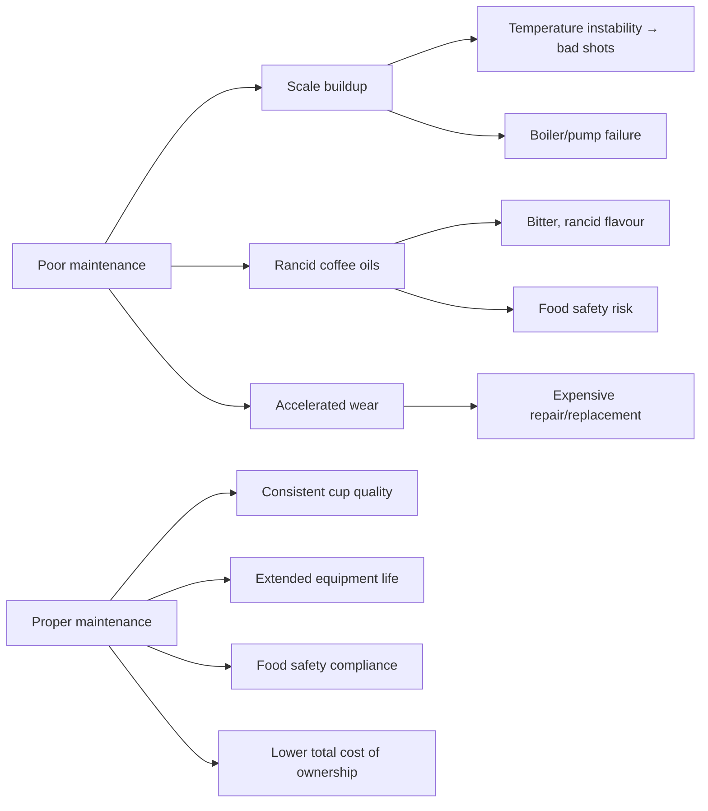

# Equipment Maintenance & Cleaning — Complete Guide

## 📍 Parent Topics
- [Equipment](../INDEX.md)
- [Espresso Machines](espresso-machines.md)
- [Grinders](grinders.md)

---

## Why Maintenance Matters



> 💡 *A La Marzocco Linea costs $15,000+. Proper maintenance extends its life to 15–20+ years. Neglect reduces this to 5–8 years. Maintenance is always cheaper than replacement.*

---

## Cleaning Products Reference

### Espresso Machine Cleaners

| Product | Type | Use |
|---------|------|-----|
| **Cafiza (Urnex)** | Enzyme powder | Daily backflush; group head cleaning |
| **Puly Caff** | Enzyme powder | Daily backflush; equivalent to Cafiza |
| **Full Circle (Urnex)** | Tablet | Backflush (1 tablet = 1 dose) |
| **Cafiza Spray** | Liquid | Steam wand exterior; surface cleaning |
| **Dezcal (Urnex)** | Descaling powder | Boiler descaling; batch brewers |
| **Puly Descaler** | Descaling liquid | Commercial descaling |

### Grinder Cleaners

| Product | Use |
|---------|-----|
| **Grindz (Urnex)** | Grinder cleaning tablets — run through like coffee |
| **Full Circle Grinder tablets** | Alternative to Grindz |
| **Compressed air** | Blow out chute and burrs |
| **Stiff brush (dedicated)** | Manual burr brushing |

### Milk Equipment

| Product | Use |
|---------|-----|
| **Rinza (Urnex)** | Milk residue cleaner for steam wands and pitchers |
| **Full Circle Milk tablets** | Frother/steam wand cleaning |
| **Hot water + soak** | Basic pitcher cleaning |

---

## Espresso Machine: Daily Cleaning

### After Every Shot

```
□ Wipe portafilter basket with dry cloth
□ Knock grounds into knock box
□ Rinse: lock blank portafilter in group, run 3s flush
```

### After Every Milk Drink

```
□ Purge steam wand (1–2 seconds BEFORE steaming)
□ Wipe steam wand immediately after use
□ Purge again after wiping
□ Do NOT let milk dry on wand — purge within 30 seconds
```

### End of Service (Daily)

```
GROUP HEAD CLEANING
1. Remove portafilter
2. Insert blank basket (no holes)
3. Add 1 tsp Cafiza powder OR 1 Cafiza/Puly tablet
4. Lock portafilter; activate brew for 10 seconds
5. Stop; wait 10 seconds
6. Activate again for 10 seconds
7. Repeat 5–6 times (until water runs clear)
8. Remove blank; rinse with water shot through standard basket
9. Wipe group head gasket and shower screen

STEAM WAND DEEP CLEAN
1. Remove steam wand tip (if removable)
2. Soak tip in hot water + small amount of Rinza for 15 min
3. Rinse thoroughly; reinstall
4. Purge steam 5 seconds

PORTAFILTER & BASKET
1. Remove baskets from portafilter
2. Soak baskets in hot water + Cafiza solution (5g per litre) for 20 min
3. Scrub with brush
4. Rinse thoroughly (enzyme residue ruins next coffee)
5. Reassemble dry

DRIP TRAY & KNOCK BOX
1. Remove and empty drip tray
2. Wash with hot water and dish soap
3. Wipe exterior surfaces of machine
4. Empty and rinse knock box

FINAL CHECK
□ All group heads purged clean
□ Steam wands clean and purged
□ Drip tray replaced
□ Machine wiped down
□ Log completed ✓
```

---

## Espresso Machine: Weekly Cleaning

```
WEEKLY PROTOCOL (in addition to daily)

SHOWER SCREEN REMOVAL
□ Remove shower screen (screwdriver or coin)
□ Soak in Cafiza solution 30 min
□ Scrub with brush; inspect for blockages
□ Reinstall firmly

DISPERSION BLOCK
□ With screen removed, scrub dispersion block face
□ Check for scale or residue buildup
□ Rinse thoroughly before reinstalling screen

PORTAFILTER EXTENDED SOAK
□ Full portafilter bodies soaked in Cafiza overnight (1×/week)
□ Rinse next morning before service

DRIP GRID
□ Remove metal grid from drip tray
□ Soak and scrub; clear all drainage holes

WATER SOFTENER CHECK (if BWT or inline system)
□ Check filter capacity indicator
□ Note if approaching replacement threshold
```

---

## Espresso Machine: Monthly / Quarterly

```
MONTHLY
□ Check group head gaskets — feel for hardness, cracking, deformation
□ Gaskets should be firm but slightly pliable; replace if stiff/cracked
□ Check portafilter spring tension (consistent resistance)
□ Inspect steam wand tip holes — clean with pin if partially blocked
□ Run full backflush protocol with enzyme × 2 passes

QUARTERLY
□ Replace group head gaskets (even if visually OK — preventive)
□ Replace shower screens if worn (holes enlarge over time → uneven distribution)
□ Professional service inspection (commercial machines)
□ Check boiler pressure gauge calibration
□ Full descale if water hardness warrants (see schedule below)
```

---

## Descaling Protocol

### When to Descale

| Water Hardness | Descaling Frequency |
|---------------|---------------------|
| Soft (< 100 mg/L, filtered) | Every 6–12 months |
| Medium (100–200 mg/L) | Every 3–6 months |
| Hard (200–300 mg/L) | Every 1–3 months |
| Very hard (> 300 mg/L) | Monthly — install filtration immediately |

### Signs of Scale Buildup

- Temperature inconsistency between shots
- Machine takes longer to reach temperature
- Unusual noises from boiler/pump
- Reduced steam power
- Pressure gauge abnormalities

### Descaling Procedure (Commercial Machine)

> ⚠️ Always consult your specific machine manual. This is a general guide.

```
PREPARATION
□ Empty water reservoir or close mains supply
□ Prepare descaling solution per product instructions
   (Dezcal: typically 1 sachet / 500mL water)
□ Have clean water ready for rinse cycles

PROCEDURE (varies by machine — consult manual)
1. Enter descaling mode (if machine has one) OR
   Manually circulate descaler through group head(s)
2. Allow solution to dwell 15–20 min in boiler
3. Circulate through all water paths per manual
4. Flush with minimum 3 full tanks of clean water
5. Verify rinse water is neutral (pH strip or taste)
6. Return to normal operation

POST-DESCALE
□ Pull 3 blank shots through each group head (discard)
□ Check temperature stability
□ Log: date, product used, machine hours
```

---

## Grinder Maintenance

### Daily

```
□ Brush grind chute with dedicated brush after last use
□ Wipe hopper lid
□ Note any unusual noise or grind inconsistency
```

### Weekly

```
□ Empty hopper completely
□ Brush inside hopper; wipe with dry cloth (no water — moisture ruins burrs)
□ Brush grind chute thoroughly
□ Remove any grounds from around burr chamber opening
□ Check grind consistency (visual check of particle uniformity)
```

### Monthly / Per-Schedule

```
GRINDER DEEP CLEAN
1. Remove hopper; empty and brush clean
2. Remove upper burr (consult machine manual):
   — Flat burr: lift off retaining ring; remove upper burr
   — Conical burr: unscrew inner burr
3. Brush all grounds from burr faces and chamber
4. Inspect burr condition (see below)
5. Run Grindz tablets (2–3) through grinder before reinstalling burrs
6. Reinstall burrs; run 20g of coffee through and discard
7. Recalibrate grind setting (may have shifted during disassembly)

BURR INSPECTION
□ Burr edges: sharp and defined? → Good
□ Burr edges: rounded, chipped, or glazed? → Replace
□ Glazing (shiny, polished look on cutting edges): reduces quality significantly
□ Replacement schedule: flat burrs every 500–800kg; conical every 1,000–3,000kg
```

### Grind Calibration After Deep Clean

After reassembling grinder burrs:
1. Grind setting will typically need to be **finer** than before (burrs reset to wider gap)
2. Dial in fresh: pull 3–5 shots adjusting grind to hit target time and yield
3. Document new setting; compare to pre-clean setting

---

## Batch Brewer Maintenance

### Daily

```
□ Discard any remaining coffee from carafes
□ Wash carafes with hot soapy water; rinse thoroughly
□ Wipe brew basket and housing
□ Run clean water brew cycle (no coffee) to flush
```

### Weekly

```
□ Run descaling/cleaning cycle with Dezcal or manufacturer cleaner
□ Rinse × 3 full cycles after cleaning
□ Wipe exterior; clean warming plate (if glass carafe model)
□ Check filter basket for damage or staining
```

### Monthly

```
□ Deep descale
□ Check shower head spray pattern (should be even across basket)
□ Inspect carafe pour spout and seal
```

---

## Cold Brew Equipment

```
AFTER EVERY BATCH
□ Discard spent grounds promptly
□ Rinse vessel with cold water
□ Wash with hot water + dish soap
□ Rinse thoroughly
□ Air dry completely before next batch

WEEKLY
□ Sanitise vessel with food-grade sanitiser
□ Check filters/bags for wear or holes
□ Inspect pour spouts and taps for residue
```

---

## Water System Maintenance

### Filter Replacement Schedule

| System | Replacement Interval |
|--------|---------------------|
| BWT Bestmax | Per capacity rating on cartridge |
| Activated carbon block | Every 3–6 months |
| RO membrane | Every 12–24 months |
| Sediment pre-filter | Every 3–6 months |
| UV steriliser bulb | Annually |

```
FILTER CHANGE PROTOCOL
1. Turn off water supply
2. Relieve pressure (run tap briefly)
3. Remove old cartridge (have towel ready for drips)
4. Install new cartridge per manufacturer direction
5. Flush new filter: run 5–10 litres through before use
6. Test TDS and pH after installation
7. Log change date and starting water parameters
8. Set calendar reminder for next change
```

---

## Preventive Maintenance Calendar

```
ANNUAL CALENDAR TEMPLATE

JANUARY:   Deep clean all equipment + grinder burr inspection
FEBRUARY:  Descale (if on 6-month cycle)
MARCH:     Replace group head gaskets + shower screens
APRIL:     Water filter cartridge replacement
MAY:       Full machine service (professional)
JUNE:      Descale (if on 6-month cycle)
JULY:      Grinder burr replacement (if high volume)
AUGUST:    Water filter mid-year check
SEPTEMBER: Group head gasket inspection
OCTOBER:   Descale (if on 3-month cycle)
NOVEMBER:  Pre-Christmas deep clean
DECEMBER:  Annual equipment audit + budget for next year
```

---

## Maintenance Log Template

```
EQUIPMENT MAINTENANCE LOG

Machine: ________________________
Serial #: _______________________

DATE | TASK | PRODUCT USED | COMPLETED BY | NOTES
-----|------|-------------|-------------|------
     |      |             |             |
     |      |             |             |
     |      |             |             |

UPCOMING DUE:
□ Next descale:          ___________
□ Next gasket change:    ___________
□ Next filter change:    ___________
□ Next professional service: ________
□ Grinder burr check:    ___________
```

---

## 🔗 Related Topics
- [Espresso Machines](espresso-machines.md)
- [Grinders](grinders.md)
- [Water Chemistry](../water-science/water-chemistry.md)
- [Filtration Systems](../water-science/filtration-systems.md)
- [Workflow SOP](../cafe-operations/workflow-sop.md)
