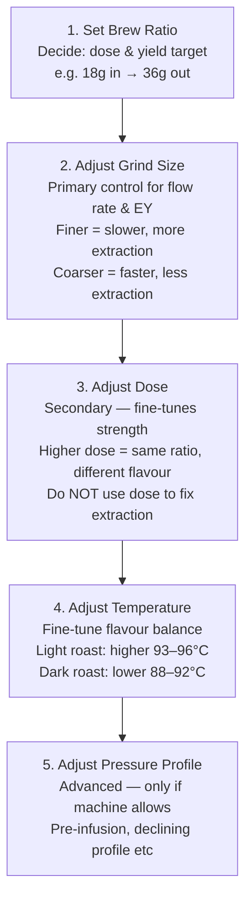
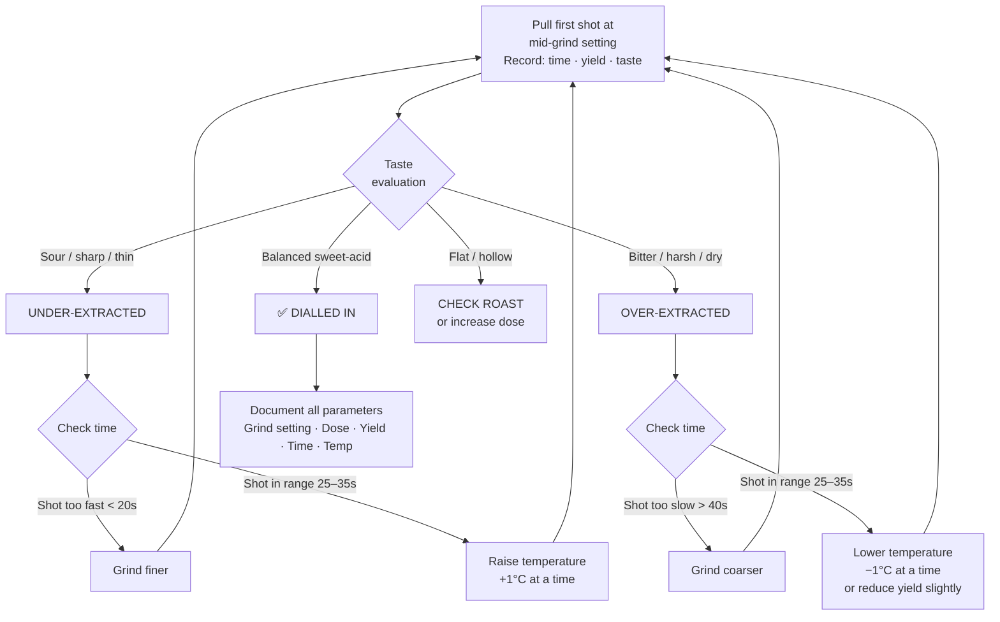

# Dialing In Espresso — Systematic Protocol

## 📍 Parent Topics
- [Espresso Science](../INDEX.md)
- [Extraction Theory](extraction-theory.md)
- [Puck Preparation](puck-preparation.md)

---

## What Is Dialing In?

**Dialing in** is the systematic process of adjusting espresso parameters to achieve a specific target: the right balance of extraction yield, taste, flow rate, and appearance for a given coffee, machine, and grinder combination.

Every new bag of coffee, change in humidity, roast date, or equipment service requires a fresh dial-in.

---

## Variable Hierarchy

Always adjust in this priority order — one variable at a time:



---

## Dial-In Decision Tree



---

## Dial-In Session Protocol

### Step 1: Set Your Targets Before Pulling Shots

| Parameter | My Target | SCA Guideline |
|---------|-----------|---------------|
| Dose | ___ g | 14–22g (style-dependent) |
| Yield | ___ g | Dose × 2 for 1:2 ratio |
| Brew ratio | 1:___ | 1:2 (standard), 1:1.5 (ristretto), 1:3 (lungo) |
| Time | ___ s | 25–35s at 1:2 |
| EY target | 18–22% | Measure with refractometer |
| Taste target | Balanced, sweet, bright | No sour / no harsh bitter |

---

### Step 2: Purge Grinder

Before dialling in a new bag:
- Run 10–15g of the new coffee through the grinder and discard
- Clears old coffee from burr chamber
- Allows new coffee to coat burrs

---

### Step 3: Pull & Evaluate (Structured Shot Log)

| Shot | Grind Setting | Dose (g) | Yield (g) | Time (s) | Taste | Action |
|------|--------------|---------|---------|---------|-------|--------|
| 1 | — start — | | | | | |
| 2 | | | | | | |
| 3 | ✅ DIALLED | | | | | Document |

---

### Step 4: Confirm with 3 Consecutive Shots

Once you've found the setting, pull **3 shots in a row** without changing anything:
- All 3 should land within ±1g yield and ±2s time
- All 3 should taste consistent
- This confirms the setting is stable, not lucky

---

## Grind Adjustment Reference

| Situation | Direction | Increment |
|-----------|-----------|-----------|
| Shot too fast (< 20s) | Finer | 1 step at a time |
| Shot too slow (> 40s) | Coarser | 1 step at a time |
| Shot in range, sour | Slightly finer | Half-step |
| Shot in range, bitter | Slightly coarser | Half-step |

> ⚠️ **One variable at a time.** If you change grind AND dose AND temperature between shots, you cannot know which change fixed (or broke) anything.

---

## New Bag Protocol

Every new bag requires a **full redial** — not just minor adjustment:

```
New Bag Checklist:
□ Note: roaster, origin, process, roast date
□ Rest appropriately (espresso: 7–14 days post-roast)
□ Purge grinder (10–15g of new coffee)
□ Start grind at mid-point — not yesterday's setting
□ Pull 3+ shots; adjust systematically
□ Document final settings for this bag
□ Note expected drift (fresh beans drift finer over time as CO₂ off-gasses)
```

---

## Grind Drift During Service

Grind drift happens because burrs heat up during use → metal expands → effective gap narrows → particles get finer → shots slow:

| Time in Service | Expected Drift | Action |
|----------------|---------------|--------|
| First 30 min | Fastest drift | Recheck at 30 min |
| 30 min–2 hours | Moderate drift | Check every hour |
| 2 hours+ | Mostly stable | Check if noticeable taste change |

**Rule:** On a busy morning, dial in 30 minutes before opening, then recheck at peak service (30–45 min in).

---

## Environmental Factors Causing Drift

| Factor | Effect on Grind |
|--------|----------------|
| High humidity | Coffee absorbs moisture → swells → needs coarser grind |
| Low humidity | Coffee dries out → needs finer grind |
| Cold ambient temp | Coffee more dense → needs adjustment |
| New bag (fresh roast) | High CO₂ → coarser than expected needed |
| Old coffee (3+ weeks) | CO₂ gone → finer than fresh |

---

## Refractometer-Assisted Dial-In

For precision dial-in with a **VST refractometer**:

1. Pull shot; collect in small cup; let cool 5 min to ~25°C
2. Apply 2–3 drops to refractometer lens; read Brix value
3. Convert: `TDS% = Brix × 0.85` (VST conversion factor)
4. Calculate EY: `EY = (TDS% × Yield g) / Dose g × 100`
5. Target: EY 18–22%; TDS 8–12%

| EY Result | Interpretation | Action |
|-----------|---------------|--------|
| < 18% | Under-extracted | Finer grind or more time |
| 18–22% | ✅ Optimal | Document and maintain |
| > 22% | Over-extracted | Coarser grind or shorter time |

---

## 🔗 Related Topics
- [Shot Diagnosis](shot-diagnosis.md)
- [Puck Preparation](puck-preparation.md)
- [Extraction Theory](extraction-theory.md)
- [Pressure & Flow Profiling](pressure-flow-profiling.md)
- [Grinders](../equipment/grinders.md)
