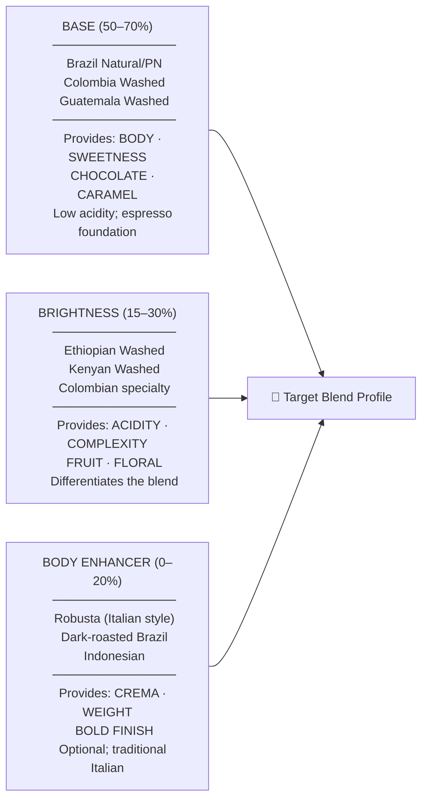

# Espresso Blending Theory & Practice

## 📍 Parent Topics
- [Espresso Science](../INDEX.md)
- [Extraction Theory](extraction-theory.md)
- [Roastery Operations](../roasting/roastery-operations.md)

---

## Why Blend Espresso?

### Single Origin vs Blend — Decision Framework

| Single Origin Espresso | Blend Espresso |
|----------------------|----------------|
| Showcases specific origin character | Designed flavour profile transcends single origin |
| Changes seasonally (new crop = different cup) | Consistent year-round (components rotate) |
| Smaller volumes (harder to scale) | Large volumes possible (multiple sources) |
| Higher price tolerance among enthusiasts | Wider consumer acceptance; milk-drink performance |
| Tells a specific story | Tells a brand story |
| Best: light roast, distinctive origins | Best: medium roast, milk drinks, everyday espresso |

**When to blend:**
1. Consistency is critical (high-volume café service)
2. A flavour profile doesn't exist in any single origin
3. You need to manage price and volume across seasonal variability
4. Your roast style is medium+ where single-origin distinction fades

---

## The Anatomy of an Espresso Blend

### Component Roles



---

## Flavour Design Framework

### Step 1: Define the Target Profile

Write it down **before** selecting components:

```
TARGET PROFILE SPECIFICATION:

Espresso (straight):
  Primary: Chocolate, caramel
  Secondary: Mild citrus, red fruit hint
  Acidity: Medium-low, soft
  Body: Full, heavy
  Finish: Long, chocolatey-sweet
  SCA Score target: 84–87

With milk (flat white):
  Cut-through: Espresso character clear through milk
  Balance: Sweet, mild caramel, no astringency
  Texture: Smooth, round
```

### Step 2: Select Components by Role

| Component Role | Origin Options | Roast Level |
|---------------|---------------|-------------|
| **Chocolate/body base** | Brazil (natural), Guatemala (washed), Colombia (washed) | Medium |
| **Brightness** | Ethiopia (washed), Kenya, Colombia Huila | Medium-light |
| **Sweetness amplifier** | Yellow Bourbon (Brazil/El Salvador), Honey-processed | Medium |
| **Crema/body** | Fine Robusta, India Monsooned (small %) | Medium-dark |

---

## Pre-Blend vs Post-Blend Roasting

### Pre-Blend (Blend Before Roasting)

```
Component A (green) ─┐
Component B (green) ─┼──→ Mix green → Roast as one batch
Component C (green) ─┘
```

**Advantages:**
- Single roast run = simpler workflow
- Flavours integrate during roasting (Maillard together)
- Consistent blend ratio every batch

**Disadvantages:**
- Beans roast at different rates (different density/moisture) → uneven development
- Cannot optimise roast for each component
- Not suitable if components have significantly different roast requirements

**Best for:** When origins have similar density and optimal roast temperatures (±5°C max)

---

### Post-Blend (Roast Separately, Blend After)

```
Component A (green) → Roast at 93°C medium-light → Cooled → ─┐
Component B (green) → Roast at 90°C medium       → Cooled → ─┼──→ Blend
Component C (green) → Roast at 95°C medium-dark  → Cooled → ─┘
```

**Advantages:**
- Each component roasted optimally
- Maximum cup quality per component
- Easier to adjust individual ratios seasonally
- Can adjust individual components when one origin changes

**Disadvantages:**
- More complex production
- More SKUs to manage
- Must blend before packaging

**Best for:** Specialty-focused roasters; blends with components that need different roast approaches

---

## Trial Blend Methodology

### The 10% Increment Matrix

When developing a new blend, start with a **full component matrix** at 10% increments:

**Example: 3-component blend (Brazil + Ethiopia + Colombia)**

| Trial | Brazil | Ethiopia | Colombia | EY% | Taste Notes |
|-------|--------|---------|---------|-----|-------------|
| A | 100% | 0% | 0% | 19% | Chocolate, flat |
| B | 80% | 20% | 0% | 20% | Better; some brightness |
| C | 70% | 20% | 10% | 20% | Caramel, citrus, balanced |
| **D** | **60%** | **25%** | **15%** | **20.5%** | **✅ Target profile achieved** |
| E | 50% | 30% | 20% | 21% | Too bright; lacks body |
| F | 70% | 10% | 20% | 19.5% | Colombia dominates |

**Rules:**
1. Cup all trials blind
2. Cup against straight components for reference
3. Use identical extraction parameters across all trials
4. Cup at two temperatures (70°C and 50°C) — milk affinity often more apparent when cooler
5. Test with milk: steam 100mL whole milk + trial blend double espresso for flat white

---

## Seasonal Consistency Management

### The Consistency Challenge

Single origins change seasonally. A blend must deliver **consistent profile year-round**. Strategy:

```
SEASONAL BLEND MANAGEMENT CYCLE:

Q1 (Jan–Mar): Cup new crop arrivals from Americas
  → Compare to previous season's lots
  → Select replacement components that match target profile
  → Run transition trials: 90% old / 10% new → 70/30 → 50/50 → new

Q2 (Apr–Jun): Cup new African arrivals
  → Ethiopia, Kenya new crops
  → Evaluate brightness component replacement options

Q3 (Jul–Sep): Cup new Central American arrivals
  → Honduras, Guatemala, Costa Rica new crops
  → Body/base component refresh

Q4 (Oct–Dec): Cup new Indian/Indonesian arrivals
  → Indonesia and India new crops
  → Body component if used

RULE: Never change more than 20–25% of blend in one transition period
      — incremental changes preserve consumer experience continuity
```

---

## Extraction Behaviour of Blends

### Why Blends Extract Differently from Single Origins

Multi-component blends create complex extraction dynamics:

| Factor | Effect |
|--------|--------|
| **Different particle solubility** | Each component has different extractable solids content |
| **Different density** | Dense and light beans need different grind for optimal EY |
| **Different roast level** | Darker component extracts faster; lighter extracts slower |
| **Different freshness** | If components have different roast dates, CO₂ varies |

### Practical Implication

Pre-blend mixing creates a **heterogeneous puck** — different particles extracting at different rates. This is why:
- Blend EY calculation is an average, not uniform
- Extraction of a blend typically plateaus at lower EY than a single origin (some over-extracted, some under)
- Target EY 18–21% for blends (conservative) vs 19–22% for single origin

---

## The Blend Ratio Document

Every finalised blend must have a living document:

```
BLEND SPECIFICATION DOCUMENT

BLEND NAME: ___________________
VERSION: ___  DATE: ___________
ROAST PROFILE: ________________
INTENDED USE: ☐ Espresso  ☐ Filter  ☐ Both

COMPONENT SPECIFICATIONS:
Component A:
  Origin: _________________ Region: ______________
  Varietal: _______________ Process: _____________
  Crop year: ______________ Grade: _______________
  Roast level (Agtron): ___ Roast date target: ____
  Ratio in blend: _____%   Current importer lot: ___

Component B:
  [Same fields]

Component C:
  [Same fields]

TARGET EXTRACTION:
  Dose: ____g   Yield: ____g   Ratio: 1:___
  Time: ____s   Temperature: ____°C
  EY target: ____-%   TDS target: ____%

CUP NOTES (target):
  Espresso: _____________________________
  With milk: ____________________________

SCA SCORE TARGET: _____ pts
APPROVED BY: ____________  DATE: ________
```

---

## 🔗 Related Topics
- [Extraction Theory](extraction-theory.md)
- [Roastery Operations](../roasting/roastery-operations.md)
- [Roast Curves & Profiles](../roasting/roast-curves-profiles.md)
- [Green Coffee Grading](../beans/green-coffee-grading.md)
- [Dialing In](dialing-in.md)
- [Shot Diagnosis](shot-diagnosis.md)
