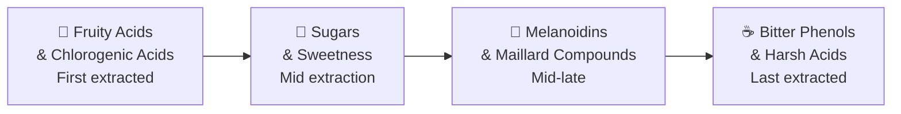
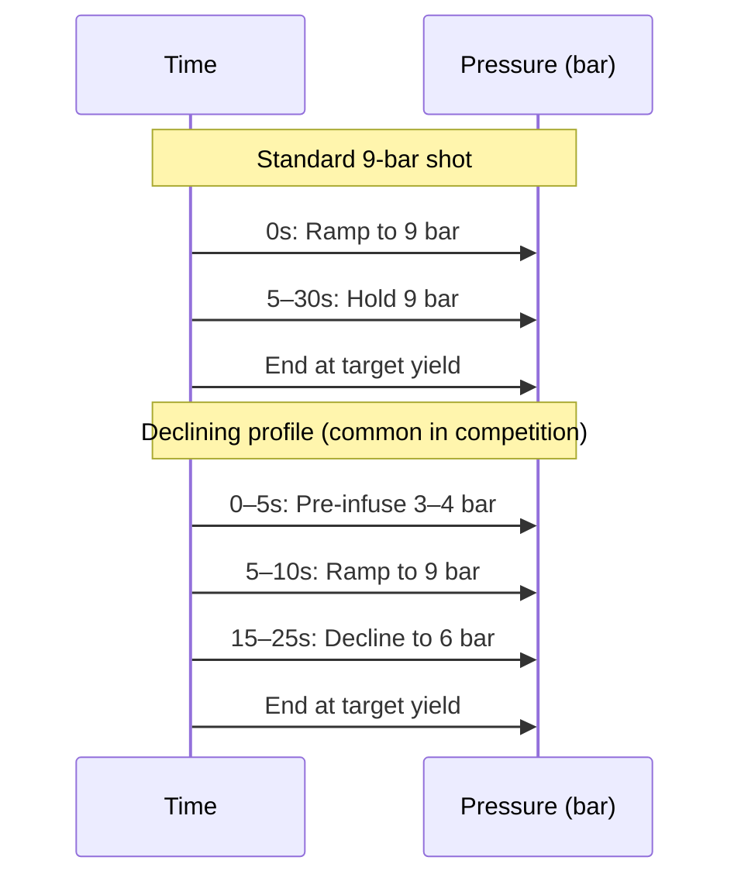

# Espresso Extraction Theory

## 📍 Parent Topics
- [Espresso Science](../INDEX.md)
- [Brewing Science Overview](../brewing-methods/brewing-science-overview.md)

---

## What Is Espresso?

Espresso is a brewing method using:
- **Hot water** (88–96°C)
- **High pressure** (8–10 bar)
- **Fine grind** (high surface area)
- **Short time** (20–35 seconds)
- **Small yield** (25–60g from 14–22g coffee)

The result is a **concentrated beverage** with 8–12% TDS (vs ~1.2–1.5% for filter coffee), rich body, and thick foam (crema).

---

## Core Variables & Units

| Variable | Symbol | Unit | Typical Range |
|---------|--------|------|---------------|
| Dose (dry coffee in) | D | grams (g) | 14–22g |
| Yield (liquid out) | Y | grams (g) | 25–60g |
| Brew Ratio | BR | dimensionless | 1:1.5 to 1:3 |
| Extraction Time | t | seconds (s) | 20–40s |
| Extraction Yield | EY | % | 18–22% (optimal) |
| TDS (Total Dissolved Solids) | TDS | % or g/100mL | 8–12% |
| Pressure | P | bar | 8–10 bar |
| Temperature | T | °C | 88–96°C |
| Grind Size | G | μm (microns) | ~200–400μm |

---

## Core Formulas

### 1. Brew Ratio

$$BR = \frac{Y}{D} = \frac{\text{Espresso Yield (g)}}{\text{Coffee Dose (g)}}$$

| Ratio | Style | Example |
|-------|-------|---------|
| 1:1 to 1:1.5 | Ristretto | 18g dose → 18–27g yield |
| 1:2 to 1:2.5 | Standard espresso | 18g dose → 36–45g yield |
| 1:3 to 1:4 | Lungo | 18g dose → 54–72g yield |
| 1:5+ | Turbo/filter-espresso | 18g dose → 90g+ yield |

---

### 2. Extraction Yield (EY)

$$EY\% = \frac{TDS\% \times \text{Beverage Mass (g)}}{\text{Dry Coffee Mass (g)}} \times 100$$

**Example:**
- Dose: 18g
- Yield: 36g
- TDS measured: 10%

$$EY = \frac{0.10 \times 36}{18} \times 100 = 20\%$$

> ✅ **Optimal EY Range:** 18–22% for espresso  
> ⬇️ **Under-extracted:** < 18% (sour, thin, hollow)  
> ⬆️ **Over-extracted:** > 22% (bitter, dry, harsh)

---

### 3. Dissolved Solids from Brew Ratio

When no refractometer is available, EY can be estimated:

$$\text{Estimated EY} \approx \frac{(BR \times \text{average TDS})}{100}$$

> ⚠️ *This is an approximation; refractometry is always more accurate.*

---

### 4. Beverage Strength (TDS)

$$TDS\% = \frac{\text{Dissolved Coffee Solids (g)}}{\text{Beverage Mass (g)}} \times 100$$

Measured with a **refractometer** (VST LAB Coffee III or similar):
- Brix reading → converted to TDS using refractometer's coffee conversion factor
- Always use calibrated equipment at consistent temperatures

---

## The Extraction Curve

```
Extraction Yield %
    22% ─────────────────────────── Over-extracted zone
          ↑
    20% │    ██████████████         Optimal zone (18–22%)
    19% │  ████████████████
    18% │████████████████████
          ↓
    16% ─────────────────────────── Under-extracted zone

         ←─── Time / Grind Fine ───→
         Course/fast = lower EY
         Fine/slow = higher EY
```

---

## Extraction Sequence — What Dissolves First

Compounds are extracted in this order (fastest to slowest):



| Extraction Phase | Flavor Compounds | Cup Impact |
|-----------------|-----------------|-----------|
| Early (first 10s) | Acids, aromatics | Bright, sour, fruity |
| Mid (10–25s) | Sugars, melanoidins | Sweet, balanced, body |
| Late (25s+) | Bitter phenols, harsh acids | Bitter, dry, harsh |

This is why **extraction time matters**: too short = sour/thin; too long = bitter/harsh.

---

## Pressure Science

### Standard: 9 Bar

The **9 bar standard** (≈ 131 PSI) was established by the Istituto Nazionale Espresso Italiano and adopted by the SCA. At 9 bar:
- Water penetrates the puck uniformly
- CO₂ is forced into solution, creating crema
- Optimal flow rate through a properly dosed puck ≈ 1–2 mL/s

### Pre-Infusion

**Pre-infusion** = applying low pressure (2–4 bar) for 5–15 seconds before full extraction pressure. Benefits:
- Saturates puck slowly → reduces channeling
- Evens out puck density inconsistencies
- Gentler extraction of aromatics

### Pressure Profiling



**Why declining pressure works:**
- Maintains flow rate as puck compacts
- Reduces over-extraction of late-stage bitter compounds
- Softer finish on the shot

---

## Temperature Science

### Optimal Range: 90–96°C

| Temperature | Effect on Cup |
|-------------|--------------|
| < 88°C | Under-extracted; sour, flat |
| 90–92°C | Lighter roasts optimal |
| 93–95°C | Medium roasts optimal |
| 95–96°C | Dark roasts, harder to extract |
| > 96°C | Over-extraction risk; harsh bitterness |

> 🔬 *Temperature affects solubility: higher temp dissolves more compounds faster — including undesirable bitter phenols if too high.*

### Temperature Stability
- **Commercial machines:** Dual/multi-boiler with PID = very stable (±0.2°C)
- **Single boiler:** Requires temperature surfing; less consistent
- **Thermoblock:** Faster but less stable

---

## Grind Particle Size & Distribution

```
Grind Size Distribution (ideal for espresso)
    
    │     ██████
    │    ████████████
    │  ████████████████
    │████████████████████████
    └─────────────────────────
      Fine ←───────→ Coarse
         ~200–400μm
```

- **Bimodal distribution** (from conical burrs): fine particles (fines) + coarser particles
- **Fines** extract faster → provide body and intensity
- **Coarser fraction** → extracts more slowly → provides sweetness and body
- **Too many fines** → over-extraction, channeling
- **Too few fines** → under-extraction, weak body

### Grinder Types & Impact

| Burr Type | Distribution | Flavor Result |
|-----------|-------------|---------------|
| Flat Burr | More unimodal | Clarity, brightness |
| Conical Burr | Bimodal | Sweetness, roundness, body |
| Ghost (worn) Burrs | Uneven | Inconsistency, off flavors |

---

## Refractometry in Practice

A **refractometer** measures light bending through the liquid → correlates to dissolved solids concentration.

**Workflow:**
1. Pull espresso shot
2. Let cool to ~25°C (dilute 1:10 if > 5% TDS for VST meter)
3. Place 2–3 drops on lens
4. Read Brix value
5. Convert: TDS% = Brix × (coffee conversion factor, ≈ 0.85 for VST)
6. Calculate EY: `EY = TDS × Yield / Dose`

**Target zones:**

| Zone | EY% | TDS% |
|------|-----|------|
| Ideal espresso | 18–22 | 8–12 |
| Ideal filter | 18–22 | 1.15–1.45 |
| Ristretto | 16–18 | 10–14 |

---

## The SCA Brewing Control Chart

```
         TDS %
  1.6 ──────────────────
  1.5 │    STRONG/OVER │
  1.4 │ ╔══════════╗   │
  1.3 │ ║  IDEAL   ║   │
  1.2 │ ╚══════════╝   │
  1.1 │   WEAK/UNDER   │
  1.0 ──────────────────
      16  18  20  22   %
             EY %
    (Filter coffee ranges shown)
```

*(For espresso, scale TDS to 8–12% with same EY axis)*

---

## Summary: Extraction Levers

| Variable | ↑ Increases EY | ↓ Decreases EY |
|---------|---------------|----------------|
| Grind | Finer | Coarser |
| Temperature | Higher | Lower |
| Pressure | Higher (to a limit) | Lower |
| Time | Longer | Shorter |
| Dose | Lower (same yield) | Higher |
| Yield | Higher (same dose) | Lower |
| Agitation | More (turbo/agitation) | Less |

---

## 🔗 Related Topics
- [Pressure & Flow Profiling](pressure-flow-profiling.md)
- [Puck Preparation](puck-preparation.md)
- [Shot Diagnosis](shot-diagnosis.md)
- [Dialing In](dialing-in.md)
- [Water Chemistry](../water-science/water-chemistry.md)
- [Grinders](../equipment/grinders.md)
- [Formula Library](../formulas/formula-library.md)
