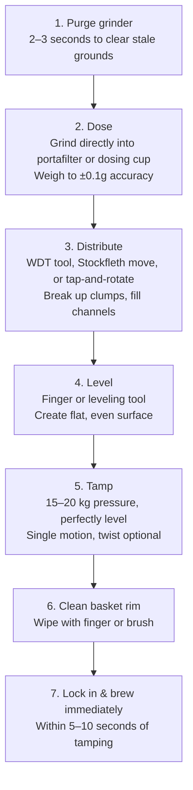
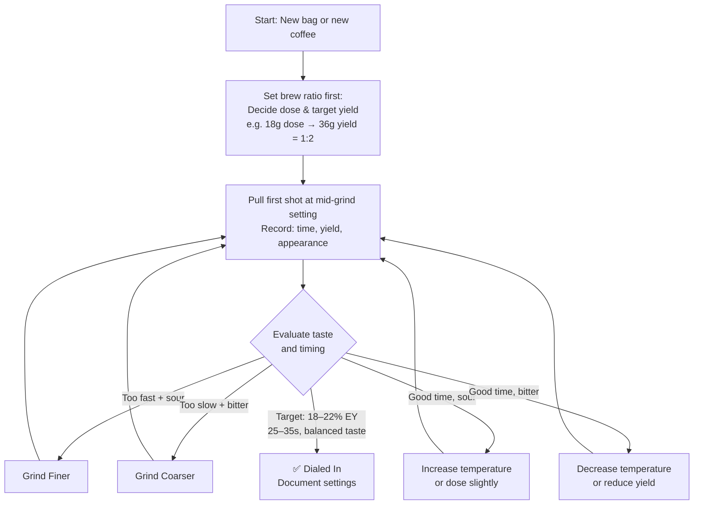
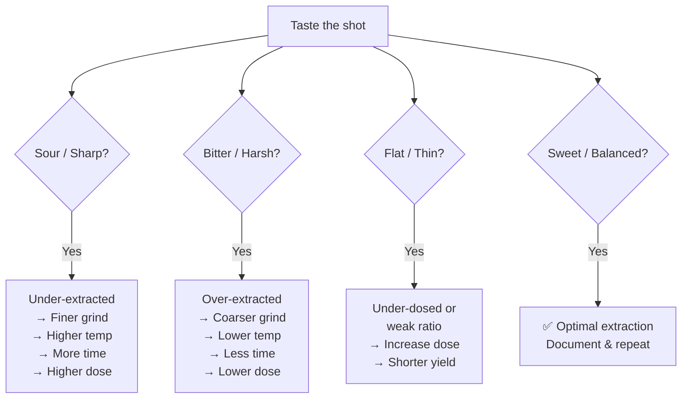

# Puck Preparation, Dialing In & Shot Diagnosis

## 📍 Parent Topics
- [Espresso Science](../INDEX.md)
- [Extraction Theory](extraction-theory.md)

---

## Part 1: Puck Preparation

The **puck** is the compressed coffee bed inside the portafilter basket. Proper preparation ensures:
- **Even water distribution** through the coffee
- **Minimal channeling** (water finding easy paths)
- **Consistent extraction** shot to shot

### The Preparation Sequence



---

### WDT (Weiss Distribution Technique)

**WDT** uses a fine needle or multi-needle tool to stir the loose grounds in the basket, breaking up clumps and creating a uniform, channel-free bed.

**Why it works:**
- Espresso grounds clump due to static and fine particle cohesion
- Clumps create **channels** → water bypasses most of the puck → under-extraction
- WDT creates **homogeneous density** throughout the puck

**How to do it:**
1. Grind into dosing cup or directly into portafilter
2. Insert WDT tool (0.3–0.4mm needles)
3. Stir in circular and figure-8 patterns for 10–15 seconds
4. Proceed to level and tamp

---

### Tamping Science

**Tamp pressure:** Research (Illy et al.) suggests **15–20 kg** is optimal. Beyond this, little measurable difference.

**What matters most:**
- **Levelness** > pressure magnitude
- An unlevel tamp creates a density gradient → water finds the lower-resistance path → channeling

**Tools:**
| Tool | Advantage |
|------|-----------|
| Calibrated tamp (e.g., Normcore V4) | Consistent pressure, auto-stop |
| Flat-base tamp | Even pressure distribution |
| Self-leveling tamp | Corrects minor angle errors |
| Traditional tamp | Requires skill, muscle memory |

---

### Basket Types

| Basket | Internal Geometry | Extraction Style |
|--------|-------------------|-----------------|
| **Ridgeless (IMS, VST)** | No ridge; puck releases cleanly | More consistent; preferred for specialty |
| **Standard ridged** | Ridge locks puck | Traditional; slightly more channeling risk |
| **Single wall** | Holes throughout bottom | Allows full puck expression; requires good prep |
| **Double wall (pressurized)** | Inner + outer wall with tiny hole | Compensates for poor technique/coarse grind |

---

## Part 2: Dialing In

**Dialing in** = the systematic process of adjusting variables to hit target extraction yield, taste, and flow rate for a specific coffee.

### Dial-In Protocol



### One Variable at a Time

**Critical rule:** Only change **one variable** between shots. Otherwise you cannot determine what caused the change.

**Priority order for dial-in:**
1. **Grind size** (most impactful on flow rate and extraction)
2. **Dose** (adjust yield ratio if needed)
3. **Temperature** (fine-tune flavor balance)
4. **Pressure** (only if machine allows profiling)

### Dial-In Targets

| Parameter | Target | Notes |
|---------|--------|-------|
| Flow rate | 1–2 mL/s | After pre-infusion |
| Shot time | 25–35s | For 1:2 ratio |
| EY | 18–22% | Measured or estimated |
| TDS | 8–12% | For espresso |
| Taste | Balanced sweet-acid | Not sour, not bitter |

---

## Part 3: Shot Diagnosis

### Visual Diagnosis

| What You See | Likely Problem | Fix |
|-------------|---------------|-----|
| Blonde (pale) from start | Under-extracted / too coarse | Grind finer |
| Very dark/black immediately | Over-extracted / too fine | Grind coarser |
| Blonde streaks / channels | Channeling | Better distribution/WDT |
| Drips before flow | Good pre-infusion saturation | Normal |
| Gushing (fast flow) | Too coarse or underdosed | Fine grind or increase dose |
| Very slow drips | Too fine or overdosed | Coarser grind or reduce dose |
| Uneven flow left/right | Uneven tamp or distribution | Level tamp, use WDT |

### Taste Diagnosis



---

### Channeling — Deep Dive

**Channeling** occurs when water finds a low-resistance path through the puck, bypassing most of the coffee.

**Causes:**
- Clumped grounds
- Uneven distribution
- Unlevel tamp
- Damaged/cracked puck
- Overdosed basket (puck too high)
- Underdosed basket (puck too loose)

**Detection:**
- Naked/bottomless portafilter reveals channels visually
- Uneven crema (streaky, pale spots)
- Fast initial flow then slowing
- Flavor: simultaneously sour AND bitter (different parts extracting differently)

**Prevention Hierarchy:**
1. Consistent grind (less static, less clumping)
2. WDT tool (break all clumps)
3. Level tamp (density uniformity)
4. Correct dose (right fill height)
5. Basket quality (ridgeless VST/IMS recommended)

---

## Calibration Routine (Daily)

```
☕ DAILY DIAL-IN CHECKLIST

□ Purge grinder with 5–10g coffee
□ Check scale calibration (zero it)
□ Pull a shot at yesterday's setting
□ Weigh yield (should match target ±1g)
□ Taste: compare to target profile
□ Adjust grind if drift detected
   (Temperature/humidity causes drift daily)
□ Document grind setting + parameters
□ Note: new bag = full redial from step 1
```

> ⚠️ **Grind drift:** As burrs heat up during service, particle size can shift. Espresso may run faster after 30 minutes of heavy use. Monitor first and last shots of a busy period.

---

## 🔗 Related Topics
- [Extraction Theory](extraction-theory.md)
- [Pressure & Flow Profiling](pressure-flow-profiling.md)
- [Grinders](../equipment/grinders.md)
- [Espresso Machines](../equipment/espresso-machines.md)
- [Barista Workflow SOP](../cafe-operations/workflow-sop.md)
