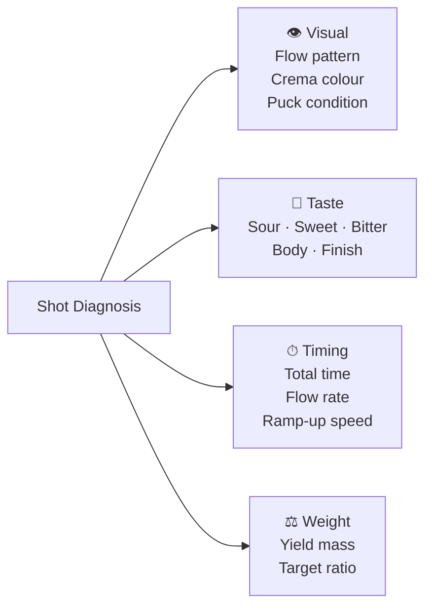

# Shot Diagnosis — Complete Reference

## 📍 Parent Topics
- [Espresso Science](../INDEX.md)
- [Dialing In](dialing-in.md)
- [Puck Preparation](puck-preparation.md)

---

## Diagnosis Framework

Every espresso shot tells a story through four channels of information:



Use all four together — a single signal can be misleading; patterns across all four reveal the true problem.

---

## Defect 1: Under-Extraction

### Signatures

| Channel | Signs |
|---------|-------|
| **Taste** | Sour, sharp, tart, hollow, thin, watery |
| **Visual** | Pale/blonde flow; no tiger striping; thin crema |
| **Timing** | Shot finishes too fast (< 20–22s for 1:2 ratio) |
| **Weight** | Yield comes too quickly; hard to stop at target |
| **Puck** | Wet, soupy, uncompressed after shot |

### Root Causes & Fixes

| Cause | Fix |
|-------|-----|
| Grind too coarse → fast flow | Grind finer (1 step at a time) |
| Dose too low → loose puck | Increase dose by 0.5–1g |
| Temperature too low | Raise temperature 1–2°C |
| Brew ratio too short (ristretto when standard needed) | Extend yield |
| Stale coffee (no soluble compounds left) | Use fresher coffee |
| Channeling causing bypass | Fix distribution/WDT |

---

## Defect 2: Over-Extraction

### Signatures

| Channel | Signs |
|---------|-------|
| **Taste** | Bitter, harsh, dry, astringent, woody |
| **Visual** | Very dark flow; dark crema; fast blonde at start |
| **Timing** | Shot runs too slow (> 40s for 1:2 ratio) |
| **Weight** | Hard to reach yield; shot barely drips |
| **Puck** | Very dry, hard, cracked surface |

### Root Causes & Fixes

| Cause | Fix |
|-------|-----|
| Grind too fine → slow flow | Grind coarser (1 step at a time) |
| Dose too high → over-packed puck | Reduce dose by 0.5–1g |
| Temperature too high | Lower temperature 1–2°C |
| Yield too long | Stop shot earlier (reduce yield by 3–5g) |
| Old/dark roast over-developing | Use medium roast; shorten brew time |

---

## Defect 3: Channeling

### What Is Channeling?

Channeling occurs when water finds a **low-resistance path** through the coffee puck instead of flowing evenly. Water rushes through the channel, over-extracting that zone while under-extracting the rest.

### Signatures

| Channel | Signs |
|---------|-------|
| **Taste** | Simultaneously sour **and** bitter; imbalanced; sharp |
| **Visual** | Streaky, uneven crema; blonde streaks on dark crema; one side flows faster |
| **Naked portafilter** | Visible jets or blonde streams from one spot; uneven drip pattern |
| **Timing** | May be normal, fast, or erratic |
| **Puck** | After shot: damp channels, holes, or trenches in puck surface |

### Root Causes & Fixes

| Cause | Fix |
|-------|-----|
| Clumped grounds | Use WDT tool; break all clumps before tamping |
| Uneven distribution | Level grounds before tamping; use distribution tool |
| Unlevel tamp | Ensure perfectly level tamp; use self-levelling tamp |
| Overdosed basket | Reduce dose to leave 2–3mm headspace |
| Underdosed basket | Increase dose so puck fills basket properly |
| Basket damage (dents, warped) | Replace basket |
| Worn group head gasket | Replace gasket |
| Coarse grind + high pressure | Fine-tune grind; use pre-infusion |

---

## Defect 4: Crema Problems

### Crema Diagnosis Table

| Crema Appearance | Cause | Action |
|-----------------|-------|--------|
| Thick, dark, tiger-striped | ✅ Ideal — good extraction | Maintain |
| Very thick, dark uniform | Slightly over-extracted | Minor coarser grind |
| Thin, blonde, dissipates fast | Under-extracted or stale coffee | Finer grind; fresher coffee |
| Very pale/white | Severely under-extracted | Significant finer adjustment |
| Large white bubbles | Very fresh coffee (high CO₂) | Rest beans 7–14 days |
| Dark black hole in centre | Fast channeling stream | Fix distribution |
| Crema missing entirely | Stale coffee or broken machine | Check freshness; check pump |
| Oily, very dark | Very dark roast or over-extracted | Use lighter roast; adjust grind |

---

## Defect 5: Baked / Flat

### Signatures

| Channel | Signs |
|---------|-------|
| **Taste** | Flat, hollow, lifeless; not sour, not bitter — just nothing |
| **Aroma** | Weak; cardboard; muted |
| **Visual** | May look normal |
| **Crema** | May look normal but thin |

### Root Causes

| Cause | Fix |
|-------|-----|
| Stale coffee (primary cause) | Use fresher roast (within 4–6 weeks) |
| Baked roast (roasting defect) | Change coffee supplier or batch |
| Temperature too low for too long | Raise temperature; check machine calibration |
| Shot pulled too fast + too coarse together | Lower ratio + finer grind |

---

## Defect 6: Flow Rate Anomalies

### Flow Pattern Diagnosis

```
Normal flow (1:2, ~28s):
Sec: 0──5──10──15──20──25──30
     dry|ramp|───────steady────|stop
         Pre-infusion (if used)

Too fast:
Sec: 0──5──10──15──20──25──30
     dry|ramp|──fast──|stop early
         ↑ Coarser grind needed

Too slow:
Sec: 0──5──10──15──20──25──30
     dry|looooong ramp|drip...drip
                  ↑ Finer grind is wrong; go coarser
```

| Flow Pattern | Interpretation | Fix |
|-------------|---------------|-----|
| Immediate gush from start | Channeling or very coarse | WDT + distribution |
| Slow ramp (> 10s to flow) | Very fine or overdosed | Coarser or lower dose |
| Steady 1–2mL/s | ✅ Ideal | Maintain |
| Decelerating to drips | Puck compacting (normal) | Declining pressure profile |
| Alternating fast/slow | Multiple channels | Better distribution |

---

## Defect 7: Temperature-Related Issues

| Symptom | Temperature Issue | Fix |
|---------|-----------------|-----|
| Sour, thin (timing OK) | Too cool | +1–2°C |
| Bitter, harsh (timing OK) | Too hot | −1–2°C |
| Inconsistent between shots | Unstable temperature | Flush group head between shots; check PID |
| First shot sour, subsequent OK | Cold group head | Purge 2–3 blank shots before service |

---

## The Naked/Bottomless Portafilter — Diagnostic Tool

The **naked portafilter** (no spout) is the most powerful diagnostic tool for channeling and distribution:

```
What you see → What it means:

✅ Even, brown curtain of drops from entire basket bottom:
   → Even extraction; good distribution; no channeling

⚠️ Jets from one side only:
   → Channeling; uneven distribution; fix tamp angle

⚠️ Blonde stream from one spot, dark from rest:
   → Single channel; WDT needed

⚠️ Completely pale/blonde from start:
   → Severe under-extraction; significant grind adjustment

⚠️ Spraying / misting outward:
   → Overdosed; puck too close to shower screen
```

---

## Shot Diagnosis Quick Card

```
┌─────────────────────────────────────────────────────┐
│             ESPRESSO SHOT DIAGNOSIS                  │
│                                                     │
│  SOUR + FAST SHOT    → UNDER-EXTRACTED → FINER      │
│  BITTER + SLOW SHOT  → OVER-EXTRACTED  → COARSER    │
│  SOUR + BITTER       → CHANNELING      → DISTRIBUTE │
│  FLAT + LIFELESS     → STALE COFFEE    → NEW BAG    │
│  PALE CREMA + QUICK  → UNDER-EXTRACTED → FINER      │
│  DARK CREMA + SLOW   → OVER-EXTRACTED  → COARSER    │
└─────────────────────────────────────────────────────┘
```

---

## 🔗 Related Topics
- [Dialing In](dialing-in.md)
- [Puck Preparation](puck-preparation.md)
- [Extraction Theory](extraction-theory.md)
- [Pressure & Flow Profiling](pressure-flow-profiling.md)
- [Equipment — Espresso Machines](../equipment/espresso-machines.md)
