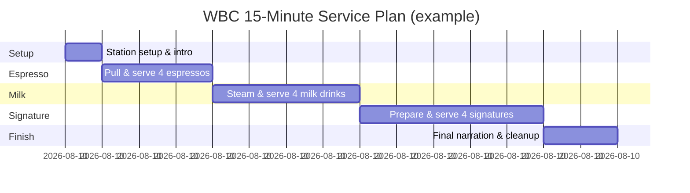
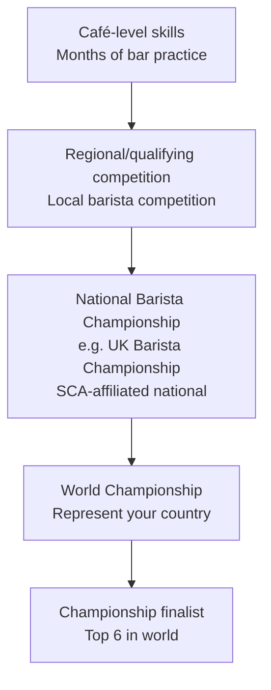

# Competition Coffee — Complete Guide

## 📍 Parent Topics
- [Learning Paths](../learning-paths/learning-paths.md)
- [Espresso Science](../espresso/INDEX.md)

---

## World Coffee Championships Overview

The **World Coffee Championships (WCC)** umbrella organisation (a joint project of SCA and World Coffee Events) runs:

| Championship | Abbrev | Focus | Time |
|-------------|--------|-------|------|
| World Barista Championship | WBC | Espresso + milk + signature | 15 min |
| World Brewers Cup | WBrC | Manual brew | ~10 min |
| World Latte Art Championship | WLAC | Latte art speed + quality | ~8 min |
| World Cup Tasters Championship | WCTC | Triangle test speed | ~8 min |
| World Coffee in Good Spirits | WCIGS | Coffee + alcohol | ~10 min |
| World AeroPress Championship | WAC | AeroPress recipe | ~10 min |
| World Siphonist Championship | WSC | Siphon brew + presentation | ~10 min |

---

## 🏆 World Barista Championship (WBC)

### Format

Competitors prepare **12 drinks** in **15 minutes**:
- **4 espressos** — served to 4 sensory judges
- **4 milk beverages** — served to 4 sensory judges
- **4 signature beverages** — served to 4 sensory judges
- Narration throughout to **1 head judge** + audience

### Judging Panel

| Judge Type | Number | Scores |
|-----------|--------|--------|
| Sensory judges | 4 | Taste, aroma, appearance of all drinks |
| Technical judges | 2 | Technique, workflow, hygiene, timing |
| Head judge | 1 | Overall impression, rules compliance, disqualification |

### Scoring Breakdown

**Technical Score (max 100 pts):**
- Cleanliness/hygiene
- Correct technique (dosing, tamping, prep)
- Calibration consistency
- Workflow efficiency
- Cup presentation

**Espresso Score (max 36 pts total — 4 judges × 9 pts each):**
- Taste (0–6)
- Visual/aroma (0–3)

**Milk Beverage Score (max 36 pts total):**
- Taste (0–6)
- Visual/latte art (0–3)

**Signature Beverage Score (max 36 pts total):**
- Taste (0–6)
- Creativity/presentation (0–3)

**Total maximum:** 100 (technical) + 108 (sensory × 3 drinks) = **208 pts**

---

### Signature Beverage Rules

The signature beverage must:
- Be served hot (above 45°C) OR cold (below 15°C)
- Be based on espresso (must contain espresso)
- Not contain alcohol
- Be **original** — created by the competitor
- Include an ingredient or concept that tells a story

**Successful signature concepts (real examples):**
- Espresso + clarified butter + buckwheat tea (umami + fat theme)
- Espresso + fermented honey + cold sparkling water (fermentation concept)
- Espresso + dehydrated fruit powder + coconut water (terroir + hydration)

### 15-Minute Service Flow



---

### WBC Preparation Strategy

**6 months out:**
- Secure coffee — single origin, traceable, ideally direct relationship
- Start espresso recipe development: ratio, temperature, profile
- Write initial signature drink concept

**3 months out:**
- Lock coffee recipe (dose, yield, temp, profile)
- Finalise signature drink (test with 20+ people; iterate)
- Write script/narration draft
- Run full 15-minute timed practices (weekly)

**1 month out:**
- Daily full-run practices
- Video every run; review
- Refine transitions between drink sets
- Practice narration fluency (not memorised robotically)

**Competition week:**
- Confirm machine settings with technician
- Practice on competition machine model if possible
- Rest, hydration, sleep — mental clarity matters

---

## ☕ World Brewers Cup (WBrC)

### Format

Two rounds:
1. **Compulsory Service:** All competitors brew same coffee, same grinder, same equipment. Only recipe and technique differentiate.
2. **Open Service:** Competitor brings own coffee, equipment, recipe. 10 minutes to brew 3 servings.

### Scoring (Open Service)

| Category | Points |
|---------|--------|
| **Taste** (3 sensory judges × 15) | 45 |
| **Presentation** (story, communication) | 15 |
| **Technical** (technique, consistency) | 15 |
| **Total** | **75** |

### Brew Method Rules

Any non-espresso manual brew method is permitted:
- Pour over (most common — V60, Kalita, Origami)
- AeroPress
- Siphon
- Clever Dripper
- Chemex
- Cold brew presented as hot (chilled and reheated — creative)

### WBrC Coffee Strategy

Top competitors choose coffees that:
- Tell a compelling story (direct relationship with farmer ideal)
- Have extraordinary cup quality (85+ pts; often 90+)
- Are distinctive and memorable
- Support their presentation narrative

---

## 🎨 World Latte Art Championship (WLAC)

### Format

Two rounds × 2 pours each:
1. **Speed Round:** Pattern judged on speed + quality; 8-minute window
2. **Free Pouring Round:** Competitor's original pattern

### Judging Criteria

| Criterion | Weight |
|----------|--------|
| **Visual complexity** | High |
| **Symmetry** | High |
| **Contrast** (white/dark definition) | High |
| **Creativity** (novel patterns) | Medium |
| **Overall impression** | Medium |
| **Consistency** (duplicate cups match) | High |

### Common Competition Patterns

| Pattern | Difficulty | Key Skill |
|---------|-----------|-----------|
| Rosetta | Intermediate | Backward movement + wiggle consistency |
| Tulip | Intermediate | Pulse control + layering |
| Swan | Advanced | Multi-pattern combination |
| Phoenix/Peacock | Expert | Multiple elements + symmetry |
| Original patterns | Expert | Innovation + execution |

---

## 🫙 World AeroPress Championship (WAC)

### Format

- **Local/National heats** → winners to World Championship
- Three competitors brew simultaneously; **3 judges** taste blind
- Each judge picks favourite → 2/3 votes wins the round
- Single-elimination bracket

### Recipe Freedom

WAC has virtually **no rules on recipe** — competitors can use:
- Any dose
- Any grind
- Any water temperature
- Any brew time
- Inverted or standard orientation
- Any filter type
- Multiple infusions

This extreme freedom drives the most creative recipes in coffee competition.

### Winning Recipe Characteristics (patterns from WAC winners)

| Variable | Common range in winning recipes |
|---------|-------------------------------|
| Dose | 11–22g |
| Water | 75–230g |
| Temperature | 60–96°C |
| Time | 45s–3min |
| Technique | Inverted popular; some standard |

**Key insight:** Most winning recipes prioritise **sweetness** and **clean finish** over intensity, because judges taste multiple coffees and clean, sweet cups stand out.

---

## 👅 World Cup Tasters Championship (WCTC)

### Format

- 8 sets of **triangle tests** (3 cups — 2 identical, 1 different)
- Competitor must identify the **odd cup** in each set
- Scored on: correct picks AND speed

### Training Programme

| Exercise | Frequency | Detail |
|---------|-----------|--------|
| Daily triangle tests | Daily | Use different origins/processing |
| Aroma kit | Daily | Le Nez du Café — 36 aromas |
| Acid solutions | 3×/week | Identify individual acids |
| Origin blind tasting | Weekly | Name country/process |
| Pressure practice | Monthly | Full timed set (8 triangles) |

---

## National Competition Pathway



**Qualifier note:** Each country has its own national championship process. Contact your national SCA chapter for current qualifier schedule.

---

## Presentation Language & Narration

### Effective WBC Narration Structure

```
1. HOOK (0–30s):
   "Coffee has always been about connection — 
    but this morning in Huila, I found something deeper..."

2. COFFEE STORY (30s–2min):
   Origin, farmer, process, why this coffee, what's special

3. ESPRESSO PRESENTATION (during espresso service):
   Recipe rationale, flavour prediction, tasting notes

4. MILK PRESENTATION (during milk service):
   Why this ratio, milk choice, what balance you sought

5. SIGNATURE CONCEPT (before + during signature):
   The idea, the ingredients, why they work together, the story

6. CLOSE (final 30s):
   Unifying theme, gratitude, invitation to experience
```

### Language That Scores Well

| Instead of... | Say... |
|--------------|--------|
| "This tastes good" | "You'll find a clean, persistent sweetness with a lingering floral finish" |
| "I chose this coffee" | "I travelled to Nariño specifically to find this varietal because..." |
| "My technique is..." | "I've calibrated the temperature to 94°C to highlight the malic acidity without losing the florals" |
| "I hope you enjoy it" | "I invite you to taste the story of this coffee and the hands that grew it" |

---

## Equipment Checklist (Competition Day)

```
PERSONAL KIT
□ Scale (calibrated, charged)
□ Tamper (personal, correct diameter)
□ WDT tool
□ Distribution tool
□ Thermometer
□ Stopwatch / timer
□ Cupping spoon (for tasting own shots)
□ Notebook (last-minute reference)
□ Grinder burr set (if allowed by competition)

COFFEE & CONSUMABLES
□ Pre-weighed doses (if permitted; check rules)
□ Signature drink ingredients (all pre-prepped where allowed)
□ Garnishes/presentations for signature
□ Water (if bringing special water profile)

MENTAL PREPARATION
□ Script printed (backup reference)
□ Full run yesterday — not today
□ Sleep 7–8 hours
□ Eat well before; hydrate
□ Arrive 90+ minutes early to warm-up time
```

---

## 🔗 Related Topics
- [Learning Paths — Competition](../learning-paths/learning-paths.md)
- [Pressure & Flow Profiling](../espresso/pressure-flow-profiling.md)
- [Milk Science & Latte Art](../milk-latte-art/milk-science.md)
- [Latte Art Patterns](../milk-latte-art/latte-art-patterns.md)
- [Cupping Protocol](../sensory-cupping/cupping-protocol.md)
- [Flavour Wheel](../sensory-cupping/flavor-wheel-guide.md)
