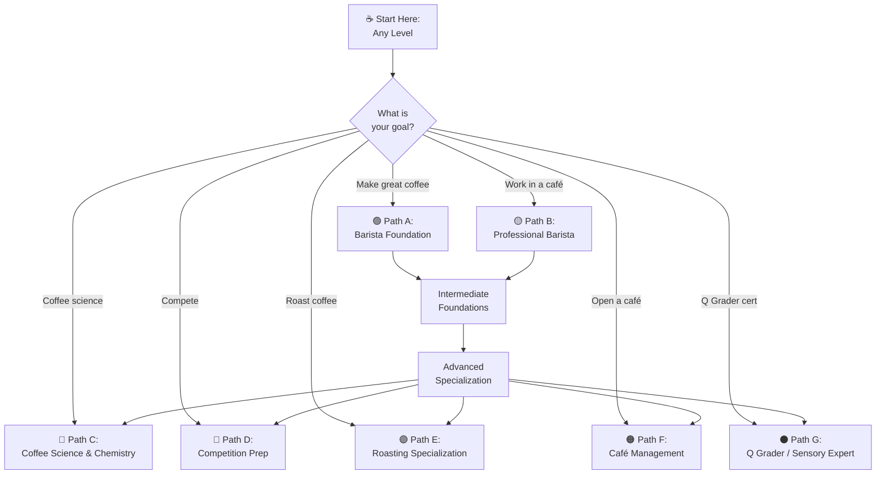
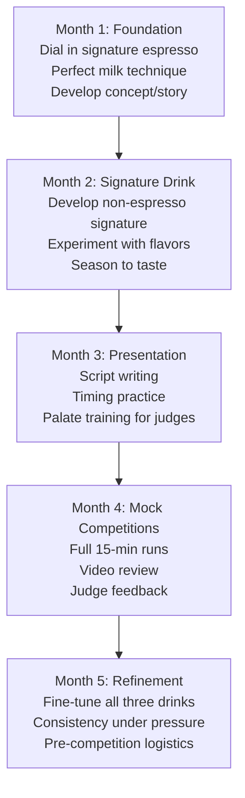

# Learning Paths — Coffee Education System

## 📍 Parent Topics
- [Coffee Knowledge Base](../INDEX.md)

---

## Overview: All Learning Paths



---

## 🟢 Path A: Barista Foundation (Beginner)

**Duration:** 4–8 weeks self-study + practice  
**Goal:** Make excellent coffee at home; understand coffee fundamentals

### Module Sequence

| Week | Topic | Files to Read | Practice |
|------|-------|--------------|---------|
| 1 | Coffee basics | `history-of-coffee.md`, `specialty-coffee-movement.md` | Visit a specialty café; taste and identify |
| 2 | Bean knowledge | `species-overview.md`, `beans/regions/ethiopia.md` | Buy 2 origins; compare taste |
| 3 | Brewing fundamentals | `brewing-methods/pour-over.md` (V60 + AeroPress sections) | Make 10 pour-overs; adjust variables |
| 4 | Water & variables | `water-science/water-chemistry.md` | Test your tap water; try filtered |
| 5 | Espresso basics | `espresso/extraction-theory.md` | Pull shots; learn to dial in |
| 6 | Milk basics | `milk-latte-art/milk-science.md` | Practice steaming; aim for microfoam |
| 7 | Sensory | `sensory-cupping/cupping-protocol.md` | Taste intentionally; describe what you sense |
| 8 | Review & refine | Formula Library | Calculate your EY from a shot |

### Skill Milestones

```
□ Can explain the difference between Arabica and Robusta
□ Can pull a consistent espresso within target ratio (±2g yield)
□ Can steam microfoam for a flat white (glossy, silky texture)
□ Can identify under-extraction vs over-extraction by taste
□ Can make a V60 pour-over within target time window
□ Knows what TDS and EY mean
□ Can describe at least 5 flavor descriptors from memory
```

---

## 🟡 Path B: Professional Barista

**Duration:** 3–6 months working practice + study  
**Goal:** Work confidently in a specialty café; SCA Barista Skills Foundation/Intermediate certification

### Module Sequence

| Month | Focus | Files | Certifications |
|-------|-------|-------|---------------|
| 1 | Espresso mastery | `extraction-theory.md`, `puck-preparation.md`, `pressure-flow-profiling.md` | SCA Barista Skills Foundation |
| 2 | Milk & drinks | `milk-science.md` (all sections), `workflow-sop.md` | Practice latte art daily |
| 3 | Operations | `workflow-sop.md`, `beverage-costing.md` | SCA Barista Skills Intermediate |
| 4 | Coffee knowledge | All `beans/regions/*.md`, `roasting-science.md` | Study origin flashcards |
| 5 | Water & equipment | `water-chemistry.md`, `espresso-machines.md` | Set up water recipe at work |
| 6 | Sensory depth | `cupping-protocol.md`, `sensory-training.md` | Participate in cuppings |

### Professional Competency Checklist

```
□ Dial in a new bag of coffee in < 5 shots
□ Maintain < ±1g yield variance across 20 shots
□ Steam and pour a recognizable heart and rosetta
□ Handle 3 simultaneous orders without error
□ Complete opening and closing SOPs independently
□ Pass SCA Barista Skills Intermediate
□ Calculate beverage cost for any menu item
□ Identify and correct channeling
□ Explain your current coffee's origin and processing
□ Maintain full hygiene compliance throughout shift
```

---

## 🔵 Path C: Coffee Science & Chemistry

**Duration:** 6–12 months deep study  
**Goal:** Understand the science behind extraction, roasting, and water at a research level

### Module Sequence

| Phase | Topic | Files | External Resources |
|-------|-------|-------|-------------------|
| 1 | Extraction theory | `extraction-theory.md`, `formula-library.md` | Rao's "Everything but Espresso" |
| 2 | Chemistry | `extraction-chemistry.md`, `maillard-caramelization.md` | Illy & Viani "Espresso Coffee" |
| 3 | Water science | `water-chemistry.md`, `water-recipes.md` | Colonna-Dashwood "Water for Coffee" |
| 4 | Roasting chemistry | `roast-science.md`, `roast-curves-profiles.md` | Schenker PhD thesis |
| 5 | Sensory science | `cupping-protocol.md`, `flavor-wheel-guide.md` | Le Nez du Café kit |
| 6 | Research | Primary literature (see sources in each file) | Google Scholar: Hendon, Illy, Yeretzian |

---

## 🔴 Path D: Competition Preparation

**Duration:** 3–6 months intensive  
**Goal:** WBC, WBrC, WCE, or national championship participation

### Competition Types

| Competition | Format | Key Files |
|------------|--------|----------|
| World Barista Championship (WBC) | 15-min espresso + milk + signature drinks | All espresso + milk files |
| World Brewers Cup (WBrC) | Manual brew, compulsory + open service | All brew method files |
| World Cup Tasters | Triangle test, identify different coffees | Sensory files, cupping |
| World Coffee in Good Spirits | Alcoholic coffee drinks | Creative; espresso base |
| World Latte Art | Speed + quality latte art patterns | Milk science, latte art |

### WBC Preparation Sequence



### Competition Calibration Standards

| Parameter | WBC Standard |
|---------|-------------|
| Espresso dose | No specification (barista chooses) |
| Espresso yield | No specification (barista chooses) |
| Espresso temp serve | > 0°C (no specific limit, but hot) |
| Milk drink temp | 55–70°C |
| Service time | 15 minutes total |
| Judges | 3 technical + 4 sensory + 1 head judge |

---

## 🟣 Path E: Roasting Specialization

**Duration:** 6–18 months + roasting practice  
**Goal:** Professional roaster; SCA Roasting Skills certification

### Module Sequence

| Phase | Topic | Files |
|-------|-------|-------|
| 1 | Coffee fundamentals | `species-overview.md`, all `beans/` files |
| 2 | Green coffee | `supply-chain.md`, `certifications-standards.md` |
| 3 | Roast science | `roast-science.md`, `roast-curves-profiles.md` |
| 4 | Roast defects | `roast-defects.md` |
| 5 | Sensory for roasters | `cupping-protocol.md`, `sensory-training.md` |
| 6 | Business of roasting | `beverage-costing.md`, `coffee-economics.md` |

### Roasting Skill Milestones

```
□ Understand all phases of the roast curve
□ Can read and interpret a roast log/profile
□ Know DTR target and can adjust to hit it
□ Can identify 8+ roast defects by taste
□ Cup own roasts vs reference daily
□ Consistent batch-to-batch (< 5°C temperature variation at key points)
□ Can profile different roasts for espresso vs filter
□ SCA Roasting Skills Foundation passed
```

---

## 🟠 Path F: Café Management

**Duration:** Ongoing — business-focused  
**Goal:** Open or manage a specialty café successfully

### Module Sequence

| Priority | Topic | Files |
|---------|-------|-------|
| Essential | Operations & SOP | `workflow-sop.md` |
| Essential | Financials | `beverage-costing.md`, `coffee-economics.md` |
| Essential | Quality systems | `extraction-theory.md`, `cupping-protocol.md` |
| Important | Staff training | `workflow-sop.md` (training section), `learning-paths.md` |
| Important | Supply chain | `supply-chain.md`, `certifications-standards.md` |
| Important | Equipment | `espresso-machines.md` |
| Strategic | Menu engineering | `beverage-costing.md` (menu engineering section) |

### Manager Competency Checklist

```
□ Can calculate beverage cost % for all menu items
□ Can calculate and track prime cost monthly
□ Can write and enforce opening/closing SOPs
□ Can train a new barista from zero to independent in 4 weeks
□ Can diagnose espresso machine issues (basic level)
□ Can conduct weekly calibration sessions with staff
□ Understands supply chain and sources coffee intentionally
□ Has set up or maintains water filtration system
□ Tracks waste and has active reduction strategy
□ Reviews P&L monthly and can act on findings
```

---

## ⚫ Path G: Q Grader / Sensory Expert

**Duration:** 6–12 months study + pass all modules  
**Goal:** CQI Q Arabica Grader certification

### Exam Modules Overview

| Module | Skill | Preparation |
|--------|-------|-------------|
| General Knowledge | Coffee science, processing, history | All `coffee-fundamentals/` + `beans/` files |
| Olfactory Skills | Smell triangle tests, aroma identification | Le Nez du Café kit (36 aromas) |
| Sensory Skills | Salt/acid/sweet/bitter thresholds | Solution training exercises |
| Organic Acids | Identify individual acids | Acid solution kit + `extraction-chemistry.md` |
| Cupping | Blind cupping to SCA standard | 500+ hours cupping practice |
| Arabica Grading | Green coffee defect analysis | SCA Green Coffee Standard manual |
| Roast Identification | Match Agtron score tiles | Agtron tiles + `roasting-science.md` |
| Triangulation | Find odd cup in 3-cup set | Daily triangle practice |
| Written Exam | All above knowledge | Full KB review |

### Q Grader Study Schedule (6-month plan)

| Month | Focus |
|-------|-------|
| 1 | General knowledge: all fundamentals, origin, processing |
| 2 | Cupping: daily practice; `cupping-protocol.md` deep study |
| 3 | Sensory thresholds: acid kit, salt kit, sugar kit training |
| 4 | Aroma training: Le Nez du Café daily |
| 5 | Triangle tests: 3× per day minimum |
| 6 | Mock exam conditions: full CQI exam simulation |

---

## SCA Coffee Skills Program (Official Certifications)

| Module | Levels | Coverage |
|--------|--------|---------|
| **Introduction to Coffee** | Foundation only | Overview of all areas |
| **Barista Skills** | Foundation / Intermediate / Professional | Espresso, milk, workflow |
| **Brewing** | Foundation / Intermediate / Professional | Brew methods, recipe development |
| **Green Coffee** | Foundation / Intermediate / Professional | Sourcing, grading, sensory |
| **Sensory Skills** | Foundation / Intermediate / Professional | Cupping, flavor, evaluation |
| **Roasting** | Foundation / Intermediate / Professional | Roast science, profiling |

**SCA Diploma:** Earn Foundation + Intermediate + Professional in all modules → SCA Coffee Diploma

---

## 🔗 Related Topics
- [Workflow SOP](../cafe-operations/workflow-sop.md)
- [Extraction Theory](../espresso/extraction-theory.md)
- [Cupping Protocol](../sensory-cupping/cupping-protocol.md)
- [Roasting Science](../roasting/roast-science.md)
- [Formula Library](../formulas/formula-library.md)
