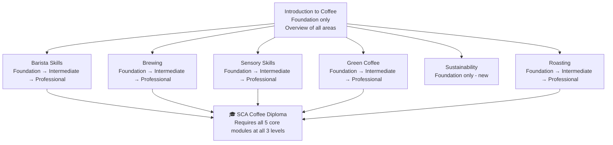

# SCA Curriculum Map & Certification Pathways

## 📍 Parent Topics
- [Learning Paths](../learning-paths/learning-paths.md)
- [Q Grader Study Plan](q-grader-study-plan.md)

---

## SCA Coffee Skills Programme Overview

The **SCA Coffee Skills Programme (CSP)** is the world's most widely recognised professional coffee education system, with certified trainers in 50+ countries.

### Programme Structure

---

## Points System

Each certification earns **SCA Credits**:

| Level | Credits per Module |
|-------|------------------|
| Foundation | 5 credits |
| Intermediate | 10 credits |
| Professional | 25 credits |
| Introduction to Coffee | 5 credits |

**SCA Coffee Diploma = 100 credits total** (all core modules at all levels)

---

## Module 1: Introduction to Coffee

### Overview
- **Level:** Foundation only
- **Duration:** ~8 hours (1 day)
- **Credits:** 5
- **Format:** Practical + written

### Curriculum Content

| Topic | Key Content |
|-------|-------------|
| History & origin | Coffee origins, waves, SCA history |
| Coffee growing | Species, varietals, terroir, altitude |
| Processing | Washed, natural, honey overview |
| Roasting basics | Phases, light vs dark, freshness |
| Brewing fundamentals | Methods overview; extraction basics |
| Sensory basics | Taste, aroma, basic tasting |
| Business of coffee | Supply chain, certifications |

### Assessment
- Written multiple choice + short answer: 70% pass
- Practical demonstration: competence sign-off

---

## Module 2: Barista Skills

### Foundation Level

**Duration:** 8 hours | **Credits:** 5 | **Prerequisite:** None

| Section | Content |
|---------|---------|
| Espresso | Machine operation, extraction basics, recipe setting |
| Milk | Steaming basics, texture targets, simple drink assembly |
| Workflow | Station set-up, hygiene, opening/closing |
| Menu knowledge | Core drink identification and ratios |

**Assessment:**
- Espresso: Pull 4 shots within target parameters
- Milk: Steam milk to microfoam standard
- Written: 70% on knowledge questions
- Practical: All skills demonstrated competently

---

### Intermediate Level

**Duration:** 2 days (16 hours) | **Credits:** 10 | **Prerequisite:** Foundation

| Section | Content |
|---------|---------|
| Espresso science | Extraction theory, EY, TDS, refractometry introduction |
| Dialling in | Systematic adjustment, troubleshooting |
| Milk mastery | Non-dairy, advanced texturing, latte art patterns |
| Workflow | Multi-order management, speed, calibration |
| Coffee knowledge | Origins, processing, seasonality |
| Customer service | Hospitality, communication, complaint handling |

**Assessment:**
- Written: 70% on technical knowledge
- Practical exam: Full service scenario — pull and serve 4 espressos, 4 milk drinks, present coffee knowledge

---

### Professional Level

**Duration:** 4 days (32 hours) | **Credits:** 25 | **Prerequisite:** Intermediate

| Section | Content |
|---------|---------|
| Advanced extraction | Pressure profiling, refractometry, TDS calibration |
| Competition preparation | WBC format, presentation skills |
| Signature drinks | Development, execution, storytelling |
| Advanced sensory | Defect identification, cupping integration |
| Training others | How to coach barista skills |
| Business integration | Menu design, cost management |

**Assessment:**
- 15-minute WBC-format service presentation to examiners
- Written theory exam: 70%
- Practical: Observed skill stations (extraction, milk, calibration)
- Oral: Coffee knowledge interview

---

## Module 3: Brewing

### Foundation Level

**Duration:** 8 hours | **Credits:** 5

| Content |
|---------|
| Filter methods overview (pour-over, French Press, AeroPress) |
| Water basics (temperature, TDS introduction) |
| Grind understanding |
| SCA Golden Cup standard introduction |
| Basic recipes |

---

### Intermediate Level

**Duration:** 2 days | **Credits:** 10

| Content |
|---------|
| Water chemistry and SCA standards |
| Extraction yield and TDS measurement |
| Method-specific optimisation (V60, Chemex, Kalita, batch) |
| Recipe development |
| Troubleshooting |
| Cold brew |

---

### Professional Level

**Duration:** 4 days | **Credits:** 25

| Content |
|---------|
| Advanced water science and recipe creation |
| WBrC-format service presentation |
| Comparative brewing analysis |
| Equipment evaluation |
| Training others in brewing |

---

## Module 4: Sensory Skills

### Foundation Level

**Duration:** 8 hours | **Credits:** 5

| Content |
|---------|
| Basic taste recognition (sweet, sour, bitter, salty, umami) |
| Introduction to coffee aroma |
| SCA Flavour Wheel overview |
| Basic cupping introduction |
| Describing coffee using sensory language |

---

### Intermediate Level

**Duration:** 2 days | **Credits:** 10

| Content |
|---------|
| Full SCA cupping protocol |
| Scoring to SCA scorecard |
| Organic acid identification |
| Origin and process identification |
| Defect recognition |
| Calibration with others |

---

### Professional Level

**Duration:** 4 days | **Credits:** 25

| Content |
|---------|
| Advanced calibration (WBC/WBrC/CoE judge preparation) |
| Triangle testing |
| Statistical sensory analysis |
| Sensory panel management |
| Training others in sensory skills |

---

## Module 5: Green Coffee

### Foundation Level

**Duration:** 8 hours | **Credits:** 5

| Content |
|---------|
| Coffee botany and species |
| Growing regions and terroir |
| Processing overview |
| Basic green grading |
| Supply chain introduction |
| Certifications |

---

### Intermediate Level

**Duration:** 2 days | **Credits:** 10

| Content |
|---------|
| Full SCA green grading procedure |
| Defect identification and classification |
| Storage and handling |
| Moisture analysis |
| Cupping for green buying decisions |
| Seasonality and crop cycles |

---

### Professional Level

**Duration:** 4 days | **Credits:** 25

| Content |
|---------|
| Advanced grading and international grading systems |
| Origin research and sourcing |
| Green buying strategy |
| Quality control systems |
| Contract terms and trade |
| Training others |

---

## Module 6: Roasting

### Foundation Level

**Duration:** 8 hours | **Credits:** 5

| Content |
|---------|
| Roasting phases (drying, Maillard, first crack, development) |
| Basic roasting equipment |
| Roast colour and Agtron introduction |
| Freshness and degassing |
| Roast impact on cup |

---

### Intermediate Level

**Duration:** 2 days | **Credits:** 10

| Content |
|---------|
| Roasting on a drum roaster under supervision |
| Profile reading (bean temp, inlet temp, RoR) |
| DTR and development ratio |
| Roast defects identification |
| Roast logging and documentation |
| Sensory evaluation of roasted coffee |

---

### Professional Level

**Duration:** 4 days | **Credits:** 25

| Content |
|---------|
| Advanced profile development |
| Blend development |
| Quality control systems |
| Roastery operations management |
| Training others in roasting |

---

## Pathway Comparison: SCA vs Q Grader

| Attribute | SCA CSP (all modules) | Q Arabica Grader (CQI) |
|-----------|----------------------|------------------------|
| **Issuing body** | SCA | CQI (Coffee Quality Institute) |
| **Focus** | Broad coffee skills | Specialist sensory/grading |
| **Exam format** | Multiple modules over time | Single intensive exam (22 modules) |
| **Pass rate** | ~70–80% | ~50% (first attempt) |
| **Recognition** | Global; industry-wide | Global; highly respected for buying/roasting |
| **Time to complete** | 1–3 years (all levels) | 6–12 months preparation; 4-day exam |
| **Cost** | $1,500–5,000+ (all modules) | $600–$800 + prep costs |
| **Recertification** | Not required | Every 3 years |
| **Best for** | Baristas, café staff, educators | Green buyers, roasters, quality professionals |

---

## SCA Approved Trainer (AT) Pathway

For those who want to teach SCA courses:

| Step | Requirement |
|------|------------|
| 1 | Hold SCA Intermediate or Professional in the module to teach |
| 2 | Complete Trainer Development module (2 days) |
| 3 | Demonstrate teaching competency to SCA Authorized Educator |
| 4 | Approved to deliver Foundation and Intermediate |
| 5 | Professional delivery requires Professional certification + experience |

---

## Self-Study Resources (SCA-Aligned)

| Resource | SCA Module | Format |
|---------|-----------|--------|
| `extraction-theory.md` | Barista Skills Intermediate/Professional | This KB |
| `cupping-protocol.md` | Sensory All Levels | This KB |
| `roast-science.md` | Roasting Foundation/Intermediate | This KB |
| `green-coffee-grading.md` | Green Coffee All Levels | This KB |
| `brewing-science-overview.md` | Brewing Foundation/Intermediate | This KB |
| `water-chemistry.md` | Brewing Intermediate/Professional | This KB |
| SCA Primers (PDF) | All modules | specialtycoffee.org |
| Barista Hustle courses | Barista, Brewing, Sensory | baristahustle.com |
| Coffee Mind academy | All modules | coffeemind.com |

---

## 🔗 Related Topics
- [Learning Paths](learning-paths.md)
- [Q Grader Study Plan](q-grader-study-plan.md)
- [Competition Guide](competition-guide.md)
- [Cupping Protocol](../sensory-cupping/cupping-protocol.md)
- [Extraction Theory](../espresso/extraction-theory.md)
- [Roasting Science](../roasting/roast-science.md)
