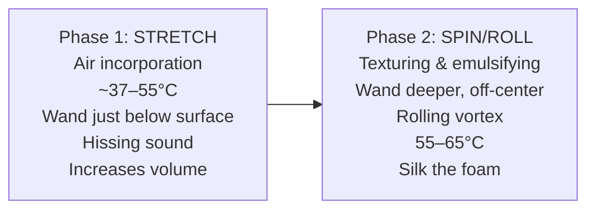
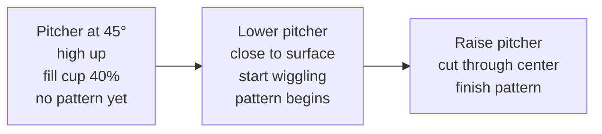

# Milk Science, Steaming & Latte Art

## 📍 Parent Topics
- [Coffee Knowledge Base](../INDEX.md)

---

## Milk Chemistry

### Composition of Whole Milk

| Component | % by Weight | Role in Steaming |
|-----------|------------|-----------------|
| Water | ~87% | Carrier medium |
| Lactose (sugar) | ~4.8% | Sweetness; Maillard at high temps |
| Proteins | ~3.2% | **Foam formation** (whey proteins) |
| Fat | ~3.5% | **Foam stability**; mouthfeel |
| Minerals | ~0.7% | Texture, minor flavor |

### Key Proteins for Foam

```
Milk Proteins
├── Casein (80%) — large micelles; structural
└── Whey Proteins (20%) — key foam-formers
    ├── β-Lactoglobulin — primary foaming protein
    ├── α-Lactalbumin — secondary foaming protein
    └── Lactoferrin — minor contribution
```

**How foam forms:**
1. Steam injects hot water + air into milk
2. **Whey proteins** unfold (denature) due to heat
3. Denatured proteins migrate to **air-water interface**
4. Proteins stabilize the air bubbles → foam
5. Fats interact with protein films → add stability

> 🔬 *Key insight: If milk is heated above 70°C without steam pressure (e.g., microwave), proteins denature but no foam forms. Steam pressure is required to inject and stretch air.*

---

## Temperature Science

### Target Temperatures

| Milk Temperature | Result |
|-----------------|--------|
| < 55°C | Underheated; thin foam; sweet but watery |
| 60–65°C | **Optimal zone** — silky texture, maximum sweetness |
| 65–70°C | Slightly less sweet; still serviceable |
| > 70°C | **Burnt milk** — scorched proteins; thin foam; unpleasant |
| > 75°C | Foam collapses; lactose degradation; off flavors |

> 💡 *Lactose reaches peak sweetness perception at ~60°C. Above 70°C, Maillard reactions begin consuming sugars → milk loses sweetness and develops "cooked" flavor.*

### Temperature Sensing

**Tools:**
- **Thermometer** — most accurate (clip-on digital)
- **Hand test** — palm under jug: hot but holdable ≈ 60–65°C; too hot to touch > 70°C
- **Machine thermometer gauges** — for reference only (often inaccurate ±5°C)

---

## Steaming Technique

### The Two Phases



### Step-by-Step Steaming Sequence

1. **Purge steam wand** (1–2 seconds) → removes condensate
2. **Cold milk in pitcher** (ideally ~4°C fresh from fridge)
3. Position wand tip: **just below milk surface, off-center** (creates vortex)
4. Open steam valve fully
5. **Stretch phase:** wand at surface → hissing incorporates air → milk volume rises
   - Stretch only until ~55°C or volume reaches target
6. **Roll phase:** lower wand slightly below surface → no new air → rolling motion emulsifies foam
7. Close steam valve at **60–65°C** (or just before palm-burn temp)
8. **Wipe and purge** wand immediately
9. **Tap and swirl** pitcher on counter → pop large bubbles → integrate foam

### Volume Guidelines

| Drink | Stretch Volume |
|-------|---------------|
| Flat White | Minimal stretch (~15% increase) |
| Latte | Moderate stretch (~20–25%) |
| Cappuccino | Maximum stretch (~40–50%) |
| Macchiato | Just a dollop of stretched milk |

---

## The Perfect Microfoam

**Target characteristics:**
- **Texture:** Liquid, pourable, silky ("wet paint")
- **Surface:** Glossy, no visible bubbles
- **Consistency:** Even throughout — no dry foam on top, liquid below
- **Temperature:** 60–65°C

**Microfoam quality test:**
- Pour on flat surface → spreads evenly without mounding
- Reflects light uniformly (glossy = microfoam; matte = macro bubbles)
- Latte art patterns hold clearly

---

## Non-Dairy / Plant Milk Science

### Comparison Matrix

| Milk Type | Foam Quality | Sweetness | Flavor Impact | Best Use |
|-----------|-------------|-----------|---------------|----------|
| **Whole dairy** | ⭐⭐⭐⭐⭐ | High | Neutral | Any espresso drink |
| **Oat milk (barista)** | ⭐⭐⭐⭐ | Medium-high | Slightly sweet/oaty | Lattes, cappuccinos |
| **Soy (barista)** | ⭐⭐⭐ | Low | Beany (can clash) | Lattes |
| **Almond (barista)** | ⭐⭐ | Low-medium | Nutty, thin | Flat whites |
| **Coconut** | ⭐⭐ | High | Strong flavor | Only if desired |
| **Macadamia** | ⭐⭐⭐ | Medium | Mild, buttery | Specialty lattes |
| **Pea protein** | ⭐⭐⭐⭐ | Low | Neutral | Good dairy substitute |

> ⚠️ *"Barista edition" plant milks have added proteins (typically soy or pea protein) and stabilizers to improve foaming. Always use barista-edition for café service.*

**Oat milk steaming adjustments:**
- **Lower temperature** (55–60°C max) — oat starches can get starchy/gluey above 65°C
- **Slower steam** — more delicate protein structure
- **Less stretch** — already lower protein than dairy

---

## Latte Art

### Physics of Latte Art

Latte art works because:
1. **Espresso** forms a thin, dark layer with crema surface
2. **Microfoam** has higher density than crema air bubbles → can sit on top
3. **Pour angle + speed** controls where milk lands and how foam floats
4. The **contrast** between white milk fat and brown crema creates visible patterns



---

### Pattern Library

#### 1. Heart

```
     ██████
   ██      ██
  ██        ██
   ██      ██
     ██████
       ██
        ██
```

**Technique:**
1. Fill cup 40% with milk (no art yet — hold high)
2. Lower pitcher to espresso surface, pour in center
3. Wiggle pitcher left-right briefly → round blob forms
4. Raise pitcher, pour thin stream through center to cut and form point

---

#### 2. Rosetta (Fern)

```
      ↑
    ╱│╲
   ╱ │ ╲
  ╱  │  ╲
 ╱   │   ╲
```

**Technique:**
1. Fill 40% (high pour)
2. Lower to surface, start wiggling left-right rhythmically
3. **Move backward** (toward rim) while wiggling → creates layers
4. Final pour: raise and cut through center to finish

---

#### 3. Tulip

```
    ○
   ○ ○
  ○   ○
   ○ ○
    ─
```

**Technique:**
1. High pour to fill 30%
2. Short pulse → small white circle
3. Another pulse closer → second larger circle
4. Third pulse → largest circle
5. Cut through center

---

### Practice Tips

| Tip | Explanation |
|-----|------------|
| Use a wide cup | Easier to see pattern develop |
| Match foam consistency | Thin microfoam flows better for complex patterns |
| Milk at 65°C max | Hotter milk is thinner and flows uncontrollably |
| Practice with water + soap | Build muscle memory cheaply |
| Watch from above | See the canvas clearly |
| Consistent espresso shot | Crema must be intact and even |

---

## 🔗 Related Topics
- [Espresso Machines](../equipment/espresso-machines.md)
- [Barista Workflow SOP](../cafe-operations/workflow-sop.md)
- [Extraction Theory](../espresso/extraction-theory.md)
- [Sensory Training](../sensory-cupping/sensory-training.md)
