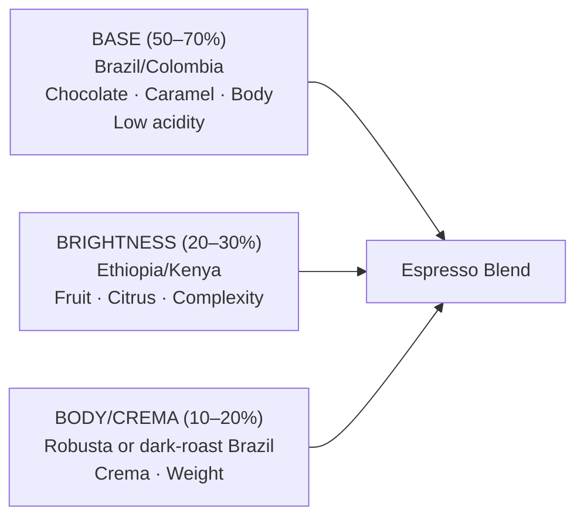

# Roastery Operations & Business Setup

## 📍 Parent Topics
- [Roasting Science](../INDEX.md)
- [Coffee Knowledge Base](../../INDEX.md)

---

## Roaster Equipment Selection

### Drum Roaster Comparison

| Brand | Model | Batch Size | Technology | Price Range |
|-------|-------|-----------|-----------|-------------|
| **Probat** | P12/P25/P60 | 12–60kg | Gas drum; industry standard | $50,000–$250,000+ |
| **Giesen** | W6A/W15A | 6–15kg | Drum; Dutch; excellent software | $30,000–$100,000 |
| **Loring** | S15/S35 | 15–35kg | Recirculating hot air; very consistent | $75,000–$200,000 |
| **Diedrich** | IR-5/IR-12 | 5–12kg | Infrared + convection; clean | $25,000–$80,000 |
| **Joper** | BPR-5/BPR-15 | 5–15kg | Portuguese; reliable; good value | $20,000–$60,000 |
| **Mill City** | MCR-2/MCR-10 | 2–10kg | Hybrid; excellent for learning | $10,000–$35,000 |
| **Bullet R1** | V2 | 1kg | Home/sample; app-controlled | $1,500–$2,000 |
| **Ikawa Pro** | 50g | Sample | Ultra-precision; R&D | $3,000–$5,000 |

### Roaster Size Selection Framework

```
Volume Calculation:
Daily demand → batches per day → roaster size

Example: 
  Daily demand: 50kg roasted coffee
  Batches at 70% capacity: 50kg / 0.70 = 71.4kg green needed
  Batch size target: run 8 batches → 71.4 / 8 = ~9kg green per batch
  Roaster needed: 10kg roaster (roast at 90% capacity)

Rule: Never consistently run at 100% capacity — reduces quality and machine life
Optimal: 60–85% of rated capacity
```

---

### Sample Roasters

Essential for green coffee evaluation:

| Model | Type | Batch Size |
|-------|------|-----------|
| Ikawa Pro | Air roaster; app-controlled | 50g |
| Joper Sample | Drum | 100–200g |
| Probat Sample | Drum | 100g |
| Coffee Crafters Artu | Air | 100–250g |

**Workflow:** Receive green samples → sample roast → rest 24h → cup → decide to buy or not

---

## Production Planning

### Batch Planning Sheet

```
WEEKLY PRODUCTION PLAN

Week: ___________

DEMAND FORECAST:
  Espresso blend:    _____ kg
  Single origin A:   _____ kg
  Single origin B:   _____ kg
  Filter blend:      _____ kg
  TOTAL:             _____ kg roasted

GREEN COFFEE NEEDED:
  Espresso blend:    _____ kg (÷ 0.85 for ~15% roast loss)
  Single origin A:   _____ kg (÷ 0.87 for ~13% roast loss)
  TOTAL GREEN:       _____ kg

ROASTING SCHEDULE:
  Day 1 (Monday):   Espresso blend — X batches
  Day 2 (Tuesday):  Single origins — X batches
  Day 3 (Wednesday): Reserve / re-roast / samples
  [Rest day Friday — allow minimum 2 days degassing before dispatch]

QUALITY CHECK:
  □ Cup all lots before dispatch
  □ Agtron colour check vs standard
  □ Weight loss % logged
```

---

## Blend Development

### Why Blend?

| Reason | Detail |
|--------|--------|
| **Consistency** | Single origins change seasonally; blends can be matched with rotating components |
| **Price stability** | Average out expensive and affordable components |
| **Profile construction** | Build specific flavour profile unavailable in single origins |
| **Milk compatibility** | Design for sweetness + body through milk |

### Espresso Blend Architecture



### Blend Construction Process

1. **Define target cup profile** (write it down: "chocolate, caramel, mild citrus, full body, 1:2 espresso")
2. **Source candidates** for each role (base, brightness, body)
3. **Cup each component** individually
4. **Build trial blends** in 10% increments
5. **Cup all trials** blind (against each other and target)
6. **Dial in** winning blend
7. **Test across multiple extractions** (different temperatures, ratios)
8. **Document final recipe** (% each component, roast level of each)
9. **Re-evaluate seasonally** as green coffee changes

### Sample Trial Blend Matrix

| Trial | Brazil | Colombia | Ethiopia | Robusta | Notes |
|-------|--------|---------|---------|---------|-------|
| A | 60% | 30% | 10% | 0% | Too bright |
| B | 70% | 20% | 10% | 0% | Better body |
| C | 65% | 20% | 15% | 0% | More fruit |
| **D** | **65%** | **25%** | **10%** | **0%** | ✅ Best balance |
| E | 60% | 20% | 10% | 10% | Robusta adds crema but harsh |

---

## Quality Control Systems

### Pre-Roast (Green Coffee)

```
GREEN RECEIVING CHECKLIST (every new lot)
□ Weigh incoming lot (vs invoice)
□ Sample roast (100–200g on sample roaster)
□ Rest sample 24h minimum
□ Cup against SCA protocol
□ Score and compare to pre-buy sample
□ Acceptable if within 2 points of pre-buy score
□ Moisture check (10–12% target)
□ Inspect for visible defects or off-odours
□ Approve for production OR reject/negotiate
□ Log: date, lot, importer, score, moisture
```

### During Roasting (Batch QC)

```
PER-BATCH LOGGING (mandatory)
□ Green coffee: name, lot, weight
□ Charge temperature
□ All turning points (time + temp)
□ First crack: onset time + temp, full time
□ Drop: time + temperature
□ Roasted weight
□ Calculate: Roast loss %, DTR%
□ Agtron colour (after cooling)
□ Cropster/Artisan profile saved
```

### Post-Roast (Cup Evaluation)

```
PRODUCTION CUPPING SCHEDULE
□ Cup every production roast (within 5 days of roast)
□ Compare to reference sample (stored from dial-in)
□ Score: acceptable if within 1 point of reference
□ Flag and hold any lot with defects
□ Do not dispatch held lots without re-evaluation
□ Document all cupping results
```

---

## Freshness & Degassing Windows

| Use | Minimum Rest | Peak | Maximum Freshness |
|-----|-------------|------|-------------------|
| Espresso | 7 days | 10–21 days | 4–6 weeks |
| Filter/Pour Over | 3 days | 5–15 days | 3–4 weeks |
| Cold Brew | 1 day | 5–10 days | 4–5 weeks |

**Dispatch policy:** Never dispatch espresso less than 5 days post-roast. Communicate freshness date to wholesale accounts.

---

## Packaging

### Packaging Options

| Package | Degassing Valve? | Shelf Life | Best For |
|---------|----------------|-----------|---------|
| **Quad-seal bag + one-way valve** | ✅ Yes | 6–12 months (unopened) | Standard retail specialty |
| **Flat-bottom bag + valve** | ✅ Yes | 6–12 months | Premium retail; stands upright |
| **Tin-tie paper bag** | ❌ No | 2–4 weeks only | Short shelf-life; single origin |
| **Valve + nitrogen flush** | ✅ + N₂ | 12–18 months | Long-term preservation; subscription |
| **Compostable bag + valve** | ✅ Yes | 4–6 months | Sustainability-focused brands |

**One-way valve:** Allows CO₂ to escape without letting oxygen in — essential for roasted coffee. Without it, bags inflate and burst from degassing CO₂.

### Label Information Requirements

| Information | Required? | Notes |
|------------|---------|-------|
| Coffee name / origin | ✅ | Consumer information |
| Roast date | ✅ | Freshness transparency |
| Roast level | Recommended | Consumer guidance |
| Tasting notes | Optional | Marketing |
| Brew recommendations | Optional | Barista education |
| Weight | ✅ | Legal requirement |
| Ingredients | ✅ (if blend) | Legal: "100% Arabica coffee" etc |
| Allergen info | ✅ | Legal; coffee is not a common allergen but cross-contamination |
| Country of origin | ✅ | Legal in many jurisdictions |
| Barcode | Retail requirement | Needed for wholesale/retail accounts |

---

## Roastery Business Economics

### Revenue Streams

| Stream | Margin | Volume Typical |
|--------|--------|---------------|
| Retail bags (direct) | 70–80% | Lower volume; high margin |
| Wholesale to cafés | 50–65% | Higher volume; relationship-based |
| Online subscription | 65–75% | Recurring; scalable |
| Training/courses | 80%+ | Low volume; expertise-dependent |
| Equipment sales | 20–40% | High ticket; low volume |
| Café (own) | 70–75% (beverage) | Highest volume; operational complexity |

### Roastery P&L (Illustrative — 100kg/week)

```
MONTHLY REVENUE
  Retail bags (40kg × $30/kg): $1,200
  Wholesale (60kg × $18/kg):   $1,080
  Total Revenue:                $2,280

COST OF GOODS
  Green coffee (100kg green → 85kg roasted):
    100kg × $8/kg (average): $800
  Packaging: $150
  Total COGS: $950

GROSS PROFIT: $1,330 (58%)

OPERATING EXPENSES
  Rent/utilities: $400
  Labour (part-time): $600
  Equipment/maintenance: $100
  Marketing: $80
  Total OpEx: $1,180

NET PROFIT: $150/month (6.6%)

Scale note: Roasting is a volume business — margins improve significantly at higher volume through fixed cost leverage.
```

---

## SCA Roasting Skills Certification

| Level | What It Tests | Prep Time |
|-------|-------------|-----------|
| **Foundation** | Basic roasting knowledge; history; equipment | 2–4 weeks |
| **Intermediate** | Profile roasting; sensory evaluation; green assessment | 2–3 months |
| **Professional** | Advanced profiling; blend development; quality systems | 6–12 months |

---

## 🔗 Related Topics
- [Roasting Science](roast-science.md)
- [Roast Curves & Profiles](roast-curves-profiles.md)
- [Roast Defects](roast-defects.md)
- [Green Coffee Grading](../beans/green-coffee-grading.md)
- [Cupping Protocol](../sensory-cupping/cupping-protocol.md)
- [Beverage Costing](../cafe-operations/beverage-costing.md)
