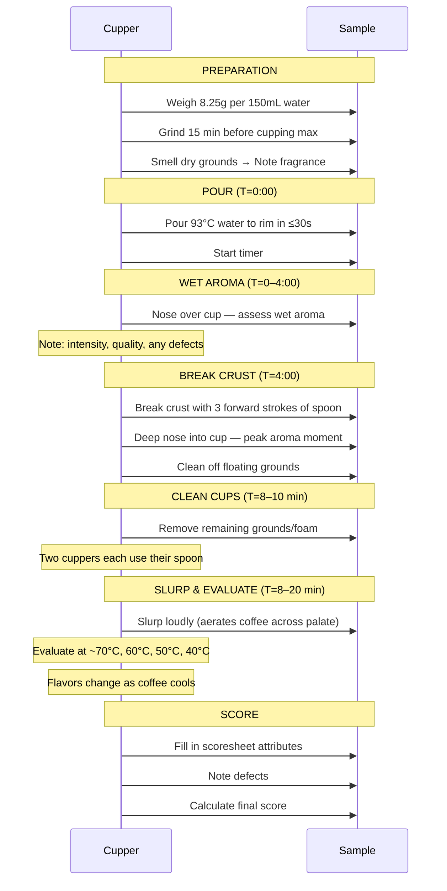

# Cupping Protocol & Sensory Analysis

## 📍 Parent Topics
- [Coffee Knowledge Base](../INDEX.md)

---

## What Is Cupping?

**Cupping** is the standardized method for evaluating coffee quality — used by green coffee buyers, Q Graders, roasters, and competition judges worldwide. It equalizes variables to allow fair **cup-to-cup and origin-to-origin comparison**.

The SCA cupping protocol is the global standard for specialty coffee evaluation.

---

## SCA Cupping Protocol — Step by Step

### Setup Requirements

| Parameter | SCA Specification |
|---------|-------------------|
| Coffee-to-water ratio | 8.25g per 150mL |
| Grind | Medium-coarse (consistent) |
| Water temperature | 93°C ± 1°C |
| Cup size | 207–266mL |
| Number of cups per sample | Minimum 5 (statistical validity) |
| Time from grind to cup | Within 15 minutes |
| Cupping room | No strong odors, good lighting |

### Equipment Checklist
```
□ Cupping bowls/glasses (uniform size)
□ Scale (0.1g precision)
□ Cupping spoons (deep bowl, long handle)
□ Timer
□ Kettle with temperature control (93°C)
□ Grinder (freshly cleaned)
□ Rinse cup for spoons
□ Cupping scoresheet (SCA form)
□ Pen/pencil
□ Spittoon
□ Water for drinking/palate cleanse
```

---

### Protocol Sequence



---

## SCA Scoring Form — Detailed

### All 10 Attributes Explained

#### 1. Fragrance / Aroma (max 10 pts)

- **Fragrance** = dry grounds aroma (before water)
- **Aroma** = wet aroma after pouring, and at crust break
- Score considers: intensity + quality
- A coffee can have intense but poor-quality aroma → lower score

**Reference scale:**
```
6.00 = Good (baseline for specialty)
7.00 = Very Good
8.00 = Excellent
9.00 = Outstanding
10.00 = Extraordinary (almost never awarded)
```

#### 2. Flavor (max 10 pts)
The overall impression of the coffee's **primary taste + aromatic character**. Considered the most complex attribute — encompasses everything that makes the coffee taste like *itself*.

#### 3. Aftertaste (max 10 pts)
Length and quality of flavor remaining after swallowing. Short, harsh, or unpleasant finish = lower score. Long, sweet, complex = higher score.

#### 4. Acidity (max 10 pts)
⚠️ *This scores quality of acidity, NOT mere presence.*

- Bright, clean malic/citric acidity → high score
- Harsh, fermented, sour acidity → low score
- The cupper also notes **intensity** separately (low → high)

**Descriptor examples:**
- Positive: bright, lively, vibrant, juicy, crisp
- Negative: sharp, harsh, sour, vinegar, fermented

#### 5. Body (max 10 pts)
The **tactile weight and texture** of the liquid in the mouth (mouthfeel). Not flavor — purely physical sensation.

| Body Level | Description |
|------------|-------------|
| Light | Tea-like, watery |
| Medium | Smooth, balanced |
| Full | Heavy, round |
| Thick/Syrupy | Dense, coating |
| Buttery | Smooth and creamy |

#### 6. Balance (max 10 pts)
How well all attributes work **together**. A coffee with great flavor but harsh acidity = low balance. All attributes in harmony = high balance.

#### 7. Uniformity (max 10 pts)
Consistency **across 5 cups** of the same sample. Each cup that tastes different deducts 2 points (10pts possible = 2 × 5 cups).

#### 8. Clean Cup (max 10 pts)
**Absence of defects, off-flavors, or interference** from start to finish. Each cup with any non-coffee sensation deducts 2 points.

#### 9. Sweetness (max 10 pts)
**Perceived sweetness** — a natural sweet quality from sugars and pleasant compounds, not added sweetener. Each cup lacking sweetness deducts 2 points.

#### 10. Overall (max 10 pts)
The cupper's **holistic, personal assessment**. This is their professional impression beyond the sum of parts.

---

### Defects

| Type | Score Penalty per Cup |
|------|-----------------------|
| Taint (minor off-flavor) | −2 points |
| Fault (major off-flavor) | −4 points |

**Common defects:**

| Defect | Cause | Sensory Description |
|--------|-------|---------------------|
| Phenolic/medicinal | Bacterial (Pseudomonas) | Hospital, antiseptic |
| Ferment | Over-fermentation in processing | Vinegar, sour, rotten fruit |
| Musty/earthy | Mold or improper storage | Damp, cellar, soil |
| Stinker bean | Bacterial in single bean | Extreme rotten, sulfur |
| Grassy/green | Underdeveloped roast | Raw vegetable, hay |
| Baked | Poor roast development | Flat, cardboard, hollow |
| Rubber | Robusta or defective Arabica | Tire, rubber bands |
| Rio/iodine | Bacterial + geographic (Brazil/Rio) | Iodine, chemical |

---

## Specialty Threshold

| Score | Classification |
|-------|---------------|
| ≥ 90 | Outstanding |
| 85–89 | Excellent |
| **80–84** | **Specialty (minimum)** |
| 78–79 | Premium (not specialty) |
| < 78 | Commodity grade |

---

## The SCA Coffee Taster's Flavor Wheel

The SCA/WCR Flavor Wheel (2016 version) is the industry standard visual reference.

### Structure (Inner → Outer)

```
TIER 1 (innermost — primary categories):
├── Fruity
├── Sour/Fermented  
├── Green/Vegetative
├── Other
├── Roasted
├── Spices
├── Nutty/Cocoa
├── Sweet
└── Floral

TIER 2 (secondary — subcategories):
[Fruity] → Berry, Dried Fruit, Other Fruit, Citrus Fruit, Stone Fruit, Tropical Fruit
[Roasted] → Tobacco, Pipe Tobacco | Burnt → Acrid, Ashy, Smoky, Brown, Roast
[Nutty/Cocoa] → Nut, Cocoa
[Sweet] → Brown Sugar, Vanilla, Vanillin, Overall Sweet, Molasses, Maple Syrup, Caramelized, Honey

TIER 3 (outermost — specific descriptors):
[Berry] → Blackberry, Raspberry, Blueberry, Strawberry
[Citrus] → Grapefruit, Orange, Lemon, Lime
[Stone Fruit] → Cherry, Peach, Apricot, Plum
[Tropical] → Pineapple, Mango, Papaya, Passion Fruit, Guava, Coconut
[Nut] → Almond, Hazelnut, Peanuts
[Cocoa] → Dark Chocolate, Chocolate, Cocoa
```

---

## Tasting Methodology: SLURP Technique

**Why slurp loudly?**
- Aerosolizes liquid → distributes across all taste zones
- Drives aromatics up retronasal pathway → amplifies aroma perception
- Achieves better evaluation than sipping politely

**The tasting process:**
1. **Retronasal aroma** (nose during sip) — most of "flavor"
2. **Sweetness** (tip of tongue)
3. **Sour/Acid** (sides of tongue)
4. **Bitter** (back of tongue/throat)
5. **Body** (whole mouth, texture)
6. **Finish** (after swallowing)

---

## Sensory Training Exercises

### Exercise 1: Water Dilution Reference
Prepare coffees at different TDS by diluting with hot water:
- 100%, 80%, 60%, 40% strength
- Train: perceive extraction strength changes

### Exercise 2: Acid Identification
Prepare solutions of known acids in distilled water:
- Citric acid (citrus, lemon)
- Malic acid (apple, green fruit)
- Acetic acid (vinegar, fermented)
- Phosphoric acid (crisp, clean brightness)
- Tartaric acid (grape, wine)

### Exercise 3: Defect Training
Purchase SCA defect kits or create:
- Add 1 taint-defective bean to a 350g sample
- Learn to detect: Rio, phenol, ferment, musty

### Exercise 4: Aroma Kit (Le Nez du Café)
36-aroma reference kit for coffee — essential for Q Grader exam prep:
- Category training: enzymatic, sugar-browning, dry-distillation
- Memory training for 36 reference aromas

### Exercise 5: Body Comparison
- French Press vs V60 of same coffee
- Whole milk, 2% milk, skim milk dilution comparison
- Train tactile perception of body/texture

---

## Q Grader Program Overview

The **Q Grader** (CQI certification) is the highest professional sensory certification in coffee.

| Module | Content |
|--------|---------|
| General Knowledge | Science, sourcing, processing |
| Olfactory Skills | Triangle tests, aroma kits |
| Sensory Skills | Salt, acid, sweet, bitter thresholds |
| Organic Acids | Identify acids in water |
| Cupping Calibration | Blind cupping to SCA standard |
| Arabica Grading | Green coffee defect analysis |
| Roast Identification | Match Agtron color standards |
| Triangulation | Identify odd sample in trio |
| Written/Practical Exam | Pass all modules |

**Pass requirement:** Pass all individual modules (each has minimum score/threshold)

---

## 🔗 Related Topics
- [Specialty Coffee Movement](../coffee-fundamentals/specialty-coffee-movement.md)
- [Roasting Science](../roasting/roast-science.md)
- [Sensory Training Exercises](sensory-training.md)
- [Flavor Wheel Guide](flavor-wheel-guide.md)
- [Coffee Chemistry](../chemistry-physics/extraction-chemistry.md)
