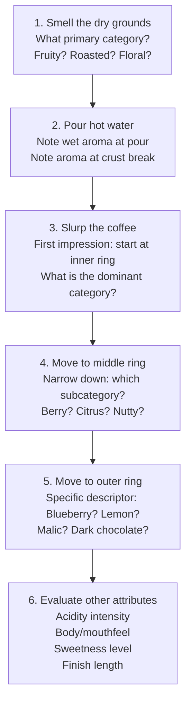
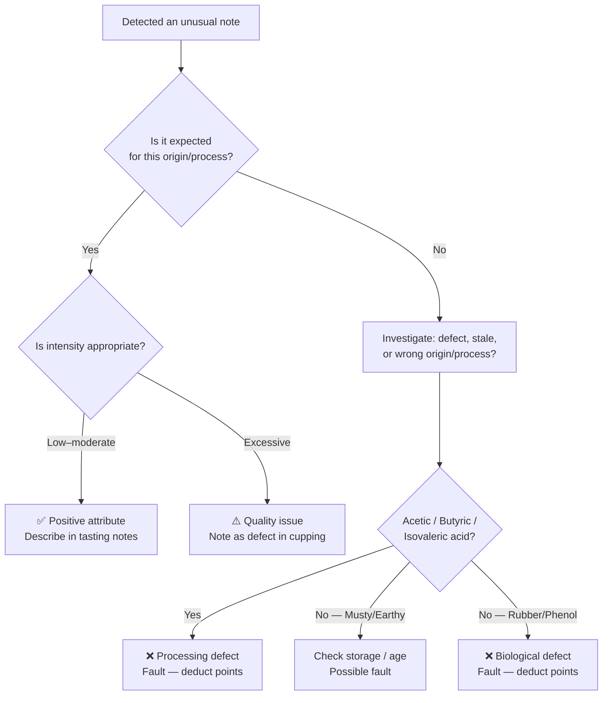

# Coffee Flavour Wheel — Complete Guide

## 📍 Parent Topics
- [Cupping Protocol](cupping-protocol.md)
- [Sensory Training](sensory-training.md)

---

## Overview

The **SCA Coffee Taster's Flavour Wheel** (2016 version) was developed in collaboration with the **World Coffee Research (WCR) Sensory Lexicon** — a scientifically validated set of 110 coffee sensory attributes, each tied to a physical reference standard.

The wheel organises flavour descriptors from **general to specific**, working outward:
- **Inner ring:** 9 primary categories
- **Middle ring:** Subcategories
- **Outer ring:** Specific descriptors with physical standards

> 🔬 *The WCR Sensory Lexicon is unique because every descriptor has a defined reference standard (e.g. "Blueberry = fresh blueberries, Driscoll's preferred"). This makes the wheel scientifically calibrated, not subjective.*

---

## How to Use the Wheel

### Step-by-Step Tasting with the Wheel



### Inner-to-Outer Approach

| Step | Ring | Example |
|------|------|---------|
| "This smells fruity" | Inner | Fruity |
| "More like berries than citrus" | Middle | Berry |
| "Specifically blueberry" | Outer | Blueberry |

---

## Complete Wheel Reference

### 🍓 1. FRUITY

#### Berry
| Descriptor | Physical Reference | Typical Origins |
|-----------|-------------------|----------------|
| **Blackberry** | Fresh blackberries | Kenya (SL-28), natural Ethiopian |
| **Raspberry** | Fresh raspberries | Ethiopia natural, some Colombian |
| **Blueberry** | Fresh blueberries | Ethiopian natural (Harrar), anaerobic |
| **Strawberry** | Fresh strawberries | Natural processed, some Burundian |

#### Dried Fruit
| Descriptor | Physical Reference | Typical Origins |
|-----------|-------------------|----------------|
| **Raisin** | Sun-dried raisins | Dark roast; some naturals |
| **Prune** | Dried prunes | Dark roast; Indonesian |

#### Other Fruit
| Descriptor | Physical Reference | Typical Origins |
|-----------|-------------------|----------------|
| **Coconut** | Fresh coconut | Indonesian; some naturals |
| **Cherry** | Fresh Bing cherries | Colombia, Central America |
| **Pomegranate** | Fresh pomegranate juice | Kenya, Rwanda |
| **Pineapple** | Fresh pineapple | Some Ethiopian, Costa Rican |
| **Grape** | Concord grape juice | Natural processed |
| **Apple** | Red Delicious apple | Colombia, Central America; malic acid |
| **Peach** | Canned peach in syrup | Yirgacheffe washed, Central America |
| **Pear** | Canned pears | Light roast Colombian |

#### Citrus Fruit
| Descriptor | Physical Reference | Typical Origins |
|-----------|-------------------|----------------|
| **Grapefruit** | Fresh grapefruit | Kenya, Rwanda |
| **Orange** | Fresh Valencia orange | Colombia, Central America |
| **Lemon** | Fresh lemon juice | Ethiopian washed, Kenyan |
| **Lime** | Fresh lime juice | Some Central American |

---

### 🌸 2. FLORAL

| Descriptor | Physical Reference | Typical Origins |
|-----------|-------------------|----------------|
| **Black Tea** | Steeped black tea | Ethiopian washed Yirgacheffe |
| **Floral (general)** | Mixed flowers | Light roast Ethiopian, Gesha |
| **Chamomile** | Chamomile tea | Yirgacheffe washed |
| **Rose** | Fresh rose petals | Gesha/Geisha, some Ethiopian |
| **Jasmine** | Fresh jasmine flowers | **Yirgacheffe washed** (signature) |

---

### 🌿 3. SWEET

| Descriptor | Physical Reference | Typical Origins |
|-----------|-------------------|----------------|
| **Brown Sugar** | Brown sugar | Brazil natural, medium roast |
| **Molasses** | Blackstrap molasses | Dark roast; some naturals |
| **Maple Syrup** | Pure maple syrup | Natural processed, medium roast |
| **Caramelized** | Crème brûlée | Medium roast; espresso |
| **Honey** | Wildflower honey | Honey-processed; some naturals |
| **Vanilla** | Pure vanilla extract | Medium roast; some Colombian |
| **Vanillin** | Synthetic vanilla | Medium-dark roast |
| **Overall Sweet** | Simple syrup | General sweetness perception |

---

### 🥜 4. NUTTY / COCOA

#### Nutty
| Descriptor | Physical Reference | Typical Origins |
|-----------|-------------------|----------------|
| **Almond** | Roasted almonds | Brazil medium, Colombian |
| **Hazelnut** | Roasted hazelnuts | Brazil; medium roast espresso |
| **Peanuts** | Roasted peanuts | Commercial/lower grade; robusta |

#### Cocoa
| Descriptor | Physical Reference | Typical Origins |
|-----------|-------------------|----------------|
| **Dark Chocolate** | 70%+ dark chocolate | Brazil, Colombia, medium-dark roast |
| **Chocolate** | Milk chocolate | Brazil medium; Colombian |

---

### 🌶 5. SPICES

#### Pungent
| Descriptor | Physical Reference | Typical Origins |
|-----------|-------------------|----------------|
| **Anise** | Anise seed | Some Ethiopian, Indonesian |

#### Pepper
| Descriptor | Physical Reference | Typical Origins |
|-----------|-------------------|----------------|
| **Black Pepper** | Freshly ground black pepper | Indian (Coorg, Chikmagalur), some Sumatran |

#### Brown Spice
| Descriptor | Physical Reference | Typical Origins |
|-----------|-------------------|----------------|
| **Nutmeg** | Ground nutmeg | Some Indonesian, Indian |
| **Cinnamon** | Ground cinnamon | Some Ethiopian, Kenyan at light roast |
| **Clove** | Ground cloves | Indonesian; dark roast (guaiacol) |

---

### 🔥 6. ROASTED

#### Tobacco
| Descriptor | Physical Reference | Typical Origins |
|-----------|-------------------|----------------|
| **Tobacco** | Pipe tobacco | Dark roast; Monsooned Malabar |
| **Pipe Tobacco** | Pipe tobacco | Indonesian medium-dark |

#### Burnt
| Descriptor | Physical Reference | Typical Origins |
|-----------|-------------------|----------------|
| **Acrid** | Burning rubber | Roast defect; over-roasted |
| **Ashy** | Wood ash | Very dark roast; French roast |
| **Smoky** | Wood smoke | Dark roast; Lapsang Souchong-like |

#### Cereal
| Descriptor | Physical Reference | Typical Origins |
|-----------|-------------------|----------------|
| **Grain** | Cooked grain | Underdeveloped roast; Robusta |
| **Malt** | Barley malt extract | Medium roast; some Brazilians |

---

### 🥬 7. GREEN / VEGETATIVE

| Descriptor | Physical Reference | Association |
|-----------|-------------------|-------------|
| **Olive Oil** | Extra virgin olive oil | Some naturals at light roast |
| **Raw** | Raw green bean | Underdeveloped roast |
| **Under-ripe** | Unripe banana/fruit | Underdeveloped or unripe cherry |
| **Peapod** | Raw snap peas | Underdeveloped light roast |
| **Fresh** | Freshly cut grass | Very light roast; enzymatic |
| **Dark Green** | Spinach/kale | Underdeveloped; defect |
| **Vegetative** | Cooked vegetables | Robusta; under-roasted |
| **Hay/Straw** | Dry hay | Stale coffee; underdeveloped |
| **Herb** | Mixed fresh herbs | Some Ethiopian; some Kenyan |

---

### 🍋 8. SOUR / FERMENTED

| Descriptor | Physical Reference | Association |
|-----------|-------------------|-------------|
| **Sour Aromatics** | Apple cider vinegar aroma | Under-extracted; fermented |
| **Winey** | Red wine | Natural process; ferment notes |
| **Whiskey** | Bourbon whiskey | Anaerobic processed |
| **Fermented** | Kombucha/kefir | Over-fermented processing defect |
| **Acetic Acid** | White wine vinegar | Over-fermentation; processing defect |
| **Butyric Acid** | Rancid butter / baby diaper | Serious defect — unacceptable |
| **Isovaleric Acid** | Stinky feet / sweaty socks | Serious defect — unacceptable |
| **Citric Acid** | Citric acid solution | Normal positive acidity |
| **Malic Acid** | Malic acid solution | Apple-like; clean acidity |

---

### 🔬 9. OTHER (Defects & Off-Notes)

#### Papery / Musty / Earthy
| Descriptor | Physical Reference | Cause |
|-----------|-------------------|-------|
| **Stale** | Old cardboard | Aged/oxidised coffee |
| **Cardboard** | Wet cardboard | Papery — stale or poorly stored |
| **Papery** | Paper/cardstock | Same as cardboard |
| **Woody** | Dry wood/balsa | Old coffee; some Indonesian |
| **Moldy/Damp** | Wet basement smell | Mold contamination; storage defect |

#### Chemical
| Descriptor | Physical Reference | Cause |
|-----------|-------------------|-------|
| **Bitter** | Caffeine solution | Over-extraction; dark roast; Robusta |
| **Salty** | Salt solution | High sodium water; processing |
| **Medicinal** | Antiseptic | Phenolic defect (bacterial) |
| **Petroleum** | Gasoline | Contamination; equipment issue |
| **Skunky** | Skunk spray | Light-struck (not common in coffee) |
| **Rubber** | Rubber band | Robusta; processing defect |

---

## Flavour → Origin Mapping

Use this table to infer likely origin from flavour notes:

| Flavour Notes | Most Likely Origin | Processing |
|--------------|-------------------|-----------|
| Jasmine, bergamot, black tea | Ethiopia (Yirgacheffe) | Washed |
| Blueberry, wine, chocolate | Ethiopia (Harrar) | Natural |
| Blackcurrant, tomato, high acidity | Kenya | Washed |
| Caramel, chocolate, hazelnut | Brazil | Natural/Pulped natural |
| Red fruit, orange, caramel | Colombia | Washed |
| Spice, earthy, chocolate | India (Coorg/Chikmagalur) | Washed |
| Tobacco, wood, earthy, no acid | Monsooned Malabar (India) | Monsooned |
| Heavy earthy, cedar, tobacco | Sumatra (Indonesia) | Wet-hulled |
| Tropical fruit, brown sugar | Guatemala/Honduras | Various |
| Floral, peach, stone fruit | Panama Gesha | Washed |
| Dark fruit, ferment, complex | Any origin — anaerobic | Anaerobic |

---

## Flavour → Roast Level Mapping

| Roast Level | Typical Descriptors |
|------------|---------------------|
| Very Light | Grassy, hay, green, raw, high acidity |
| Light | Floral, citrus, stone fruit, berry, tea |
| Medium-Light | Apple, caramel, mild citrus, chocolate |
| Medium | Caramel, nut, dark chocolate, mild fruit |
| Medium-Dark | Bittersweet chocolate, vanilla, low acidity |
| Dark | Tobacco, char, ash, smoke, rubber |
| Very Dark | Acrid, ash, carbon — roast dominates entirely |

---

## Acidity Descriptor Reference

Acidity in coffee is **not always a negative** — it is a measure of complexity and brightness when positive:

| Acid | Sensory Character | Coffee Sources |
|------|-----------------|----------------|
| **Citric** | Lemon, citrus, bright | Ethiopian washed, Colombian |
| **Malic** | Apple, clean, crisp | Colombian, Central American |
| **Tartaric** | Grape, wine-like | Natural processed |
| **Phosphoric** | Clean brightness, mineral | Kenyan (signature) |
| **Lactic** | Creamy, yogurt, smooth | Lactic fermented |
| **Acetic** | Vinegar (positive = fruity; negative = sharp) | Natural processed; fermentation |
| **Quinic** | Dry, astringent, harsh | CGA degradation in dark roasts |
| **Chlorogenic** | Astringent, bitter | Light roast; green coffee |

---

## Body Descriptor Reference

| Body Level | Descriptors | Methods / Roasts |
|-----------|------------|-----------------|
| Very light (thin) | Tea-like, watery, delicate | Chemex, very light roast |
| Light | Clean, bright, elegant | V60, light roast |
| Medium | Smooth, balanced | AeroPress, medium roast |
| Full | Round, substantial | French Press, espresso |
| Heavy | Thick, coating | Cold brew, very full-body coffee |
| Syrupy | Viscous, coating | Espresso ristretto |
| Buttery | Smooth, creamy | Milk drinks; some naturals |
| Gritty | Rough, sandy | Unfiltered methods; very fine grind |

---

## Writing Professional Tasting Notes

### Structure Template

```
[Primary Aroma] on the nose,
with [Primary Taste 1] and [Primary Taste 2] flavours,
[Acidity] acidity, [Body] body,
and a [Finish Quality] finish with lingering [Aftertaste Descriptor].
```

### Examples

**Ethiopian Yirgacheffe (washed, light roast):**
> "Jasmine and bergamot on the nose, with lemon curd and ripe peach flavours, vibrant citric acidity, light tea-like body, and a long, floral finish."

**Colombian Huila (washed, medium-light roast):**
> "Fresh florals and red apple on the nose, with caramel sweetness, orange zest, and mild chocolate; clean medium body, bright malic acidity, and a sweet caramel finish."

**Brazil Natural (medium roast, espresso):**
> "Rich dark chocolate and roasted hazelnut, with brown sugar sweetness and a hint of dried cherry; full body, very low acidity, and a long bittersweet chocolate finish."

**Kenya SL-28 (washed, light-medium roast):**
> "Blackcurrant and ripe tomato aromas, intense phosphoric acidity, full round body, juicy red fruit mid-palate, and a very long, complex finish."

---

## Defect vs Positive Attribute Decision Tree



---

## Quick Reference: Positive vs Negative Descriptors

| Positive (desirable) | Negative (defect) |
|--------------------|-------------------|
| Jasmine, rose, floral | Rubber, petroleum |
| Citrus, berry, tropical fruit | Rancid, butyric, isovaleric |
| Caramel, chocolate, brown sugar | Medicinal, phenolic |
| Clean, sweet, complex | Mouldy, musty, damp |
| Bright, lively acidity | Harsh, astringent, acrid |
| Smooth, round body | Gritty, thin, watery (unintended) |
| Balanced, long finish | Hollow, short, flat |

---

## 🔗 Related Topics
- [Cupping Protocol](cupping-protocol.md)
- [Sensory Training](sensory-training.md)
- [Extraction Chemistry](../chemistry-physics/extraction-chemistry.md)
- [Roasting Science](../roasting/roast-science.md)
- [Ethiopia Origin](../beans/regions/ethiopia.md)
- [Kenya / Other Origins via Species Overview](../beans/species-overview.md)
