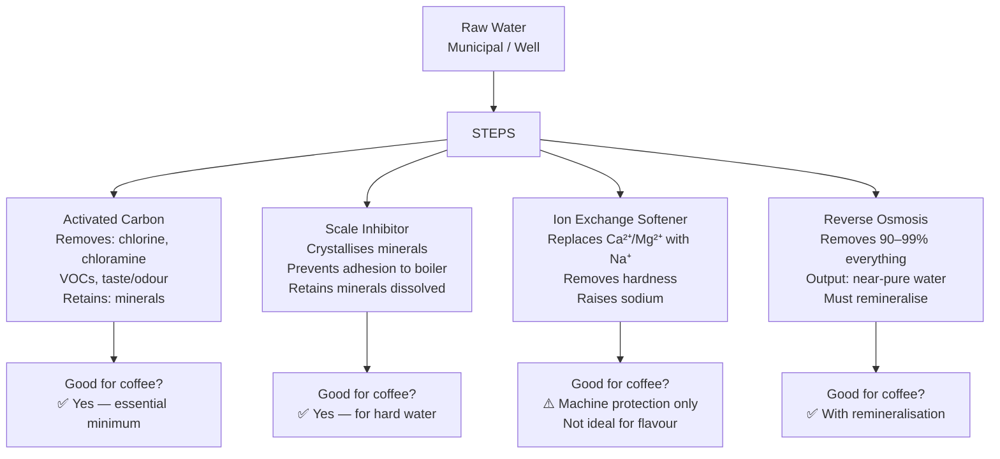

# Water Filtration Systems — Complete Guide

## 📍 Parent Topics
- [Water Chemistry](water-chemistry.md)
- [Water Recipes](water-recipes.md)

---

## Why Filtration Is Essential

Unfiltered municipal water contains:
- **Chlorine/Chloramine** → destroys coffee aromatics; medicinal taste
- **Calcium/Magnesium** → scale buildup destroying machines
- **Bacteria/sediment** → food safety issues
- **Excessive TDS** → muted, flat extraction
- **Heavy metals** → health and flavour concerns

> ⚠️ *Espresso machines are the most expensive piece of café equipment. Scale buildup from hard water is the #1 cause of premature machine failure. Filtration protects your investment.*

---

## Filtration Technology Overview



---

## Technology 1: Activated Carbon Block

### How It Works

Water flows through a solid block of activated carbon (charcoal). The massive surface area (~1,000 m²/g) adsorbs contaminants:

| Removes | Does NOT Remove |
|---------|----------------|
| Chlorine | Hardness (Ca²⁺, Mg²⁺) |
| Chloramine | Dissolved salts |
| VOCs (volatile organics) | Sodium |
| Taste and odour compounds | Nitrates |
| Some heavy metals | Bacteria (most types) |
| Sediment (if pre-filter) | TDS (meaningfully) |

### Coffee Impact
- ✅ Essential — removes chlorine/chloramine which destroy flavour
- ✅ Preserves beneficial minerals for extraction
- ❌ Does NOT prevent scale in hard water areas

### Replacement Schedule
- Standard home filter: every 3–6 months
- Commercial (e.g., BWT Bestmax): per litre rating on cartridge (varies by water hardness)
- Always follow manufacturer specification — expired carbon can release contaminants

---

## Technology 2: Scale Inhibitor (Template Assisted Crystallisation)

### How It Works

TAC (Template Assisted Crystallisation) or similar technologies change the **form** of calcium and magnesium — from dissolved ions to microscopic crystals that cannot adhere to surfaces:

```
Without TAC:                    With TAC:
Ca²⁺ ions dissolved → heat → CaCO₃ scale on boiler walls
                                     ↓
Ca²⁺ ions → TAC media → micro-crystals → pass through; no adhesion
```

### Coffee Impact
- ✅ Prevents scale without removing beneficial minerals
- ✅ No sodium increase (unlike softener)
- ✅ Minerals remain for extraction
- ❌ Does NOT remove chlorine (pair with carbon)

### Commercial Products
| Brand | Product | Best For |
|-------|---------|---------|
| **BWT** | Bestmax, BWT Penguin | Café and home |
| **Everpure** | Claris, PBS400 | Commercial |
| **Brita Professional** | Purity systems | Commercial |
| **FilterLogic** | Various | Budget home |

---

## Technology 3: Reverse Osmosis (RO)

### How It Works

Water is pressurised (40–80 PSI) through a semi-permeable membrane with pores ~0.0001 microns — smaller than most dissolved ions:

```
Feed water (all minerals) →→→ [RO membrane] →→→ Permeate (pure water, TDS < 20ppm)
                                    ↓
                              Concentrate (rejected minerals, ~drain)
```

**Rejection rates:**
- Calcium: ~96%
- Magnesium: ~95%
- Sodium: ~90%
- Chloride: ~90%
- Nitrates: ~85%
- Bacteria: >99.9%

### Coffee Impact
- ✅ Removes all contaminants including chlorine, hardness, metals
- ✅ Allows precise remineralisation to target profile
- ⚠️ **Must remineralise** — pure RO water has TDS < 20ppm which is corrosive to equipment and produces flat extraction
- ⚠️ Wastes 2–4× water volume (reject stream goes to drain)

### When to Use RO
- Very hard water (> 200 mg/L TDS)
- Water with high TDS from multiple minerals
- Competition preparation (precise water control)
- Areas with inconsistent municipal water quality

### RO + Remineralisation Setup

```
Tap water → Pre-filter (sediment) → Carbon block → RO membrane → 
RO water storage tank → Remineralisation stage → Final carbon polish → 
Output: Target water profile
```

See **Water Recipes** for specific remineralisation formulas.

---

## Technology 4: Ion Exchange Softener

### How It Works

Resin beads exchange Ca²⁺ and Mg²⁺ for Na⁺:

```
Ca²⁺ + 2 NaR (resin) ⇌ CaR₂ + 2 Na⁺
Mg²⁺ + 2 NaR (resin) ⇌ MgR₂ + 2 Mg²⁺
```

Where R = resin bead. Resin regenerated periodically with salt (NaCl).

### Coffee Impact
- ✅ Prevents scale effectively
- ❌ Raises sodium — can exceed SCA maximum of 10 mg/L at high hardness
- ❌ Removes Mg²⁺ which is the best extraction mineral
- ❌ Not recommended for specialty coffee flavour quality
- Use **only** for machine protection in extreme hard water, with separate filter for brew water

---

## Commercial Filtration Systems

### BWT Bestmax System (Industry Standard)

BWT is one of the most widely used café filtration systems in Europe and growing globally:

| Product | Capacity | Best Water Type |
|---------|---------|----------------|
| **Bestmax S** | 1,200–2,200L | Soft water (< 10°dH) |
| **Bestmax M** | 3,000–5,000L | Medium water |
| **Bestmax L** | 4,500–7,500L | Medium-hard water |
| **Bestmax XL** | 8,000–12,000L | Hard water |
| **Bestmax PREMIUM** | Variable | Optimised for specialty |

**BWT Mechanism:**
1. Stage 1: Magnesium-enriched ion exchange (replaces calcium with magnesium — beneficial!)
2. Stage 2: Activated carbon (removes chlorine, taste, odour)
3. Result: Water with ideal Mg²⁺:Ca²⁺ ratio + no chlorine

> ✅ BWT Bestmax is unique in actively **increasing magnesium** content — directly beneficial for coffee extraction.

**Change indicator:** BWT systems include colour-change indicators or capacity calculators. Change filter when:
- Indicator shows spent
- Volume limit reached per cartridge spec
- Before or after any machine service

---

### Everpure PBS400 / Claris Systems

Used extensively in commercial coffee, post-mix, and food service:

| Product | Technology | Capacity |
|---------|-----------|---------|
| PBS400 | Scale inhibitor + carbon | ~4,000L |
| Claris Ultra M | Scale inhibitor + carbon | ~3,000L |
| Claris One | Entry commercial | ~1,200L |

**Common in:** Nespresso Professional, Franke, WMF commercial machine OEM pairings.

---

## Installation: Commercial Café Setup

### Recommended System for Specialty Café (Medium Hardness)

```
Water supply → Mains pressure reducer (if > 4 bar) → 
Sediment pre-filter (5 micron) → 
BWT Bestmax L or Everpure PBS400 → 
T-junction:
  Branch 1: Espresso machine (filtered water)
  Branch 2: Steam boiler (same or separate filter)
  Branch 3: Batch brewer
  Branch 4: Cold water for staff/ice
```

### For Very Hard Water (> 300 mg/L TDS)

```
Water supply → Sediment pre-filter → 
Partial softener (soften 50% blend) → 
Carbon block → 
Output: blended water at ~150 mg/L TDS
```

*Or:*

```
Water supply → Sediment → Carbon → RO unit → 
Storage tank → Remineralisation dosing pump → 
Target profile water → Machine
```

---

## Descaling Protocols

When scale has already built up (prevention failed or interval exceeded):

### Commercial Machine Descaling

| Machine Type | Descaler | Process |
|-------------|---------|---------|
| Commercial espresso | Cafiza D powder; Puly Caff Descaler | Per manufacturer SOP — typically circulate through boiler |
| Batch brewer | Urnex Dezcal | Fill tank; run brew cycle; rinse × 3 |
| Home machine | Urnex Dezcal or manufacturer tablets | Follow machine manual exactly |

> ⚠️ **Never use vinegar** on espresso machines — acetic acid corrodes brass fittings and O-rings. Use purpose-formulated coffee descalers only.

### Descaling Frequency Guide

| Water Hardness | Descale Frequency |
|---------------|------------------|
| Soft (< 100 mg/L TDS, filtered) | Every 6–12 months |
| Medium (100–200 mg/L) | Every 3–6 months |
| Hard (200–300 mg/L) | Every 1–3 months |
| Very hard (> 300 mg/L) | Monthly or more — install filtration immediately |

---

## Filter Maintenance Schedule

```
WEEKLY
□ Visual check: any leaks at connections?
□ Pressure drop check: water pressure before and after filter normal?

MONTHLY
□ Check filter usage vs capacity rating
□ Log litres processed (if tracking manually)

QUARTERLY
□ Replace carbon pre-filter (if separate from main unit)
□ Sanitise filter housing

PER CAPACITY/ANNUALLY
□ Replace main filter cartridge per manufacturer schedule
□ Flush new filter for 5 minutes before use
□ Test TDS and alkalinity after installation
□ Log change date and starting water parameters
```

---

## 🔗 Related Topics
- [Water Chemistry](water-chemistry.md)
- [Water Recipes](water-recipes.md)
- [Espresso Machines](../equipment/espresso-machines.md)
- [Café Operations SOP](../cafe-operations/workflow-sop.md)
