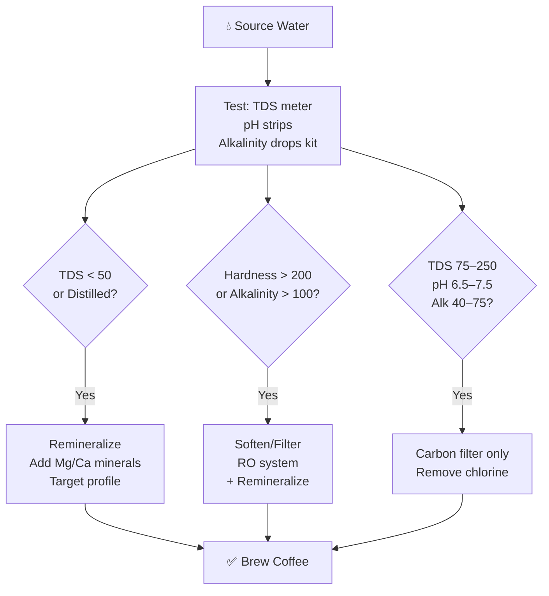

# Water Chemistry for Coffee

## 📍 Parent Topics
- [Coffee Knowledge Base](../INDEX.md)
- [Extraction Theory](../espresso/extraction-theory.md)

---

## Why Water Matters

Coffee is **98–99% water**. Water isn't just a carrier — it's a **reactive solvent** that:
- Determines **which compounds** are extracted from coffee
- Controls **extraction rate and yield**
- Impacts **perceived acidity, sweetness, bitterness**
- Affects **equipment longevity** (scale buildup)
- Determines cup **clarity and cleanliness**

> 🔬 *Hendon et al. (2014) demonstrated that magnesium ions are significantly more effective than calcium at extracting coffee flavor compounds. This changed how the specialty industry thinks about water.*

---

## Key Parameters

### 1. Total Dissolved Solids (TDS)

$$TDS = \text{sum of all dissolved minerals} \quad [\text{mg/L or ppm}]$$

| TDS Range | Effect on Coffee |
|-----------|----------------|
| < 50 mg/L | Distilled-like; flat extraction; equipment damage |
| 75–150 mg/L | Light, bright extraction; clarity |
| 150–250 mg/L | Balanced, full extraction; SCA sweet spot |
| 250–400 mg/L | Harder water; scale risk; muted flavors |
| > 400 mg/L | Mineral dominant; poor extraction; equipment damage |

**SCA Target: 150 mg/L** (acceptable 75–250)

---

### 2. Hardness (Ca²⁺ and Mg²⁺)

**Total Hardness** measures calcium and magnesium concentrations.

$$\text{Total Hardness (as CaCO}_3) = (\text{Ca}^{2+} \times 2.497) + (\text{Mg}^{2+} \times 4.118)$$

| Hardness (mg/L as CaCO₃) | Classification |
|--------------------------|----------------|
| 0–60 | Soft |
| 61–120 | Moderate |
| 121–180 | Hard |
| > 180 | Very Hard |

**SCA Hardness Target: 50–175 mg/L as CaCO₃**

---

### 3. Calcium (Ca²⁺)

| Property | Value |
|----------|-------|
| Optimal range | 40–80 mg/L |
| Function | Contributes to hardness; aids extraction |
| Too much | Scale buildup (calcium carbonate) |
| Too little | Weak extraction |
| Flavor impact | Contributes body and structure |

---

### 4. Magnesium (Mg²⁺)

| Property | Value |
|----------|-------|
| Optimal range | 10–30 mg/L |
| Function | Most effective extraction mineral |
| Key research | Hendon (2014): Mg²⁺ extracts more flavor per unit than Ca²⁺ |
| Flavor impact | Brightness, clarity, sweetness, complexity |
| Scale risk | Lower than calcium |

> 💡 *Why Magnesium first?* Magnesium forms stronger complexes with coffee's flavor compounds (chlorogenic acids, caffeine, melanoidins) due to its smaller ionic radius and higher charge density relative to size.

---

### 5. Alkalinity & Bicarbonate (HCO₃⁻)

**Alkalinity** is the water's capacity to **neutralize acids** (buffer system).

$$\text{Buffer equation: } \text{HCO}_3^- + \text{H}^+ \rightleftharpoons \text{H}_2\text{CO}_3 \rightleftharpoons \text{H}_2\text{O} + \text{CO}_2$$

| Alkalinity (mg/L as CaCO₃) | Effect |
|-----------------------------|--------|
| < 20 | Very low buffer → coffee tastes sharp, acidic |
| 40–75 | **SCA target** — balanced buffer |
| 75–150 | Moderate buffer — mutes some brightness |
| > 150 | High buffer → flat, dull coffee; "chalky" |
| Very high | Precipitates calcium scale in boiler |

**SCA Target: 40 mg/L as CaCO₃** (acceptable 40–75)

---

### 6. pH

| pH | Interpretation |
|----|----------------|
| < 6.5 | Too acidic → harsh extraction; equipment corrosion |
| 6.5–7.0 | Slightly acidic; good for specialty |
| 7.0 | Neutral — **SCA target** |
| 7.0–7.5 | Slightly alkaline; acceptable |
| > 7.5 | High alkalinity; muted flavors |

**SCA Target: 7.0** (acceptable 6.5–7.5)

---

### 7. Sodium (Na⁺)

| Range (mg/L) | Effect |
|------------|--------|
| 0–10 | Ideal — enhances sweetness slightly |
| 10–30 | Noticeable saltiness beginning |
| > 30 | Salty taste dominates; off-putting |

**SCA Maximum: 10 mg/L**

---

### 8. Chlorine / Chloramine

| Amount | Effect |
|--------|--------|
| Any detectable amount | Off-flavors, medicinal taste |
| **Target: 0 mg/L** | Always filter out |

Municipal tap water contains 0.5–4 mg/L chlorine. **Always use a carbon filter** minimum.

---

## Water Quality Diagram

---

## Water Recipes

### Recipe 1: SCA Benchmark Water (Simple)
Use with 1 liter of deionized/RO water:

| Mineral | Form | Amount |
|---------|------|--------|
| Magnesium Sulfate (Epsom Salt) | MgSO₄·7H₂O | 0.59g |
| Sodium Bicarbonate (Baking Soda) | NaHCO₃ | 0.17g |

*Results: ~TDS 150, Mg ~30mg/L, Alkalinity ~40mg/L*

---

### Recipe 2: Barista Hustle Aqua Magica (Competition-grade)
Concentrate (dilute 1:100 with RO water):

| Mineral | Form | Amount per 100mL concentrate |
|---------|------|------------------------------|
| Magnesium Chloride | MgCl₂·6H₂O | 13.2g |
| Sodium Bicarbonate | NaHCO₃ | 5.0g |
| Potassium Bicarbonate | KHCO₃ | 2.0g |

*Results: Clean, bright, high extraction efficiency*

---

### Recipe 3: Third Wave Water Mineral Packets (Commercial)
Pre-made mineral packets dissolved in 1 gallon distilled:
- Classic Profile: for medium/dark roasts (balanced)
- Espresso Profile: optimized for espresso
- *Third Wave Water* brand — available commercially

---

## Filtration Systems

### 1. Carbon Block Filter
- Removes: chlorine, chloramine, some heavy metals, sediment
- Doesn't remove: hardness minerals
- Best for: municipal water with acceptable TDS and hardness
- Replacement: every 3–6 months or per manufacturer spec

### 2. Reverse Osmosis (RO)
- Removes: 90–99% of all dissolved minerals
- Output: near-pure water (TDS < 20 mg/L)
- **Must remineralize** output for coffee (pure water = poor extraction, equipment corrosion)
- Best for: very hard water; competition prep

### 3. Softener (Ion Exchange)
- Replaces Ca²⁺/Mg²⁺ with Na⁺
- ⚠️ **Not ideal for coffee** — raises sodium, removes extraction-beneficial minerals
- Best for: protecting equipment only (not flavor)

### 4. Scale Inhibitor Systems (BWT, Everpure)
- Crystalizes minerals to prevent scale without removing them
- Doesn't remove minerals but prevents adhesion to boiler/pipes
- Good for high-volume commercial use

---

## Scale & Machine Damage

### Calcium Carbonate (Limescale) Formation

$$\text{Ca}^{2+} + 2\text{HCO}_3^- \xrightarrow{\text{heat}} \text{CaCO}_3\downarrow + \text{H}_2\text{O} + \text{CO}_2$$

High temperature + high alkalinity = scale precipitates on boiler walls, heating elements, and groupheads.

**Effects of scale:**
- Reduces heat efficiency (0.1mm scale = 10% more energy needed)
- Alters extraction temperature
- Blocks flow restrictors
- Reduces machine lifespan

**Descaling frequency (general guide):**
- Soft water (< 100 TDS): every 6–12 months
- Medium water (100–200 TDS): every 3–6 months
- Hard water (> 200 TDS): every 1–3 months

---

## 🔗 Related Topics
- [Extraction Theory](../espresso/extraction-theory.md)
- [Brewing Methods](../brewing-methods/pour-over.md)
- [Water Recipes](water-recipes.md)
- [Filtration Systems](filtration-systems.md)
- [Espresso Machines](../equipment/espresso-machines.md)
- [Formula Library](../formulas/formula-library.md)
