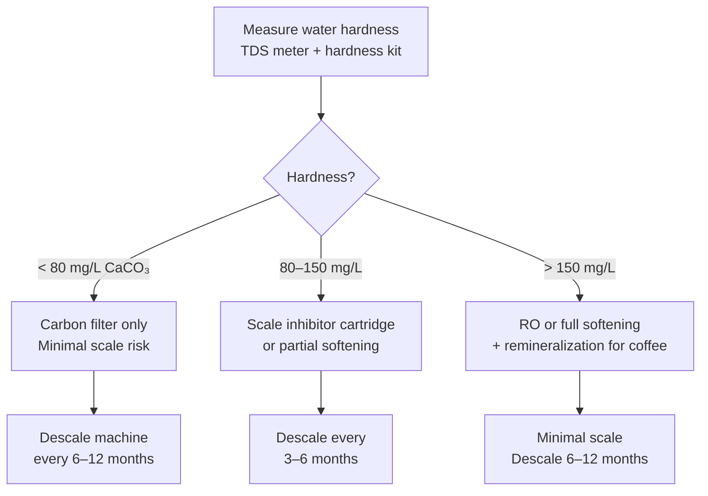

# Water Recipes & Filtration Systems

## 📍 Parent Topics
- [Water Chemistry](water-chemistry.md)

---

## Why Custom Water?

Municipal tap water varies wildly:
- **London tap:** Very hard (~300 mg/L TDS, high alkalinity) → scale risk, muted flavors
- **San Francisco tap:** Soft (~60 mg/L TDS) → bright but can be flat
- **Most Indian city tap:** Variable; often high TDS + chlorine → needs treatment

**For specialty coffee:** Target the SCA profile (TDS ~150 mg/L, pH 7.0, alkalinity ~40 mg/L as CaCO₃, Mg²⁺ 10–30 mg/L).

---

## Water Recipes

### Recipe 1: SCA Benchmark (Simple — 1L batches)

Use with **1 liter RO or distilled water:**

| Mineral | Form | Amount |
|---------|------|--------|
| Magnesium Sulfate | MgSO₄·7H₂O (Epsom Salt, food grade) | 0.59g |
| Sodium Bicarbonate | NaHCO₃ (baking soda) | 0.17g |

**Resulting profile:**
- TDS: ~150 mg/L
- Mg²⁺: ~29 mg/L
- Alkalinity: ~40 mg/L as CaCO₃
- pH: ~7.0

**Use for:** Filter coffee, pour-over, AeroPress

---

### Recipe 2: Barista Hustle Aqua Magica (Concentrate — dilute 1:100)

**Make 100mL concentrate, add 1mL per 100mL RO water:**

| Mineral | Form | Amount (per 100mL concentrate) |
|---------|------|-------------------------------|
| Magnesium Chloride | MgCl₂·6H₂O | 13.2g |
| Sodium Bicarbonate | NaHCO₃ | 5.0g |
| Potassium Bicarbonate | KHCO₃ | 2.0g |

**Resulting profile (per liter brewed water):**
- Mg²⁺: ~17 mg/L
- Na⁺: ~9 mg/L
- K⁺: ~6 mg/L
- Alkalinity: ~65 mg/L
- TDS: ~120 mg/L

**Use for:** Specialty espresso, bright filter coffees; competition use

---

### Recipe 3: Espresso-Optimized (Higher mineral for full body)

Use with 1L RO water:

| Mineral | Form | Amount |
|---------|------|--------|
| Magnesium Sulfate | MgSO₄·7H₂O | 0.80g |
| Calcium Chloride | CaCl₂ (food grade) | 0.50g |
| Sodium Bicarbonate | NaHCO₃ | 0.25g |

**Resulting profile:**
- TDS: ~200 mg/L
- Mg²⁺: ~39 mg/L
- Ca²⁺: ~18 mg/L
- Alkalinity: ~55 mg/L

**Use for:** Espresso where body and sweetness are priority

---

### Recipe 4: Third Wave Water Mineral Packets (Commercial ready-made)

| Product | Profile | Use |
|---------|---------|-----|
| Classic Profile | ~TDS 150, balanced | Medium/dark roast, espresso |
| Espresso Profile | Higher mineral, lower alkalinity | Espresso focus |
| Light Roast Profile | Lower TDS, higher Mg ratio | Light roast, pour-over |

**Use with:** 1 gallon (3.78L) distilled water per packet  
**Availability:** Amazon, specialty retailers  
**Convenience:** No measuring required

---

## Water Testing Tools

| Tool | Measures | Accuracy | Cost |
|------|---------|---------|------|
| **TDS meter** (EC pen) | Total dissolved solids | ±5% | $15–50 |
| **pH strips** | pH | ±0.5 pH units | $5–15 |
| **pH digital meter** | pH | ±0.1 pH units | $30–100 |
| **Alkalinity test kit** (drops) | KH/alkalinity | ±5 mg/L | $15–30 |
| **Hardness test kit** | Ca+Mg hardness | ±5 mg/L | $20–40 |
| **ICP-MS lab analysis** | All minerals precisely | ±1 mg/L | $50–150 per sample |

**Recommended minimum for café:** TDS meter + alkalinity test kit

---

## Filtration Systems

### System Comparison

| System | What It Removes | What It Keeps | Best For | Cost |
|--------|----------------|--------------|---------|------|
| **Activated Carbon Block** | Chlorine, chloramine, VOCs, sediment | Minerals (hardness stays) | Soft/moderate water; chlorine removal | $50–200 |
| **Reverse Osmosis (RO)** | 90–99% of everything | Essentially nothing | Hard water; competition | $150–600 installation |
| **Ion Exchange Softener** | Ca²⁺, Mg²⁺ (replaces with Na⁺) | Na⁺ increases | Scale prevention ONLY; not ideal for coffee flavor | $100–400 |
| **Scale Inhibitor (BWT/Everpure)** | Crystallizes minerals (prevents adhesion) | Minerals remain dissolved | Commercial machines; scale prevention without softening | $100–400 cartridge |
| **RO + Remineralization** | Everything then adds back | Targeted minerals only | Competition; precision water | $200–800 |

---

### BWT Penguin & Bestmax (Commercial Scale)

BWT Bestmax systems are standard in specialty cafés:
- **Bestmax S:** Low hardness water (< 10°dH); light filtration
- **Bestmax M/L/XL:** Higher capacity; commercial volume
- **Mechanism:** Dual-stage — scale inhibitor + activated carbon
- **Change interval:** Per liter specification (varies by local water hardness)
- **Benefit:** Certified for food use; café-grade; SCA water parameters achievable

---

### Setting Up RO + Remineralization (Café or Home)

```
Step 1: Install RO system
        → Output: ~10–20 mg/L TDS (near-pure)
        
Step 2: Test output (TDS meter)
        → Should read < 20 ppm
        
Step 3: Mix remineralization
        → Use Recipe 1, 2, or 3 above
        → Or use Third Wave Water packets
        
Step 4: Blend RO with target minerals
        → Dose into fresh water daily or per batch
        
Step 5: Test final product
        → TDS: 100–200 mg/L
        → pH: 6.5–7.5
        → Alkalinity: 40–75 mg/L
        
Step 6: Use within 24–48 hours
        (Opened RO water is vulnerable to CO₂ absorption → acidification)
```

---

## Scale Prevention Protocol



---

## 🔗 Related Topics
- [Water Chemistry](water-chemistry.md)
- [Espresso Machines](../equipment/espresso-machines.md)
- [Extraction Theory](../espresso/extraction-theory.md)
- [Formula Library](../formulas/formula-library.md)
