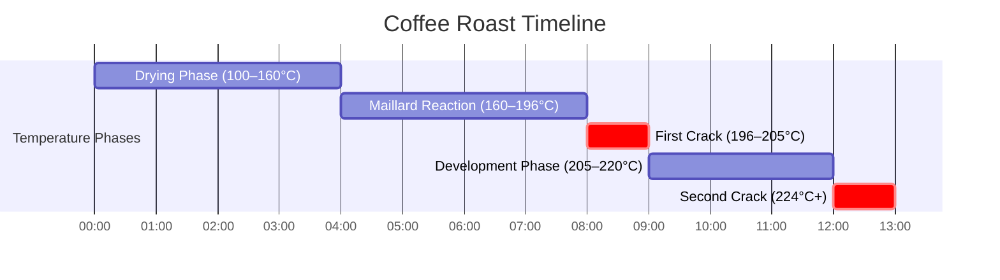

# Roasting Science & Thermal Development

## 📍 Parent Topics
- [Coffee Knowledge Base](../INDEX.md)

---

## The Roasting Process: Overview

Roasting transforms **green coffee** (essentially seeds) into **roasted coffee** (aromatic beverage ingredient) through a complex series of chemical and physical changes driven by heat.

**Before roasting:**
- Moisture: 10–12%
- Color: blue-green to pale yellow
- Flavor: grassy, vegetable, raw
- Weight: heavy, dense

**After roasting:**
- Moisture: 1–2%
- Color: yellow → tan → brown → dark brown → black
- Flavor: coffee! (hundreds of aroma compounds)
- Weight: 15–20% lighter (moisture + CO₂ lost)
- Volume: 30–100% larger (bean expands)

---

## Roasting Phases

### Phase Overview Chart



---

### Phase 1: Drying Phase (Charge → ~160°C)

**Duration:** First 3–5 minutes (varies by roaster/batch)

**What happens:**
- Green bean moisture (10–12%) evaporates
- Bean temperature rises as energy drives off water
- Color: green → yellow → straw
- Smell: grassy, hay-like, then bready

**Key metrics:**
- Should consume 35–45% of total roast time
- Too fast → uneven heat penetration (dark outside, raw inside)
- Too slow → baked, flat, underdeveloped

---

### Phase 2: Maillard Reaction Phase (~150–196°C)

**The primary flavor-building phase.**

The **Maillard reaction** (Louis-Camille Maillard, 1912):

$$\text{Amino Acids} + \text{Reducing Sugars} \xrightarrow{140-165°C} \text{Melanoidins + Volatile Aromatics}$$

**Produces:**
- **500+ aromatic compounds** including furans, pyrazines, aldehydes, ketones
- **Brown color** (melanoidins)
- **Toast, bread, caramel, nutty** aromas

**Rate of Rise (RoR):**
The temperature increase per unit time (°C/minute). Critical to control:

| RoR Pattern | Effect |
|------------|--------|
| Steadily declining RoR | ✅ Ideal — smooth development |
| Flat or rising RoR approaching crack | ⚠️ Risk of baked/dull coffee |
| Sudden crash in RoR | Stall — can cause hollow, grassy notes |
| Flick (RoR rises near end) | Can cause harsh/rough flavors |

---

### Phase 3: First Crack (~196–205°C)

**Physical phenomenon:**
As the bean temperature reaches 196°C, internal pressure (steam + CO₂) causes the cell structure to rupture audibly — an audible cracking sound, similar to popcorn.

**What happens:**
- Endothermic (absorbs heat) at the moment of crack
- Bean volume expands 50–60%
- Density decreases significantly
- CO₂ begins degassing (continues for days–weeks after roasting)

**Roast level decisions:**
- **Light roast:** Finish 30–60s after first crack begins
- **Medium roast:** Finish 60–120s after first crack
- **Medium-dark:** Finish just before or at second crack signs

---

### Phase 4: Development Phase (Post-Crack)

**DTR = Development Time Ratio**

$$DTR\% = \frac{\text{Time from first crack to drop}}{\text{Total roast time}} \times 100$$

| DTR% | Effect |
|------|--------|
| < 15% | Underdeveloped — grassy, astringent, sharp |
| 20–25% | ✅ Sweet spot for most specialty coffees |
| > 30% | Over-developed — flat, baked, less complex |

**Target:** 20–25% DTR for most light-to-medium specialty

**What's happening during development:**
- Caramelization of sucrose begins (170°C+)
- Pyrolysis continues breaking down organic acids
- CO₂ production accelerates
- Flavor compounds integrate and develop

---

### Phase 5: Second Crack (~224–230°C)

**Physical phenomenon:**
Second crack occurs when cell walls fracture more completely. Sound is faster and more continuous (rattling vs popping).

**What happens:**
- Oils migrate to bean surface (shiny appearance)
- CO₂ production accelerates further
- Pyrolysis dominates → roast character overwhelms origin character

**Roast levels:**
- **Medium-dark:** Drop just before or at onset of second crack
- **Dark/French:** Into second crack
- **Very dark/Espresso Italian:** Full second crack and beyond

---

## Chemical Changes Summary

| Compound | Light Roast | Medium Roast | Dark Roast |
|---------|------------|--------------|------------|
| Chlorogenic Acids | High (astringent) | Medium | Low (degraded) |
| Sucrose | ~98% degraded | Mostly degraded | Fully degraded |
| Trigonelline | High | Medium | Low |
| Caffeine | Stable (small loss) | Stable | Stable (≈same) |
| Melanoidins | Low | Medium | High |
| Acidity | High (complex) | Medium | Low |
| CO₂ | High | Medium | Lower (lost) |

> ⚠️ *Myth: Dark roasts have more caffeine. FALSE. Caffeine is heat-stable and remains roughly constant per bean. By weight, light roast is denser → slightly more caffeine per gram.*

---

## Roast Color Analysis

### Agtron Scale

The **Agtron** spectrophotometric scale measures roast color:
- **Higher number** = lighter roast
- **Lower number** = darker roast

| Agtron Score | Roast Level |
|-------------|-------------|
| 95+ | Very light (green, raw notes) |
| 75–95 | Light |
| 65–75 | Medium-Light |
| 55–65 | Medium |
| 45–55 | Medium-Dark |
| 25–45 | Dark |
| < 25 | Very Dark / French |

**Tools:**
- Professional: Agtron M-Basic, Agtron E20P
- Consumer: Tonino, ColorTrack (smartphone-based)
- SCA roast color tiles (visual reference standard)

---

## Roast Curve Architecture

```
Temperature (°C)
│
230│                                    ● Second Crack
225│                                 ●●●
220│                              ●●●
215│    Development Zone        ●●
210│                         ●●
205│                      ●●● First Crack
200│                   ●●
195│                ●●
190│             ●●
185│          ●●  Maillard Phase
180│       ●●
175│    ●●
170│  ●●
165│●●
160│●
...│
100│● ─── Drying Phase
 90│●
   └───────────────────────────────────────────
   0    2    4    6    8   10   12   14  minutes
```

---

## Heat Transfer in Roasting

| Mechanism | Description | % of Heat Transfer |
|-----------|-------------|-------------------|
| **Conduction** | Direct bean-to-drum contact | 30–40% |
| **Convection** | Hot air circulating through drum | 50–60% |
| **Radiation** | Infrared from drum walls | 5–10% |

**Drum roasters** (most common): primarily conduction + convection
**Fluid-bed roasters** (hot air): primarily convection
**Hybrid roasters** (Loring, Bullet R1): mixed systems

---

## Roast Defects

| Defect | Appearance | Cause | Flavor Impact |
|--------|-----------|-------|---------------|
| **Scorching** | Dark spots/burns on surface | Too high charge temp | Acrid, sharp, burnt |
| **Baked** | Pale, under-developed | Too low RoR, too long roast | Flat, cardboard, hollow |
| **Underdeveloped** | Light inside, normal outside | Too fast roast | Grassy, astringent, papery |
| **Tipping** | Brown tips on beans | Excessive drum airflow | Dry, rough |
| **Face cracking** | Excessive surface cracks | Fast development, high moisture | Irregular extraction |
| **Quakers** | Pale beans in roasted lot | Unripe green beans | Peanut, bland in cup |

---

## Degassing & Freshness

After roasting, beans release **CO₂** for days to weeks:

```
CO₂ Release Rate
│
████  ← Days 0–2: Rapid degassing (peak)
│████
│  ████ ← Days 2–5: Still significant
│    ████
│       ████ ← Days 5–14: Moderate
│           ████
│               ████████████ ← Ongoing slow release
└──────────────────────────────────
   0    5    10    14    30 days
```

**Implications:**
- **Espresso:** Rest 7–14 days after roast (CO₂ causes channeling)
- **Filter:** 5–10 days rest ideal
- **Bloom** in pour-over releases residual CO₂ from fresh coffee

**Optimal freshness window:**
- Peak flavor: Days 5–30 (espresso), 3–20 (filter)
- Noticeable staling: 4–6 weeks unsealed, 8–12 weeks sealed valve bag

---

## 🔗 Related Topics
- [Coffee Chemistry](../chemistry-physics/extraction-chemistry.md)
- [Species Overview](../beans/species-overview.md)
- [Extraction Theory](../espresso/extraction-theory.md)
- [Sensory & Cupping](../sensory-cupping/cupping-protocol.md)
- [Roast Defects](roast-defects.md)
